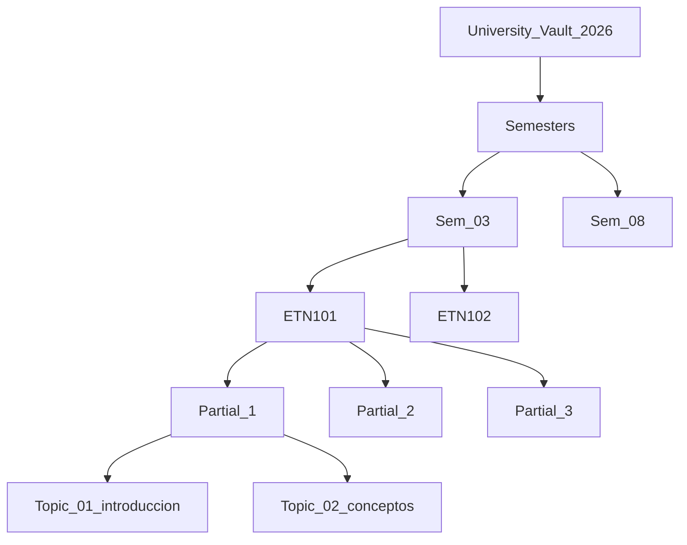
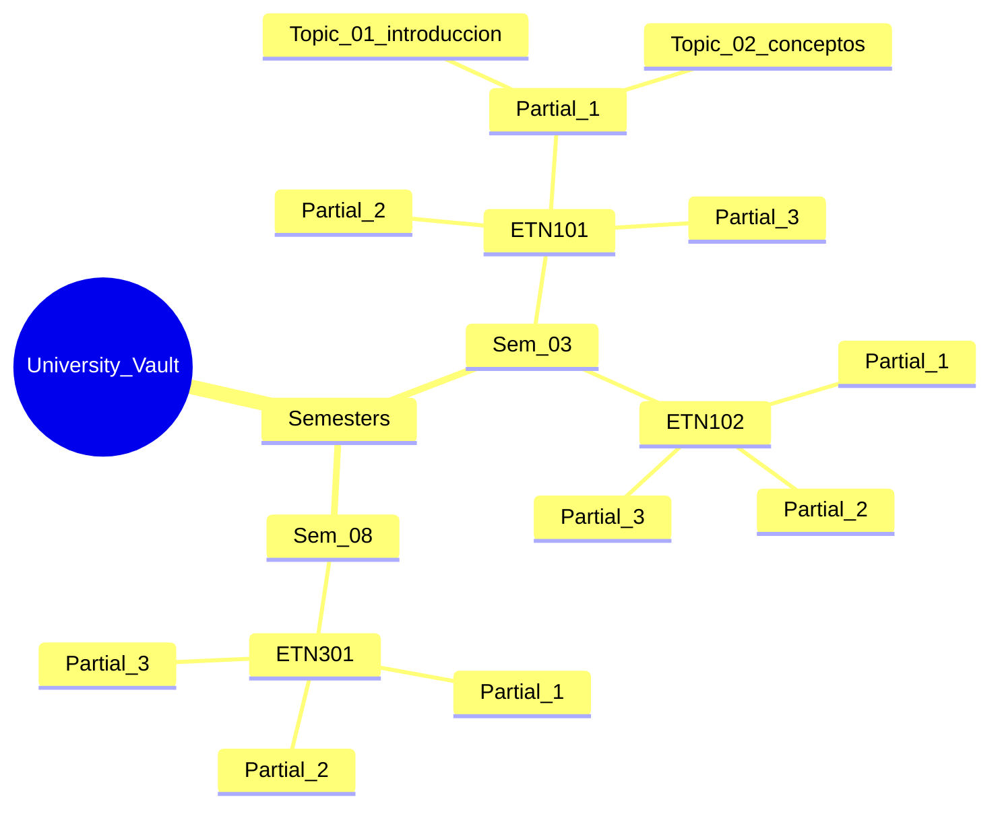
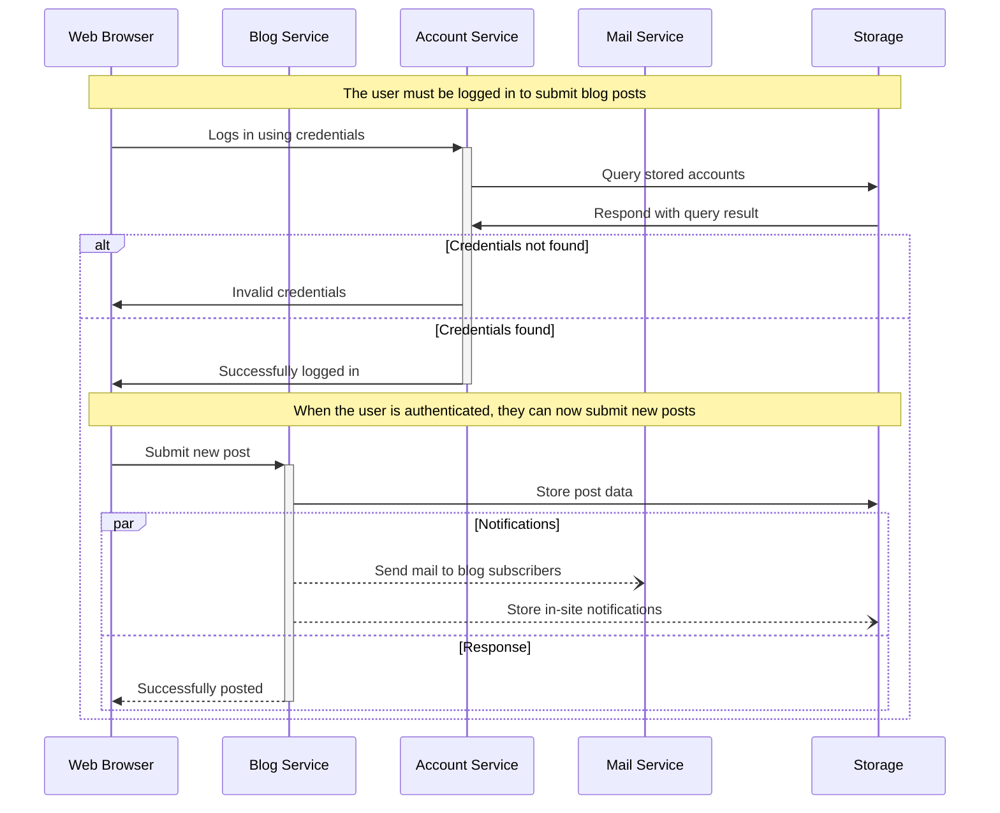
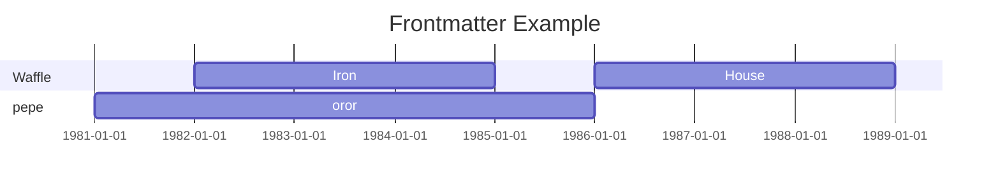

```mermaid
---
config:
    treeView:
        rowIndent: 20
        paddingX: 8
        paddingY: 4
        lineThickness: 1
    themeVariables:
        treeView:
            labelFontSize: '30px'
            labelColor: '#7c6f9f'
            lineColor: '#b0a8c8'
            descriptionColor: '#9fb8a8'
            highlightBg: 'rgba(180, 160, 210, 0.15)'
            highlightStroke: '#c4aee0'
---
treeView-beta
    University_Vault_2026/
        Semesters/ ## todo el contenido académico vive aquí
            Sem_NN/ ## una carpeta por semestre (Sem_03, Sem_08...)
                ETNXXX/ ## una carpeta por materia
                    Partial_1/ ## una carpeta por parcial
                        Topic_NN_nombre-descriptivo/ ## una carpeta por tema
                            [notas]
                    Partial_2/
                    Partial_3/
        MOC/ ## notas de índice a nivel de materia — una MOC por materia, enlaza todas sus Stars
        _app/ ## infraestructura del baúl (no es contenido académico)
            notebooklm/ ## prompts y guías del sistema NotebookLM
                prompts/ ## instrucciones de comportamiento para NotebookLM
                    ETN806/
                        ETN806-P1.md ## prompt P1 Procesos Estocásticos
                        ETN806-P1-legacy.md ## histórico primer prompt P1
                        ETN806-P2.md ## prompt P2 Procesos Estocásticos
                        ETN806-P3.md ## prompt P3 Procesos Estocásticos
                    MAT101/
                        MAT101-study.md ## prompt estudio activo Cálculo 1
                        MAT101-transcription.md ## guía de transcripción cuaderno físico MAT101
                guides/ ## fuentes que se suben al notebook
                    ETN806/
                        ETN806-P3-colas_guide_s.md ## estructuras de colas con Mermaid
                        ETN806-P3-Tikz_markov_guide.md ## diagramas Markov con TikZ
                    MAT101/
                        MAT101_desmos.md ## sintaxis Desmos para Obsidian
                        MAT101_TikzJax.md ## sintaxis TikZJax para Obsidian
                        MAT101_latex.md ## notación LaTeX: cancelaciones, colores, cajas
                        MAT101_library.md ## criterio de fuentes, caps y páginas por tema
                general/ ## guías reutilizables independientes de la materia
                    obsidian_notation.md ## YAML, wikilinks, Cornell, callouts, bloques
                    tikzjax_guide-legacy.md ## sintaxis antigua y genérica de TikZJax (legacy)
                other/ ## archivos en desuso pendientes de revisión
                    MAT101-notebooklm-user_guide.md ## guía de uso personal Cálculo 1
            _config/ :::highlight
                _basic-memory-system.md ## MCP Basic Memory (memoria semántica)
                _claude-boot.md ## punto de entrada de Claude al vault
                _excalidraw-system.md ## configuración del plugin Excalidraw
                _galaxy-system.md ## este archivo — sistema completo: tipos, YAML, convenciones
                _graph-system.md ## Desmos / TikZJax (neutrino)
                _library-system.md ## protocolo de búsqueda y selección de libros
                _mindmap-system.md ## Excalidraw + Mindmap Builder
                _note-system.md ## convención de nombres de notas
                _notebooklm-system.md ## beacon del sistema NotebookLM (transcripción + estudio)
                _pdf-system.md ## sistema de integración de PDFs
                _sync-system.md ## sincronización GitHub + Mega
                _TABnote-system.md ## apuntes de tablet (Samsung Notes → supernova)
                _template-system.md ## sistema de plantillas Templater
                _claude-matter-boot.md ## generador de contexto para Claude
                _ToDo-system.md ## pendientes del sistema
            _appnotes/ ## guías de herramientas usadas dentro del baúl
                tags_notes.md ## documentación del sistema de tags
            Excalidraw/
                Constellations/ ## mapas mentales galaxy (Excalidraw + Mindmap Builder) — galaxy_body: constellation
                Observatory/ ## dibujos técnicos libres sin Mindmap Builder — galaxy_body: observatory
            scripts/ ## scripts de automatización para mantenimiento del baúl
                tag_routs_scripts/
            solve/ ## problemas conocidos y sus soluciones
                git_solve.md ## soluciones a conflictos de git y sincronización
        _assets/ ## archivos visuales exportados — .png .svg .jpeg desde Desmos, Excalidraw o imágenes insertadas — se nombran igual que la nota fuente
        _PDF/ ## archivos PDF físicos — ver _pdf-system
            PDF-telefonia/ ## una carpeta por materia/tema en texto (no sigla ETNXXX)
            PDF-921/
            PDF-nombre/ ## la organización semántica la llevan los nombres y las notas asteroid en Semesters/
        _projects/ ## proyectos activos y backlog de ideas
            tsk_alias.md ## slots de proyecto — 5 slots activos + 1 standby + 1 emergencia
            tsk_tpl.md ## plantilla base para los slots
            _ideas.md ## backlog de ideas futuras (sin galaxy_body)
        _skills/ ## skills de sesión de Claude (work, plan, close, setup, boot) — cada archivo define el comportamiento de Claude para un tipo de tarea específica
        _templates/ ## plantillas de notas de Obsidian — ver _template-system
            tpl-supernova.md ## una plantilla por tipo de cuerpo galaxy
            tpl-star.md
            tpl-planet.md
            tpl-moon.md
            tpl-comet.md
            tpl-nebula.md
            tpl-dwarf.md
            tpl-asteroid.md
            tpl-photon.md
            tpl-bridge.md
            tpl-constellation.md ## Excalidraw + Mindmap Builder
            tpl-observatory.md ## Excalidraw dibujo libre
            tpl-w-initial.md ## workshop: inicio de materia
            tpl-w-transcription.md ## workshop: transcripción por parcial
            tpl-w-study.md ## workshop: estudio por parcial
            tpl-w-project.md ## workshop: proyecto académico puntual
            alt-B/ ## respaldo
                plantillas-A-respaldo.md ## plantillas Opción A consolidadas (sin ruta dinámica)
        borrar/ ## carpeta de espera antes de eliminar — revisar antes de borrar permanentemente
```

---

```mermaid-next
treeView-beta
    University_Vault_2026/ ## vault principal
        Semesters/
            Sem_03/ ## primer año
                ETN101/ ## Matemáticas I
                    Partial_1/ ## enero-febrero
                        Topic_01_introduccion/ ## 3 notas
                        Topic_02_conceptos/
                    Partial_2/
                    Partial_3/ ## pendiente
```

```mermaid-next
treeView-beta
    University_Vault_2026/
        Semesters/
            Sem_03/
                ETN101/
                    Partial_1/ :::highlight
                        Topic_01_introduccion/ :::highlight
                        Topic_02_conceptos/
                    Partial_2/
                    Partial_3/
```

```mermaid-next
treeView-beta
    University_Vault_2026/
        Semesters/
            Sem_03/ ## cursando ahora
                ETN101/ ## Matemáticas I
                    Partial_1/ :::highlight ## en progreso 
                        Topic_01_introduccion/ ## completado
                        Topic_02_conceptos/ :::highlight ## en progreso 
                        Topic_03_derivadas/ ## pendiente
                    Partial_2/
                    Partial_3/
                ETN102/ ## Física I
                    Partial_1/
```

```mermaid-next
treeView-beta
    University_Vault_2026/
        Semesters/ aca
            Sem_03/
                ETN101/
                    Partial_1/
                        Topic_01_introduccion/
                        Topic_02_conceptos/
                    Partial_2/
                    Partial_3/
                ETN102/
                    Partial_1/
                    Partial_2/
                    Partial_3/
            Sem_08/
                ETN301/
                    Partial_1/
                    Partial_2/
                    Partial_3/
```

---

```mermaid-next
graph TD
    A[University_Vault_2026] --> B[Semesters]
    B --> C[Sem_03]
    B --> D[Sem_08]
    C --> E[ETN101]
    C --> F[ETN102]
    E --> G[Partial_1]
    E --> H[Partial_2]
    E --> I[Partial_3]
    G --> J[Topic_01_introduccion]
    G --> K[Topic_02_conceptos]
```

```mermaid-next
mindmap
  root((University_Vault))
    Semesters
      Sem_03
        ETN101
          Partial_1
            Topic_01_introduccion
            Topic_02_conceptos
          Partial_2
          Partial_3
        ETN102
          Partial_1
          Partial_2
          Partial_3
      Sem_08
        ETN301
          Partial_1
          Partial_2
          Partial_3
```

---

```mermaid
sequenceDiagram
    participant web as Web Browser
    participant blog as Blog Service
    participant account as Account Service
    participant mail as Mail Service
    participant db as Storage

    Note over web,db: The user must be logged in to submit blog posts
    web->>+account: Logs in using credentials
    account->>db: Query stored accounts
    db->>account: Respond with query result

    alt Credentials not found
        account->>web: Invalid credentials
    else Credentials found
        account->>-web: Successfully logged in

        Note over web,db: When the user is authenticated, they can now submit new posts
        web->>+blog: Submit new post
        blog->>db: Store post data

        par Notifications
            blog--)mail: Send mail to blog subscribers
            blog--)db: Store in-site notifications
        and Response
            blog-->>-web: Successfully posted
        end
    end
```

```mermaid
---
title: Frontmatter Example
displayMode: compact
config:

gantt:
    useWidth: 800

---
gantt
    section Waffle
        Iron  : 1982, 3y
        House : 1986, 3y
    
	section pepe
		oror : 1981, 5y
		

```

