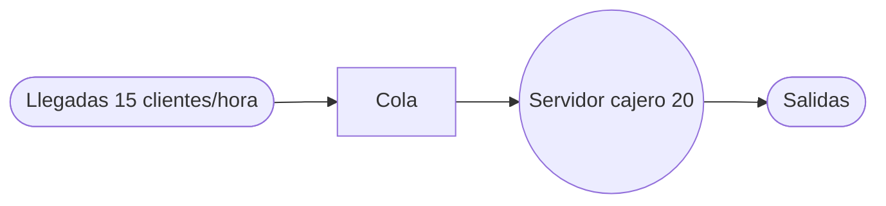
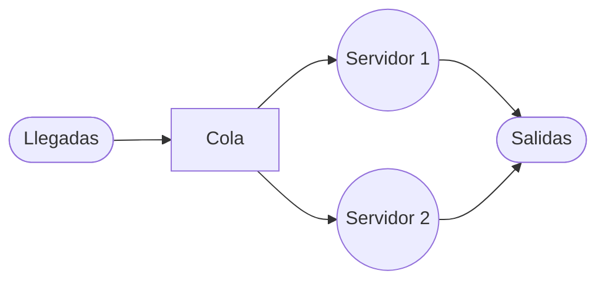

# CADENA DE MARKOV Y TEORÍA DE COLAS

## Ejercicio 1.

El departamento de estudios de mercado de una fábrica estima que el 20% de la gente que compra un producto un mes, no lo comprará el mes siguiente. Además, el 30% de quienes no lo compren un mes lo adquirirá al mes siguiente. En una población de 1000 individuos, 100 compraron el producto el primer mes.

¿Cuántos lo comprarán al mes próximo? ¿Y dentro de tres meses?
### solución
Este ejercicio se identifica como una **Cadena de Markov en tiempo discreto** porque presenta un número finito de estados (comprar o no comprar), probabilidades de transición constantes en el tiempo y la propiedad de que el estado futuro depende únicamente del estado actual.

### Diagrama de la Cadena de Markov

```tikz
\begin{document}
\begin{tikzpicture}
% Definición de estados (N=2, posicionamiento en línea horizontal)
\node[draw,circle,thick,color=orange] (C) at (2,6) {C};
\node[draw,circle,thick,color=pink] (NC) at (10,6) {NC};

% Bucles (hacia afuera)
\draw[->,ultra thick,orange] (C) .. controls (0,8) and (0,4) .. node[left] {$0.8$} (C);
\draw[->,ultra thick,pink] (NC) .. controls (12,8) and (12,4) .. node[right] {$0.7$} (NC);

% Flechas de transición
\draw[->,very thick,orange] (C) to[bend left=30] node[above] {$0.2$} (NC);
\draw[->,very thick,pink] (NC) to[bend left=30] node[below] {$0.3$} (C);

\end{tikzpicture}
\end{document}
```

---

### Resolución del Ejercicio

#### 1. Identificación de datos y estados

- **Población total ($N$):** $1000$ individuos.
- **Estados del sistema:**
    - **Estado 1 ($C$):** Comprar el producto.
    - **Estado 2 ($NC$):** No comprar el producto.
- **Probabilidades dadas:**
    - De compra a no compra: $P_{12} = 0.2$ ($20\%$).
    - De no compra a compra: $P_{21} = 0.3$ ($30\%$).

#### 2. Construcción de la matriz de transición ($P$)

La suma de las probabilidades de cada fila debe ser igual a $1$ (propiedad estocástica).

- $P_{11} = 1 - P_{12} = 1 - 0.2 = \mathbf{0.8}$ (Probabilidad de seguir comprando).
- $P_{22} = 1 - P_{21} = 1 - 0.3 = \mathbf{0.7}$ (Probabilidad de seguir sin comprar).

La matriz de transición es: $$P = \begin{bmatrix} 0.8 & 0.2 \\ 0.3 & 0.7 \end{bmatrix}$$

#### 3. Definición del vector de estado inicial ($\pi(1)$)

En el primer mes, $100$ personas compraron el producto. Expresamos esto en probabilidades dividiendo por la población total ($1000$):

- $\pi_1(1) = 100 / 1000 = 0.1$
- $\pi_2(1) = (1000 - 100) / 1000 = 0.9$ $$\pi(1) = [0.1, \quad 0.9]$$

#### 4. Proyección para el próximo mes (Mes 2)

Aplicamos la relación recurrente $\pi(n+1) = \pi(n) \cdot P$: $$\pi(2) = [0.1, \quad 0.9] \begin{bmatrix} 0.8 & 0.2 \\ 0.3 & 0.7 \end{bmatrix}$$
- $\pi_1(2) = (0.1 \times 0.8) + (0.9 \times 0.3) = 0.08 + 0.27 = \mathbf{0.35}$
- $\pi_2(2) = (0.1 \times 0.2) + (0.9 \times 0.7) = 0.02 + 0.63 = \mathbf{0.65}$

**Número de compradores (Mes 2):** $0.35 \times 1000 = \mathbf{350}$ individuos.

#### 5. Proyección para dentro de tres meses (Mes 4)

Para calcular el estado en el periodo 4 (tres meses después del primero), podemos iterar paso a paso:

**Cálculo para el Mes 3:** $$\pi(3) = \pi(2) \cdot P = [0.35, \quad 0.65] \begin{bmatrix} 0.8 & 0.2 \\ 0.3 & 0.7 \end{bmatrix}$$
- $\pi_1(3) = (0.35 \times 0.8) + (0.65 \times 0.3) = 0.28 + 0.195 = \mathbf{0.475}$
- $\pi_2(3) = (0.35 \times 0.2) + (0.65 \times 0.7) = 0.07 + 0.455 = \mathbf{0.525}$

**Cálculo para el Mes 4:** $$\pi(4) = \pi(3) \cdot P = [0.475, \quad 0.525] \begin{bmatrix} 0.8 & 0.2 \\ 0.3 & 0.7 \end{bmatrix}$$
- $\pi_1(4) = (0.475 \times 0.8) + (0.525 \times 0.3) = 0.38 + 0.1575 = \mathbf{0.5375}$
- $\pi_2(4) = (0.475 \times 0.2) + (0.525 \times 0.7) = 0.095 + 0.3675 = \mathbf{0.4625}$

**Número de compradores (Mes 4):** $0.5375 \times 1000 = \mathbf{537.5}$ (aproximadamente **538 individuos**).

---

### Resultado Final

- Al mes próximo lo comprarán **350 individuos**.
- Dentro de tres meses lo comprarán aproximadamente **538 individuos**.

**Verificación:** En cada paso, las probabilidades suman $1$ ($0.5375 + 0.4625 = 1.0$), lo que valida la consistencia del modelo.

---

## Ejercicio 2.

En una población de 10000 habitantes, 5000 no fuman, 2500 fuman uno o menos de un paquete diario y 2500 fuman más de un paquete diario. En un mes hay un 5% de probabilidad de que un no fumador comience a fumar un paquete diario, o menos, y un 2% de que un no fumador pase a fumar más de un paquete diario.

Para los que fuman un paquete, o menos, hay un 10% de probabilidad de que dejen el tabaco, y un 10% de que pasen a fumar más de un paquete diario. Entre los que fuman más de un paquete, hay un 5% de probabilidad de que dejen el tabaco y un 10% de que pasen a fumar un paquete, o menos.

¿Cuántos individuos habrá de cada clase el próximo mes?
### solución

```tikz
\usepackage{tikz}
\usetikzlibrary{arrows.meta}

\begin{document}
\begin{tikzpicture}

    % Configuración de los nodos de estado (Regla: draw, circle, thick, color; NO fill)
    % N=3, Centro=(6,6), R=4.5. Ángulos: 90, -30, -150.
    \node[draw, circle, thick, color=orange, minimum size=1.5cm] (NF) at (6, 10.5) {\textbf{NF}};
    \node[draw, circle, thick, color=pink, minimum size=1.5cm] (F1) at (9.9, 3.75) {\textbf{F1}};
    \node[draw, circle, thick, color=lime, minimum size=1.5cm] (F2) at (2.1, 3.75) {\textbf{F2}};

    % Bucle (self-loop) de cada estado (Regla: controls cx1,cy1 and cx2,cy2)
    % Probabilidades: NF=0.93, F1=0.80, F2=0.85
    \draw[->, ultra thick, color=orange] (NF) .. controls (5, 12.5) and (7, 12.5) .. node[above] {$0.93$} (NF);
    \draw[->, ultra thick, color=pink] (F1) .. controls (11.5, 3) and (11.5, 4.5) .. node[right] {$0.80$} (F1);
    \draw[->, ultra thick, color=lime] (F2) .. controls (0.5, 4.5) and (0.5, 3) .. node[left] {$0.85$} (F2);

    % Flechas de transición (Regla: bend left=N)
    % Salidas de NF
    \draw[->, very thick, color=orange] (NF) to[bend left=10] node[pos=0.2, right] {$0.05$} (F1);
    \draw[->, very thick, color=orange] (NF) to[bend left=10] node[pos=0.2, left] {$0.02$} (F2);

    % Salidas de F1
    \draw[->, very thick, color=pink] (F1) to[bend left=20] node[pos=0.3, left] {$0.10$} (NF);
    \draw[->, very thick, color=pink] (F1) to[bend left=20] node[pos=0.3, above] {$0.10$} (F2);

    % Salidas de F2
    \draw[->, very thick, color=lime] (F2) to[bend left=30] node[pos=0.4, right] {$0.05$} (NF);
    \draw[->, very thick, color=lime] (F2) to[bend left=30] node[pos=0.4, below] {$0.10$} (F1);

\end{tikzpicture}
\end{document}
```

### Resolución del Ejercicio

#### 1. Identificación de datos y estados

- **Población total ($N$):** $10,000$ habitantes.
- **Estados del sistema:**
    - **Estado 1 ($NF$):** No fumadores.
    - **Estado 2 ($F1$):** Fuman un paquete o menos diariamente.
    - **Estado 3 ($F2$):** Fuman más de un paquete diariamente.
- **Distribución inicial (Mes 0):**
    - $\pi_{NF}(0) = 5,000 / 10,000 = 0.50$.
    - $\pi_{F1}(0) = 2,500 / 10,000 = 0.25$.
    - $\pi_{F2}(0) = 2,500 / 10,000 = 0.25$.
    - Vector inicial: $\pi(0) = [0.50, \quad 0.25, \quad 0.25]$.

#### 2. Construcción de la matriz de transición ($P$)

Las probabilidades se organizan por renglones, asegurando que la suma de cada uno sea igual a 1 (probabilidad total).

- **Renglón 1 (Desde NF):** Hacia F1 es $0.05$; hacia F2 es $0.02$; permanece en NF: $1 - (0.05 + 0.02) = 0.93$.
- **Renglón 2 (Desde F1):** Hacia NF es $0.10$; hacia F2 es $0.10$; permanece en F1: $1 - (0.10 + 0.10) = 0.80$.
- **Renglón 3 (Desde F2):** Hacia NF es $0.05$; hacia F1 es $0.10$; permanece en F2: $1 - (0.05 + 0.10) = 0.85$.

La matriz de transición resultante es: $$P = \begin{bmatrix} 0.93 & 0.05 & 0.02 \\ 0.10 & 0.80 & 0.10 \\ 0.05 & 0.10 & 0.85 \end{bmatrix}$$

#### 3. Proyección para el próximo mes (Mes 1)

Se utiliza la fórmula $\pi(n+1) = \pi(n) \cdot P$ para calcular la distribución del siguiente periodo.

**Cálculo de $\pi_{NF}(1)$ (Individuos que no fuman):** $\pi_{NF}(1) = (0.50 \times 0.93) + (0.25 \times 0.10) + (0.25 \times 0.05)$. $\pi_{NF}(1) = 0.465 + 0.025 + 0.0125 = \mathbf{0.5025}$.

**Cálculo de $\pi_{F1}(1)$ (Fuman $\le 1$ paquete):** $\pi_{F1}(1) = (0.50 \times 0.05) + (0.25 \times 0.80) + (0.25 \times 0.10)$. $\pi_{F1}(1) = 0.025 + 0.20 + 0.025 = \mathbf{0.25}$.

**Cálculo de $\pi_{F2}(1)$ (Fuman $> 1$ paquete):** $\pi_{F2}(1) = (0.50 \times 0.02) + (0.25 \times 0.10) + (0.25 \times 0.85)$. $\pi_{F2}(1) = 0.01 + 0.025 + 0.2125 = \mathbf{0.2475}$.

#### 4. Conversión a número de individuos

Multiplicamos las probabilidades obtenidas por la población total ($10,000$ habitantes).

- **No fumadores:** $0.5025 \times 10,000 = \mathbf{5,025}$.
- **Fumadores $\le 1$ paquete:** $0.25 \times 10,000 = \mathbf{2,500}$.
- **Fumadores $> 1$ paquete:** $0.2475 \times 10,000 = \mathbf{2,475}$.

---

### Resultado Final

El próximo mes la población se distribuirá de la siguiente manera:

- **5,025** individuos que no fuman.
- **2,500** individuos que fuman un paquete diario o menos.
- **2,475** individuos que fuman más de un paquete diario.

**Verificación:** La suma total es $5025 + 2500 + 2475 = 10,000$ habitantes, lo que confirma que el cálculo es correcto.

---

## Ejercicio 3.

Una urna contiene dos bolas sin pintar. Se selecciona una bola al azar y se lanza una moneda.
Si la bola elegida no está pintada y la moneda produce cara, pintamos la bola de rojo; si la moneda produce cruz, la pintamos de negro.

Si la bola ya está pintada, entonces cambiamos el color de la bola de rojo a negro o de negro a rojo, independientemente de si la moneda produce cara o cruz.

Modele el problema como una cadena de Markov y encuentre la matriz de probabilidades de transición.
### solución

### 1. Identificación de Estados y Datos

Existen dos bolas en la urna. Denotaremos los posibles colores como:

- **U:** Sin pintar (Unpainted).
- **R:** Roja (Red).
- **N:** Negra (Black/Negra).

Los estados del sistema se definen por la combinación de colores de las dos bolas (el orden no importa):

- **Estado 0 ($S_0$):** ${U, U}$ — Dos bolas sin pintar.
- **Estado 1 ($S_1$):** ${R, U}$ — Una bola roja y una sin pintar.
- **Estado 2 ($S_2$):** ${N, U}$ — Una bola negra y una sin pintar.
- **Estado 3 ($S_3$):** ${R, R}$ — Dos bolas rojas.
- **Estado 4 ($S_4$):** ${N, N}$ — Dos bolas negras.
- **Estado 5 ($S_5$):** ${R, N}$ — Una bola roja y una negra.

---

---

### 2. Análisis de Probabilidades de Transición ($P_{ij}$)

Para cada estado, analizamos qué sucede al seleccionar una bola y lanzar la moneda ($H$: cara, $T$: cruz):

#### **Desde $S_0$ ${U, U}$:**

DESDE S0 {U, U}
│
└── Elegir bola U (p=1.0)
    ├── Moneda Cara  (p=0.5) ──→ {R, U} = S1   [P01 = 0.50]
    └── Moneda Cruz  (p=0.5) ──→ {N, U} = S2   [P02 = 0.50]

- Se elige una bola $U$ (probabilidad $1.0$).
- Si moneda es $H$ (prob $0.5$): la bola se pinta de Rojo $\rightarrow {R, U}$ ($S_1$).
- Si moneda es $T$ (prob $0.5$): la bola se pinta de Negro $\rightarrow {N, U}$ ($S_2$).
- $P_{01} = 0.5$, $P_{02} = 0.5$.

#### **Desde $S_1$ ${R, U}$:**

DESDE S1 {R, U}
│
├── Elegir bola U (p=0.5)
│   ├── Moneda Cara  (p=0.5) ──→ {R, R} = S3   [P13 = 0.25]
│   └── Moneda Cruz  (p=0.5) ──→ {R, N} = S5   [P15 = 0.25]
│
└── Elegir bola R (p=0.5)
    └── (moneda irrelevante)  ──→ {N, U} = S2   [P12 = 0.50]

- Elegir bola $U$ (prob $0.5$): Si moneda es $H$ ($0.5$), pasa a ${R, R}$ ($S_3$); si es $T$ ($0.5$), pasa a ${R, N}$ ($S_5$).
- Elegir bola $R$ (prob $0.5$): Cambia a Negro independientemente de la moneda $\rightarrow {N, U}$ ($S_2$).
- $P_{13} = 0.5 \times 0.5 = 0.25$; $P_{15} = 0.5 \times 0.5 = 0.25$; $P_{12} = 0.5$.

#### **Desde $S_2$ ${N, U}$:**
DESDE S2 {N, U}
│
├── Elegir bola U (p=0.5)
│   ├── Moneda Cara  (p=0.5) ──→ {N, R} = S5   [P25 = 0.25]
│   └── Moneda Cruz  (p=0.5) ──→ {N, N} = S4   [P24 = 0.25]
│
└── Elegir bola N (p=0.5)
    └── (moneda irrelevante)  ──→ {R, U} = S1   [P21 = 0.50]

- Elegir bola $U$ (prob $0.5$): Si moneda es $H$ ($0.5$), pasa a ${N, R}$ ($S_5$); si es $T$ ($0.5$), pasa a ${N, N}$ ($S_4$).
- Elegir bola $N$ (prob $0.5$): Cambia a Rojo independientemente de la moneda $\rightarrow {R, U}$ ($S_1$).
- $P_{25} = 0.5 \times 0.5 = 0.25$; $P_{24} = 0.5 \times 0.5 = 0.25$; $P_{21} = 0.5$.

#### **Desde $S_3$ ${R, R}$:**
DESDE S3 {R, R}
│
└── Elegir cualquier bola (p=1.0)
    └── (moneda irrelevante)  ──→ {R, N} = S5   [P35 = 1.00]

- Cualquier bola elegida es $R$ (prob $1.0$). Cambia a Negro $\rightarrow {R, N}$ ($S_5$).
- $P_{35} = 1.0$.

#### **Desde $S_4$ ${N, N}$:**
DESDE S4 {N, N}
│
└── Elegir cualquier bola (p=1.0)
    └── (moneda irrelevante)  ──→ {N, R} = S5   [P45 = 1.00]

- Cualquier bola elegida es $N$ (prob $1.0$). Cambia a Rojo $\rightarrow {N, R}$ ($S_5$).
- $P_{45} = 1.0$.

#### **Desde $S_5$ ${R, N}$:**
DESDE S5 {R, N}
│
├── Elegir bola R (p=0.5)
│   └── (moneda irrelevante)  ──→ {N, N} = S4   [P54 = 0.50]
│
└── Elegir bola N (p=0.5)
    └── (moneda irrelevante)  ──→ {R, R} = S3   [P53 = 0.50]

- Elegir bola $R$ (prob $0.5$): Cambia a Negro $\rightarrow {N, N}$ ($S_4$).
- Elegir bola $N$ (prob $0.5$): Cambia a Rojo $\rightarrow {R, R}$ ($S_3$).
- $P_{54} = 0.5$, $P_{53} = 0.5$.

### Diagrama de la Cadena de Markov

```tikz
\begin{document}
\begin{tikzpicture}
% Definición de estados (N=6, posicionamiento circular)
\node[draw,circle,thick,color=orange] (S0) at (90:4) {$S_0$};
\node[draw,circle,thick,color=pink] (S1) at (30:4) {$S_1$};
\node[draw,circle,thick,color=lime] (S2) at (330:4) {$S_2$};
\node[draw,circle,thick,color=purple] (S3) at (270:4) {$S_3$};
\node[draw,circle,thick,color=teal] (S4) at (210:4) {$S_4$};
\node[draw,circle,thick,color=magenta] (S5) at (150:4) {$S_5$};

% Transiciones desde S0 (0.5 a S1, 0.5 a S2)
\draw[->,very thick,orange] (S0) to[bend left=15] node[pos=0.3, right] {$0.5$} (S1);
\draw[->,very thick,orange] (S0) to[bend right=15] node[pos=0.3, left] {$0.5$} (S2);

% Transiciones desde S1 (0.5 a S2, 0.25 a S3, 0.25 a S5)
\draw[->,very thick,pink] (S1) to[bend left=15] node[pos=0.2, right] {$0.5$} (S2);
\draw[->,very thick,pink] (S1) to[bend left=15] node[pos=0.2, right] {$0.25$} (S3);
\draw[->,very thick,pink] (S1) to[bend right=15] node[pos=0.2, above] {$0.25$} (S5);

% Transiciones desde S2 (0.5 a S1, 0.25 a S4, 0.25 a S5)
\draw[->,very thick,lime] (S2) to[bend left=15] node[pos=0.2, left] {$0.5$} (S1);
\draw[->,very thick,lime] (S2) to[bend left=15] node[pos=0.2, left] {$0.25$} (S4);
\draw[->,very thick,lime] (S2) to[bend left=15] node[pos=0.2, below] {$0.25$} (S5);

% Transiciones desde S3 (1.0 a S5)
\draw[->,very thick,purple] (S3) to[bend right=15] node[pos=0.2, left] {$1.0$} (S5);

% Transiciones desde S4 (1.0 a S5)
\draw[->,very thick,teal] (S4) to[bend left=15] node[pos=0.2, left] {$1.0$} (S5);

% Transiciones desde S5 (0.5 a S3, 0.5 a S4)
\draw[->,very thick,magenta] (S5) to[bend right=15] node[pos=0.2, left] {$0.5$} (S3);
\draw[->,very thick,magenta] (S5) to[bend left=15] node[pos=0.2, left] {$0.5$} (S4);

\end{tikzpicture}
\end{document}
```
---

### 3. Matriz de Probabilidades de Transición ($P$)

La matriz se construye colocando las probabilidades $P_{ij}$ donde la fila representa el estado actual y la columna el estado futuro.

$$P = \begin{bmatrix} 0 & 0.5 & 0.5 & 0 & 0 & 0 \\ 0 & 0 & 0.5 & 0.25 & 0 & 0.25 \\ 0 & 0.5 & 0 & 0 & 0.25 & 0.25 \\ 0 & 0 & 0 & 0 & 0 & 1 \\ 0 & 0 & 0 & 0 & 0 & 1 \\ 0 & 0 & 0 & 0.5 & 0.5 & 0 \end{bmatrix}$$

### 4. Verificación

Comprobamos que la suma de cada renglón sea igual a 1 para asegurar que es una matriz estocástica válida:

- Fila 0: $0.5 + 0.5 = 1.0$ (Correcto)
- Fila 1: $0.5 + 0.25 + 0.25 = 1.0$ (Correcto)
- Fila 2: $0.5 + 0.25 + 0.25 = 1.0$ (Correcto)
- Fila 3: $1.0 = 1.0$ (Correcto)
- Fila 4: $1.0 = 1.0$ (Correcto)
- Fila 5: $0.5 + 0.5 = 1.0$ (Correcto)

---

## Ejercicio 4.

Un agente comercial realiza su trabajo en tres ciudades A, B y C. Para evitar desplazamientos innecesarios está todo el día en la misma ciudad y allí pernocta, desplazándose a otra ciudad al día siguiente, si no tiene suficiente trabajo. Después de estar trabajando un día en C, la probabilidad de tener que seguir trabajando en ella al día siguiente es 0.4, la de tener que viajar a B es 0.4 y la de tener que ir a A es 0.2.

Si el viajante duerme un día en B, con probabilidad de un 20% tendrá que seguir trabajando en la misma ciudad al día siguiente, en el 60% de los casos viajará a C, mientras que irá a A con probabilidad 0.2.

Por último, si el agente comercial trabaja todo un día en A, permanecerá en esa misma ciudad al día siguiente con una probabilidad 0.1, irá a B con una probabilidad de 0.3 y a C con una probabilidad de 0.6.

Modele el problema como una cadena de Markov.
### solución
```tikz
\usepackage{tikz}
\usetikzlibrary{arrows.meta}

\begin{document}
\begin{tikzpicture}

    % Configuración de los nodos de estado (N=3, Centro=(6,6), R=4.5)
    % Colores: orange (A), pink (B), lime (C)
    \node[draw, circle, thick, color=orange, minimum size=1.5cm] (A) at (6, 10.5) {\textbf{A}};
    \node[draw, circle, thick, color=pink, minimum size=1.5cm] (B) at (9.9, 3.75) {\textbf{B}};
    \node[draw, circle, thick, color=lime, minimum size=1.5cm] (C) at (2.1, 3.75) {\textbf{C}};

    % Bucles (self-loops) sobresaliendo hacia afuera del centro (Regla: controls cx1,cy1 and cx2,cy2)
    \draw[->, ultra thick, color=orange] (A) .. controls (5, 12.5) and (7, 12.5) .. node[above] {$0.1$} (A);
    \draw[->, ultra thick, color=pink] (B) .. controls (11.5, 3) and (11.5, 4.5) .. node[right] {$0.2$} (B);
    \draw[->, ultra thick, color=lime] (C) .. controls (0.5, 4.5) and (0.5, 3) .. node[left] {$0.4$} (C);

    % Flechas de transición curvas (Regla: bend left=N)
    % Transiciones desde A (orange)
    \draw[->, very thick, color=orange] (A) to[bend left=10] node[pos=0.2, right] {$0.3$} (B);
    \draw[->, very thick, color=orange] (A) to[bend left=10] node[pos=0.2, left] {$0.6$} (C);

    % Transiciones desde B (pink)
    \draw[->, very thick, color=pink] (B) to[bend left=20] node[pos=0.3, left] {$0.2$} (A);
    \draw[->, very thick, color=pink] (B) to[bend left=20] node[pos=0.3, above] {$0.6$} (C);

    % Transiciones desde C (lime)
    \draw[->, very thick, color=lime] (C) to[bend left=30] node[pos=0.4, right] {$0.2$} (A);
    \draw[->, very thick, color=lime] (C) to[bend left=30] node[pos=0.4, below] {$0.4$} (B);

\end{tikzpicture}
\end{document}
```

### Resolución del Ejercicio

#### 1. Identificación de los datos del problema

El sistema presenta tres estados posibles que representan la ciudad donde el agente pernocta:

- **Estado 1 ($A$):** Ciudad A.
- **Estado 2 ($B$):** Ciudad B.
- **Estado 3 ($C$):** Ciudad C.

Las probabilidades de transición dadas son las siguientes:

- **Desde Ciudad A:**
    - Permanecer en A ($A \to A$): $0.1$
    - Ir a Ciudad B ($A \to B$): $0.3$
    - Ir a Ciudad C ($A \to C$): $0.6$
- **Desde Ciudad B:**
    - Ir a Ciudad A ($B \to A$): $0.2$
    - Permanecer en B ($B \to B$): $0.2$
    - Ir a Ciudad C ($B \to C$): $0.6$
- **Desde Ciudad C:**
    - Ir a Ciudad A ($C \to A$): $0.2$
    - Ir a Ciudad B ($C \to B$): $0.4$
    - Permanecer en C ($C \to C$): $0.4$

#### 2. Construcción de la matriz de probabilidades de transición ($P$)

La matriz se organiza de forma que cada fila represente el estado actual y cada columna el estado siguiente. Una propiedad fundamental es que la suma de las probabilidades de cada renglón debe ser igual a 1 ($100\%$ de las posibilidades de movimiento).

- **Renglón 1 (Origen A):** $P_{AA} = 0.1, P_{AB} = 0.3, P_{AC} = 0.6$.
- **Renglón 2 (Origen B):** $P_{BA} = 0.2, P_{BB} = 0.2, P_{BC} = 0.6$.
- **Renglón 3 (Origen C):** $P_{CA} = 0.2, P_{CB} = 0.4, P_{CC} = 0.4$.

La matriz de transición resultante es: $$P = \begin{bmatrix} 0.1 & 0.3 & 0.6 \\ 0.2 & 0.2 & 0.6 \\ 0.2 & 0.4 & 0.4 \end{bmatrix}$$
#### 3. Verificación de la Matriz

Comprobamos que la matriz sea estocástica (suma de filas igual a la unidad):

- Fila 1: $0.1 + 0.3 + 0.6 = 1.0$ (Correcto)
- Fila 2: $0.2 + 0.2 + 0.6 = 1.0$ (Correcto)
- Fila 3: $0.2 + 0.4 + 0.4 = 1.0$ (Correcto)

### Conclusión del Modelado

El problema ha sido modelado satisfactoriamente como una cadena de Markov homogénea de tres estados, donde la matriz $P$ define completamente el comportamiento del agente comercial a corto y largo plazo.

---
---

## Ejercicio 5.

Un banco está considerando abrir un servicio para que los clientes paguen desde su automóvil, se estima que los clientes llegarán a una tasa promedio $(\lambda)$ de 15 quince por hora. El cajero que trabajará en la ventanilla puede atender a los clientes a un ritmo promedio $(\mu)$ de 1 cada 3 minutos.
Suponiendo que el patrón de llegadas en Poisson y el patrón de servicios es exponencial, encuentre:

a) La utilización promedio del cajero.
b) El número promedio de clientes en la línea de espera.
c) El número promedio de clientes en el sistema.
d) El tiempo promedio de espera en la fila.
e) El tiempo promedio de espera en el sistema.
### solución
### Estructura del Sistema de Colas

De acuerdo con la descripción, se trata de un sistema de **canal único y fase única**, donde los clientes llegan a una fila, son atendidos por un solo cajero y luego abandonan el sistema.



---

### Resolución del Ejercicio

#### 1. Identificación de los datos y modelo

- **Patrón de llegadas:** Poisson.
- **Patrón de servicios:** Exponencial.
- **Número de servidores ($s$):** 1 (canal único).
- **Modelo:** **Modelo A (M/M/1)**.

**Parámetros del sistema:**

- **Tasa promedio de llegadas ($\lambda$):** $15$ clientes por hora.
- **Tasa promedio de servicio ($\mu$):** Se atiende 1 cliente cada 3 minutos. Debemos convertir esto a la misma unidad de tiempo (clientes por hora): $$\mu = \frac{60 \text{ min}}{3 \text{ min/cliente}} = 20 \text{ clientes por hora}.$$
##### Verificación de estabilidad

Antes de aplicar cualquier fórmula debemos verificar que el sistema sea estable.

La condición es:
$\lambda < \mu$

Sustituyendo:
$15<20$

Se cumple.
Por tanto el sistema tiene solución estacionaria.

#### 2. Cálculos Paso a Paso

**a) La utilización promedio del cajero ($\rho$)** Esta fórmula mide la fracción del tiempo que el servidor está ocupado.

- **Fórmula:** $\rho = \dfrac{\lambda}{\mu}$
- **Sustitución:** $\rho = \frac{15}{20}$
- **Operación:** $\rho = 0.75$
- **Resultado:** El cajero está ocupado el **$75\%$** del tiempo.

**b) El número promedio de clientes en la línea de espera ($L_q$)** Representa la cantidad de unidades que están físicamente en la fila esperando ser atendidas.

- **Fórmula:** $L_q = \dfrac{\lambda^2}{\mu(\mu - \lambda)}$
- **Sustitución:** $L_q = \frac{15^2}{20(20 - 15)}$
- **Operaciones parciales:**
    - $15^2 = 225$
    - $20(5) = 100$
- **Resultado:** $L_q = \frac{225}{100} = \mathbf{2.25 \text{ clientes}}$.(aproximadamente **2 clientes**).

**c) El número promedio de clientes en el sistema ($L_s$)** Es el número total de clientes en la instalación, incluyendo los que esperan y el que está siendo atendido.

- **Fórmula:** $L_s = \dfrac{\lambda}{\mu - \lambda}$
- **Sustitución:** $L_s = \frac{15}{20 - 15}$
- **Operación:** $L_s = \frac{15}{5}$
- **Resultado:** $L_s = \mathbf{3 \text{ clientes}}$ en el sistema.

**d) El tiempo promedio de espera en la fila ($W_q$)** Es el tiempo que un cliente pasa exclusivamente esperando antes de que comience su servicio.

- **Fórmula:** $W_q = \dfrac{\lambda}{\mu(\mu - \lambda)}$
- **Sustitución:** $W_q = \frac{15}{20(20 - 15)}$
- **Operación:** $W_q = \frac{15}{100} = 0.15 \text{ horas}$
- **Conversión a minutos:** $0.15 \times 60 \text{ min} = \mathbf{9 \text{ minutos}}$. Un cliente espera aproximadamente 9 minutos antes de ser atendido.

**e) El tiempo promedio de espera en el sistema ($W_s$)** Es el tiempo total desde que el cliente llega hasta que termina de ser atendido (espera + servicio).

- **Fórmula:** $W_s = \dfrac{1}{\mu - \lambda}$
- **Sustitución:** $W_s = \frac{1}{20 - 15}$
- **Operación:** $W_s = \frac{1}{5} = 0.2 \text{ horas}$
- **Conversión a minutos:** $0.2 \times 60 \text{ min} = \mathbf{12 \text{ minutos}}$. Desde que llega hasta que termina su atención, un cliente permanece en promedio 12 minutos en el sistema.

---

### Verificación de los resultados

Podemos verificar la relación de Little ($L = \lambda W$):

- $L_s = \lambda \times W_s \rightarrow 3 = 15 \times 0.2 \rightarrow 3 = 3$ (Correcto).
- $L_q = \lambda \times W_q \rightarrow 2.25 = 15 \times 0.15 \rightarrow 2.25 = 2.25$ (Correcto).
- $W_s = W_q + (1/\mu) \rightarrow 12 \text{ min} = 9 \text{ min} + 3 \text{ min} \rightarrow 12 = 12$ (Correcto).

---

## Ejercicio 6.

En un hospital llegan 10 clientes cada hora $(\lambda)$ y un solo servidor puede atender 8 clientes cada hora $(\mu)$. Si se colocan 2 servidores determine:

a) Probabilidad de que ningún cliente se encuentre en el sistema.
b) Número promedio de unidades en el sistema.
c) Tiempo promedio en el que una unidad está dentro del sistema.
d) Número de clientes en la fila.
e) Tiempo de espera en la fila.
### solución

### Estructura del Sistema de Colas

Se trata de un sistema de **múltiples canales (2 servidores) y una sola fase**, donde los pacientes llegan a una cola común y pasan al primer servidor que quede libre.



---

### Resolución del Ejercicio

#### 1. Identificación de los datos y modelo

- **Tasa promedio de llegadas ($\lambda$):** $\lambda = 10 \text{ pacientes/hora}$
- **Tasa promedio de servicio ($\mu$):** $\mu = 8 \text{ pacientes/hora}$ (por servidor).
- **Número de servidores ($s$):** $s = 2$.
- **Modelo:** **M/M/2** (Modelo B).

**Verificación de estabilidad:** Para que el sistema alcance un estado estable, se debe cumplir que $\lambda < s\mu$: $10 < 2(8) \Rightarrow 10 < 16$. El sistema es estable.

#### 2. Cálculos Paso a Paso

**a) Probabilidad de que ningún cliente se encuentre en el sistema ($P_0$)** Esta fórmula determina la probabilidad de que los servidores estén inactivos.

- **Fórmula:** $P_o = \dfrac{1}{\sum_{n=0}^{s-1} \frac{(\lambda / \mu)^n}{n!} + \frac{(\lambda / \mu)^s}{s!} \left( \frac{1}{1 - (\lambda / s \mu)} \right)}$
- **Sustitución de valores:** $P_o = \dfrac{1}{\left[ \frac{(10/8)^0}{0!} + \frac{(10/8)^1}{1!} \right] + \frac{(10/8)^2}{2!} \left( \frac{1}{1 - (10 / 16)} \right)}$
- **Operaciones parciales:**
    1. Sumatoria ($n=0$ a $1$): $\frac{(10/8)^0}{0!} + \frac{(10/8)^1}{1!} = 1 + 1.25 = 2.25$.
    2. Término de los servidores: $\frac{(10/8)^2}{2!} \left( \frac{1}{1 - (10/16)} \right) = \frac{1.5625}{2} \left( \frac{1}{0.375} \right) = 0.78125 \cdot 2.6667 \approx 2.0833$
    3. Denominador total: $2.25 + 2.0833 = 4.3333$.

- **Resultado:** $P_o = \frac{1}{4.3333} = \mathbf{0.2307}$ (aproximadamente **$23.1\%$**) de que el sistema esté vacío.

**b) Número promedio de unidades en el sistema ($L_s$)** Representa la cantidad total de clientes tanto en fila como en atención.

- **Fórmula:** $L_s = \dfrac{\lambda \mu (\lambda / \mu)^s P_o}{(s - 1)! (s \mu - \lambda)^2} + \frac{\lambda}{\mu}$
- **Sustitución:** $L_s = \frac{(10)(8)(1.25)^2(0.231)}{(2-1)!(16-10)^2} + \frac{10}{8}$
- **Operaciones parciales:**
    1. $\frac{80 \times 1.5625 \times 0.231}{1 \times 36} = \frac{28.875}{36} = 0.802$
    2. $L_s = 0.802 + 1.25 = 2.052$
- **Resultado:** $L_s = \mathbf{2.052}$ Hay un promedio de **2.05 pacientes** en el sistema.

**c) Tiempo promedio en el que una unidad está dentro del sistema ($W_s$)** Es el tiempo total desde la llegada hasta la salida.

- **Fórmula:** $W_s = \dfrac{L_s}{\lambda}$
- **Sustitución:** $W_s = \frac{2.052}{10}$
- **Operación:** $W_s = 0.2052 \text{ horas}$
- **Conversión a minutos:** $0.2052 \times 60 \text{ min} = \mathbf{12.31 \text{ minutos}}$ El tiempo promedio en el sistema es de **12 minutos** y 20 segundos.

**d) Número de clientes en la fila ($L_q$)** Representa cuántos pacientes están esperando físicamente en la fila.

- **Fórmula:** $L_q = L_s - \dfrac{\lambda}{\mu}$
- **Sustitución:** $L_q = 2.052 - \frac{10}{8} = 2.052 - 1.25$.
- **Resultado:** $L_q = \mathbf{0.802}$ Hay un promedio de **0.80 pacientes** en la fila..

**e) Tiempo de espera en la fila ($W_q$)** Es el tiempo que el paciente pasa exclusivamente esperando turno.

- **Fórmula:** $W_q = W_s - \dfrac{1}{\mu}$
- **Sustitución:** $W_q = 0.2052 - \frac{1}{8}$
- **Operación:** $W_q = 0.2052 - 0.125 = 0.0802 \text{ horas}$
- **Conversión a minutos:** $0.0802 \times 60 \text{ min} = \mathbf{4.81 \text{ minutos}}$. El tiempo promedio de espera en fila es de **4 minutos** y **47 segundos**.

#### Verificación

##### Relación de Little para la cola

$L_q=\lambda W_q$ 
​ $10(0.0802)=0.802$

✓ Correcto

---

##### Relación de Little para el sistema

$L=\lambda W$
$10(0.2052)=2.052$
✓ Correcto

---

## Ejercicio 7.

Existe un lavado automático de autos con una línea de remolque, de manera que los autos se mueven a través de la instalación de lavado como en una línea de ensamble. Supóngase que el lavado de autos puede aceptar un auto cada cinco minutos $(\mu)$ (un auto cada cinco minutos da una tasa de 12 autos por hora) y que la tasa promedio de llegadas $(\lambda)$ es de nueve autos por hora.

Calcular:
a) Longitud media de la cola.
b) Tiempo medio de espera en la cola.
c) Número medio de clientes en el sistema.
d) Tiempo medio de espera en el sistema.
### solución
### Estructura del Sistema de Colas

De acuerdo con la descripción, se trata de una estructura de **canal único y fase única**. Los autos llegan, forman una fila común, pasan por la línea de lavado (servidor) y salen del sistema.


---

### Resolución del Ejercicio

#### 1. Identificación de los datos y modelo

- **Tasa promedio de llegadas ($\lambda$):** $\lambda = 9 \text{ autos/hora}$.
- **Tasa promedio de servicio ($\mu$):** $1$ auto cada $5$ minutos. Para estandarizar las unidades a horas: $$\mu = \frac{60 \text{ min}}{5 \text{ min/auto}} = 12 \text{ autos/hora}$$
- **Modelo aplicado:** **M/D/1** (Llegadas Poisson, Servicio Determinado, 1 Servidor).

##### Verificación de estabilidad

Antes de utilizar cualquier fórmula debemos verificar:

$\rho=\dfrac{\lambda}{\mu}$
$\rho=\frac{9}{12}$
$\rho=0.75$
Como:
$\rho<1$ el sistema es estable.

#### 2. Cálculos Paso a Paso

**a) Longitud media de la cola ($L_q$)** Representa el número promedio de autos que están esperando físicamente antes de entrar a la línea de lavado.

- **Fórmula:** $L_q = \dfrac{\lambda^2}{2\mu(\mu - \lambda)}$.
- **Sustitución:** $L_q = \frac{9^2}{2(12)(12 - 9)}$.
- **Operaciones parciales:**
    1. $9^2 = 81$.
    2. $2 \times 12 \times (3) = 72$.
- **Resultado:** $L_q = \frac{81}{72} = \mathbf{1.125 \text{ autos}}$.
- **Redondeo:** Siguiendo criterios prácticos, se aproxima a **$1$ auto**.

**b) Tiempo medio de espera en la cola ($W_q$)** Es el tiempo promedio que un auto permanece exclusivamente en la fila antes de que comience su proceso de lavado.

- **Fórmula:** $W_q = \dfrac{\lambda}{2\mu(\mu - \lambda)}$.
- **Sustitución:** $W_q = \frac{9}{2(12)(12 - 9)}$.
- **Operación:** $W_q = \frac{9}{72} = \mathbf{0.125 \text{ horas}}$.
- **Conversión a minutos:** $0.125 \times 60 \text{ min} = \mathbf{7.5 \text{ minutos}}$. el tiempo promedio que pasa un auto en la fila es de 7 minutos y 30 segundos.

**c) Número medio de clientes en el sistema ($L_s$)** Es la cantidad promedio de autos en toda la instalación (los que esperan en la cola más el que se está lavando).

- **Fórmula:** $L_s = L_q + \dfrac{\lambda}{\mu}$.
- **Sustitución:** $L_s = 1.125 + \frac{9}{12}$.
- **Operación:** $L_s = 1.125 + 0.75 = \mathbf{1.875 \text{ autos}}$.
- **Redondeo:** Se aproxima al entero más cercano, es decir, **$2$ autos**.

**d) Tiempo medio de espera en el sistema ($W_s$)** Es el tiempo total desde que el auto llega a la instalación hasta que sale completamente limpio.

- **Fórmula:** $W_s = W_q + \dfrac{1}{\mu}$.
- **Sustitución:** $W_s = 0.125 + \frac{1}{12}$.
- **Operación:** $W_s = 0.125 + 0.0833 = \mathbf{0.2083 \text{ horas}}$.
- **Conversión a minutos:** $0.2083 \times 60 \text{ min} = \mathbf{12.5 \text{ minutos}}$.El tiempo total desde que el auto llega hasta que se va limpio es de 12 minutos y 30 segundos.


##### Verificación mediante la Ley de Little

###### Para la cola

$L_q=\lambda W_q$
$L_q=9(0.125)$
$L_q=1.125$
✓ Correcto

---

###### Para el sistema

$L=\lambda W$
$L=9(0.20833)$
$L=1.875$
✓ Correcto
