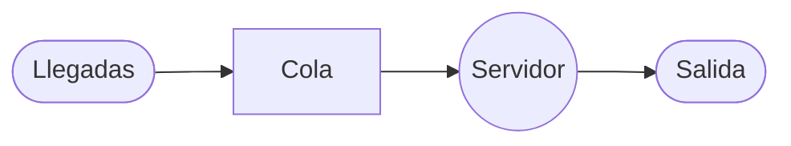
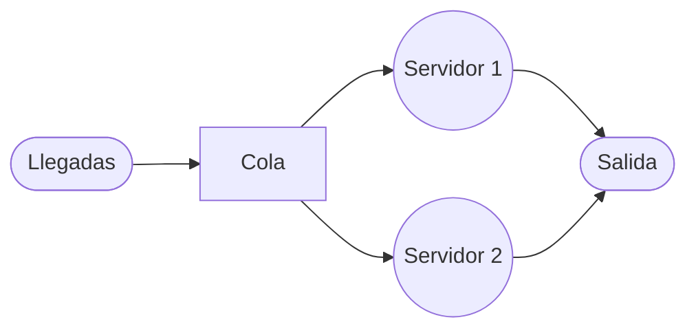

# Teoría de Colas

**Estructura**

1. **Cliente** $\longrightarrow$ Población finita / Población infinita
2. **Arribos** $\longrightarrow$ Distribución del cliente / Probabilidad de Poisson / Distribución Exponencial
3. **Tiempos de servicio** $\longrightarrow$ 1 servidor o múltiples servidores **FIFO** $\longrightarrow$ First in, First out (Primero en entrar - Primero en salir)

---

## Estructura de líneas de espera

1. (Gráfico: Fila $\longrightarrow$ Servicio) $\longrightarrow$ **Consulta de un dentista**
2. (Gráfico: Fila $\longrightarrow$ Fase 1 $\longrightarrow$ $\bigcirc$ $\longrightarrow$ Fase 2) $\longrightarrow$ **Venta de Hamburguesas Mcdonalds**
3. (Gráfico: Fila con 3 flechas hacia Servicio 1, 2 y 3) $\longrightarrow$ **Cajeros automáticos de un Banco**
4. (Gráfico: Fila con 2 flechas hacia dos flujos de Fase 1 $\longrightarrow$ Fase 2) $\longrightarrow$ **Matriculación Universitaria**

---

## Modelo de Colas

|Tipo|# de canales|Ritmo Llegada|Tiempo de servicio|Número de Fases|Disciplina de la cola|
|:--|:--|:--|:--|:--|:--|
|**Modelo A**|Sistema de canal único (M/M/1)|Poisson|Exponencial|Una|FIFO|
|**Modelo B**|Multicanal (M/M/S)|Poisson|Exponencial|Una|FIFO|
|**Modelo C**|Servicio constante (M/D/1)|Poisson|Constante|Una|FIFO|

---

## Modelo A : M/M/1

- **M:** Markoviana (Poisson)
- **M:** Markoviana (Exponencial)
- **N:** 1, 2, 3, ... n $\longrightarrow$ número de llegadas

**Elementos**

- $\lambda$: número promedio de arribos
- $\mu$: número promedio de gente
- $n$: número de unidades en el sistema

---

### Fórmulas Modelo A 

- $L_s$: número promedio de clientes $\longrightarrow$ $L_s = \frac{\lambda}{\mu - \lambda}$
- $\rho$: Factor de utilización $\longrightarrow$ $\rho = \frac{\lambda}{\mu}$
- $W_s$: Tiempo promedio de una unidad que permanece en el sistema $\longrightarrow$ $W_s = \frac{1}{\mu - \lambda}$

- $L_q$: Número promedio de unidades en cola $\longrightarrow$ $L_q = \frac{\lambda^2}{\mu(\mu - \lambda)}$
- $W_q$: Tiempo promedio que se espera en la cola $\longrightarrow$ $W_q = \frac{\lambda}{\mu(\mu - \lambda)}$
- $P_n$: Probabilidad de que "n" clientes estén en el sistema $\longrightarrow$ $P_n = (1 - \frac{\lambda}{\mu}) \cdot (\frac{\lambda}{\mu})^n$

- $P_{n > k}$: Probabilidad que más "k" unidades estén en el sistema $\longrightarrow$ $P_{n > k} = (\frac{\lambda}{\mu})^{k+1}$

---

### Ejemplo Modelo A

**Ejemplo:** Un banco está considerando abrir un servicio para que los clientes paguen desde su automóvil. Se estima que los clientes llegarán a una tasa promedio ($\lambda$) de 15 por hora. El cajero que trabajará en la ventanilla puede atender a los clientes a un ritmo de uno cada tres minutos ($\mu$).

a) La utilización promedio del cajero. 
b) El número promedio de clientes en la línea de espera. 
c) El número promedio de clientes en el sistema. 
d) El tiempo promedio de la espera en la fila. 
e) El tiempo promedio de espera en el sistema.

**Resolución:**

 $\lambda = 15$ 
 
 Para $\mu$:
1 cliente $\longrightarrow$ 3 min;
$x \longrightarrow$ 60 min. 

$x = \frac{60 min \cdot 1 cliente}{3 min} = 20$ clientes por hora. 

$\mu = 20$.

- **a)** $\rho = \frac{\lambda}{\mu} = \frac{15}{20} = 0,75 \leadsto 75%$
- **b)** $L_q = \frac{\lambda^2}{\mu(\mu - \lambda)} = \frac{(15)^2}{20(20 - 15)} = 2,25$ clientes $\cong 2$
- **c)** $L_s = \frac{\lambda}{\mu - \lambda} = \frac{15}{20 - 15} = 3$ clientes
- **d)** $W_q = \frac{\lambda}{\mu(\mu - \lambda)} = \frac{15}{20(20 - 15)} = 0,15$ [horas] $\leadsto 9$ [min]
- **e)** $W_s = \frac{1}{\mu - \lambda} = \frac{1}{20 - 15} = 0,2$ [horas] $\leadsto 12$ [min]

---

## Modelo B: M/M/s

**Modelo multicanal**

- $\lambda$: Velocidad de llegadas
- $\mu$: Velocidad del servidor
- $s$: número de servidores

**Elementos**

- $P_o$: Probabilidad de que ningún cliente se encuentre en el sistema

---

### Fórmulas Modelo B

- $P_o = \frac{1}{\sum_{n=0}^{s-1} \frac{(\lambda / \mu)^n}{n!} + \frac{(\lambda / \mu)^s}{s!} \left( \frac{1}{1 - (\lambda / s \cdot \mu)} \right)}$
- $L_s$: Número promedio de unidades en el sistema $\longrightarrow$ $L_s = \frac{\lambda \mu (\lambda / \mu)^s P_o}{(s - 1)! (s \mu - \lambda)^2} + \frac{\lambda}{\mu}$

- **Tiempo promedio de unidades en el sistema:** $W_s = \frac{L_s}{\lambda}$
- **Tiempo de espera en la fila:** $W_q = W_s - \frac{1}{\mu}$

---

### Ejemplo Modelo B

**Ejemplo:** En un hospital llegan 10 pacientes cada hora ($\lambda$) y un solo servidor puede atender 8 pacientes cada hora ($\mu$). Si se colocan dos servidores determine:

a) Probabilidad de que ningún cliente se encuentre en el sistema. 
b) Número promedio de unidades en el sistema. 

**Datos:** $\lambda = 10$, $\mu = 8$, $s = 2$.

**Resolución:**

- **a)** $P_o = \frac{1}{\frac{(10/8)^0}{0!} + \frac{(10/8)^1}{1!} + \frac{(10/8)^2}{2!} \left( \frac{1}{1 - (10/16)} \right)} = \frac{3}{13} = 0,231 \leadsto 23%$
- **b)** $L_s = \frac{10 \cdot 8 (10/8)^2 (0,231)}{(2 - 1)! (2 \cdot 8 - 10)^2} + \frac{10}{8} = 2,052$ # pacientes $\cong 2$

---

## Modelo constante (M/D/1)

### Fórmulas Modelo C
**Elementos**

- **Longitud media de la cola:** $L_q = \frac{\lambda^2}{2\mu(\mu - \lambda)}$
- **Tiempo medio de espera en la cola:** $W_q = \frac{\lambda}{2\mu(\mu - \lambda)}$
- **Número medio de clientes en el sistema:** $L_s = L_q + \frac{\lambda}{\mu}$
- **Tiempo medio de espera en el sistema:** $W_s = W_q + \frac{1}{\mu}$

---

### Ejemplo Modelo C

**Ejemplo:** Un lavado automático de autos con línea de remolque de manera que los autos se mueven a través de la instalación en una línea de ensamble. Suponga que el lavado de autos se puede hacer con un auto cada 5 minutos ($\mu$) (Un auto cada cinco minutos da una tasa de 12 autos por hora) y que la tasa de llegadas ($\lambda$) es de 9 autos. 

a) Calcule la longitud media de la cola. 
b) Tiempo de espera en la cola.

**Resolución:** $\lambda = 9$, $\mu = 12$

- **a)** $L_q = \frac{\lambda^2}{2\mu(\mu - \lambda)} = \frac{9^2}{2(12)(12 - 9)} = 1,125$ autos $\cong 1$
- **b)** $W_q = \frac{\lambda}{2\mu(\mu - \lambda)} = \frac{9}{2(12)(12 - 9)} = 0,125$ horas