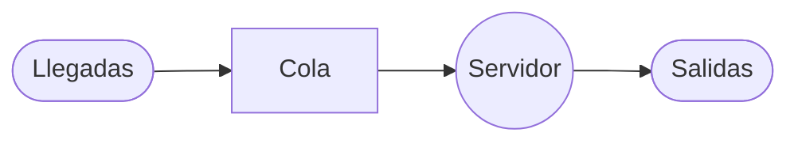

7777

Este ejercicio se identifica como un problema de **Teoría de Colas** correspondiente al **Modelo C (M/D/1)**, caracterizado por tener tiempos de servicio constantes (determinísticos). Esto se deduce del enunciado al mencionar una "línea de remolque" y "línea de ensamble", lo que implica que cada auto recibe exactamente la misma cantidad de tiempo de atención sin variaciones aleatorias.

### Estructura del Sistema de Colas

De acuerdo con la descripción, se trata de una estructura de **canal único y fase única**. Los autos llegan, forman una fila común, pasan por la línea de lavado (servidor) y salen del sistema.

---

### Resolución del Ejercicio

#### 1. Identificación de los datos y modelo

- **Tasa promedio de llegadas ($\lambda$):** $9$ autos por hora.
- **Tasa promedio de servicio ($\mu$):** $1$ auto cada $5$ minutos. Para estandarizar las unidades a horas: $$\mu = \frac{60 \text{ min}}{5 \text{ min/auto}} = 12 \text{ autos por hora}.$$
- **Modelo aplicado:** **M/D/1** (Llegadas Poisson, Servicio Determinado, 1 Servidor).

#### 2. Cálculos Paso a Paso

**a) Longitud media de la cola ($L_q$)** Representa el número promedio de autos que están esperando físicamente antes de entrar a la línea de lavado.

- **Fórmula:** $L_q = \frac{\lambda^2}{2\mu(\mu - \lambda)}$.
- **Sustitución:** $L_q = \frac{9^2}{2(12)(12 - 9)}$.
- **Operaciones parciales:**
    1. $9^2 = 81$.
    2. $2 \times 12 \times (3) = 72$.
- **Resultado:** $L_q = \frac{81}{72} = \mathbf{1.125 \text{ autos}}$.
- **Redondeo:** Siguiendo criterios prácticos, se aproxima a **$1$ auto**.

**b) Tiempo medio de espera en la cola ($W_q$)** Es el tiempo promedio que un auto permanece exclusivamente en la fila antes de que comience su proceso de lavado.

- **Fórmula:** $W_q = \frac{\lambda}{2\mu(\mu - \lambda)}$.
- **Sustitución:** $W_q = \frac{9}{2(12)(12 - 9)}$.
- **Operación:** $W_q = \frac{9}{72} = \mathbf{0.125 \text{ horas}}$.
- **Conversión a minutos:** $0.125 \times 60 \text{ min} = \mathbf{7.5 \text{ minutos}}$.

**c) Número medio de clientes en el sistema ($L_s$)** Es la cantidad promedio de autos en toda la instalación (los que esperan en la cola más el que se está lavando).

- **Fórmula:** $L_s = L_q + \frac{\lambda}{\mu}$.
- **Sustitución:** $L_s = 1.125 + \frac{9}{12}$.
- **Operación:** $L_s = 1.125 + 0.75 = \mathbf{1.875 \text{ autos}}$.
- **Redondeo:** Se aproxima al entero más cercano, es decir, **$2$ autos**.

**d) Tiempo medio de espera en el sistema ($W_s$)** Es el tiempo total desde que el auto llega a la instalación hasta que sale completamente limpio.

- **Fórmula:** $W_s = W_q + \frac{1}{\mu}$.
- **Sustitución:** $W_s = 0.125 + \frac{1}{12}$.
- **Operación:** $W_s = 0.125 + 0.0833 = \mathbf{0.2083 \text{ horas}}$.
- **Conversión a minutos:** $0.2083 \times 60 \text{ min} = \mathbf{12.5 \text{ minutos}}$.

---

### Resumen de Resultados Redondeados

|Medida|Valor Calculado|Valor Redondeado|
|:--|:--|:--|
|**Longitud media de la cola ($L_q$)**|$1.125$ autos|**$1$ auto**|
|**Tiempo de espera en la cola ($W_q$)**|$7.5$ minutos|**$8$ minutos**|
|**Número de clientes en el sistema ($L_s$)**|$1.875$ autos|**$2$ autos**|
|**Tiempo de espera en el sistema ($W_s$)**|$12.5$ minutos|**$13$ minutos**|

**Razonamiento del modelo:** Al comparar estos resultados con un modelo M/M/1 (donde el servicio es aleatorio), se observa que la constante en el servicio del M/D/1 reduce el tiempo de espera a la mitad, lo que hace que la línea de ensamble sea mucho más eficiente para el flujo de clientes.

66666
 Este ejercicio se identifica como un problema de **Teoría de Colas** del tipo **Multicanal (Modelo B: M/M/s)**. El sistema describe llegadas de clientes que forman una sola fila para ser atendidos por cualquiera de los dos servidores disponibles.

### Estructura del Sistema de Colas

Se trata de un sistema de **múltiples canales (2 servidores) y una sola fase**, donde los pacientes llegan a una cola común y pasan al primer servidor que quede libre.

---

### Resolución del Ejercicio

#### 1. Identificación de los datos y modelo

- **Tasa promedio de llegadas ($\lambda$):** $10$ clientes por hora.
- **Tasa promedio de servicio ($\mu$):** $8$ clientes por hora (por servidor).
- **Número de servidores ($s$):** $2$.
- **Modelo:** **M/M/2** (Modelo B).

**Verificación de estabilidad:** Para que el sistema alcance un estado estable, se debe cumplir que $\lambda < s\mu$: $10 < 2(8) \Rightarrow 10 < 16$. El sistema es estable.

#### 2. Cálculos Paso a Paso

**a) Probabilidad de que ningún cliente se encuentre en el sistema ($P_0$)** Esta fórmula determina la probabilidad de que los servidores estén inactivos.

- **Fórmula:** $P_o = \frac{1}{\sum_{n=0}^{s-1} \frac{(\lambda / \mu)^n}{n!} + \frac{(\lambda / \mu)^s}{s!} \left( \frac{1}{1 - (\lambda / s \mu)} \right)}$
- **Sustitución de valores:** $P_o = \frac{1}{\left[ \frac{(10/8)^0}{0!} + \frac{(10/8)^1}{1!} \right] + \frac{(10/8)^2}{2!} \left( \frac{1}{1 - (10 / 16)} \right)}$
- **Operaciones parciales:**
    1. $\frac{1.25^0}{1} + \frac{1.25^1}{1} = 1 + 1.25 = 2.25$
    2. $\frac{1.5625}{2} \left( \frac{1}{1 - 0.625} \right) = 0.78125 \left( \frac{1}{0.375} \right) = 0.78125 \times 2.6667 = 2.0833$
    3. $\sum = 2.25 + 2.0833 = 4.3333$
- **Resultado:** $P_o = \frac{1}{4.3333} = \mathbf{0.2307}$ (aproximadamente **$23.1%$**).

**b) Número promedio de unidades en el sistema ($L_s$)** Representa la cantidad total de clientes tanto en fila como en atención.

- **Fórmula:** $L_s = \frac{\lambda \mu (\lambda / \mu)^s P_o}{(s - 1)! (s \mu - \lambda)^2} + \frac{\lambda}{\mu}$
- **Sustitución:** $L_s = \frac{(10)(8)(1.25)^2(0.231)}{(2-1)!(16-10)^2} + \frac{10}{8}$
- **Operaciones parciales:**
    1. $\frac{80 \times 1.5625 \times 0.231}{1 \times 36} = \frac{28.875}{36} = 0.802$
    2. $L_s = 0.802 + 1.25 = 2.052$
- **Resultado:** $L_s = \mathbf{2.052 \text{ clientes}}$.

**c) Tiempo promedio en el que una unidad está dentro del sistema ($W_s$)** Es el tiempo total desde la llegada hasta la salida.

- **Fórmula:** $W_s = \frac{L_s}{\lambda}$
- **Sustitución:** $W_s = \frac{2.052}{10}$
- **Operación:** $W_s = 0.2052 \text{ horas}$
- **Conversión a minutos:** $0.2052 \times 60 \text{ min} = \mathbf{12.31 \text{ minutos}}$.

**d) Número de clientes en la fila ($L_q$)** Representa cuántos pacientes están esperando físicamente en la fila.

- **Fórmula:** $L_q = L_s - \frac{\lambda}{\mu}$
- **Sustitución:** $L_q = 2.052 - 1.25$
- **Resultado:** $L_q = \mathbf{0.802 \text{ clientes}}$.

**e) Tiempo de espera en la fila ($W_q$)** Es el tiempo que el paciente pasa exclusivamente esperando turno.

- **Fórmula:** $W_q = W_s - \frac{1}{\mu}$
- **Sustitución:** $W_q = 0.2052 - \frac{1}{8}$
- **Operación:** $W_q = 0.2052 - 0.125 = 0.0802 \text{ horas}$
- **Conversión a minutos:** $0.0802 \times 60 \text{ min} = \mathbf{4.81 \text{ minutos}}$.

---

### Resumen de Resultados

- **$P_0$:** $23.1%$ de probabilidad de que el hospital no tenga pacientes.
- **$L_s$:** En promedio hay $2.05$ personas en el hospital.
- **$W_s$:** Un paciente pasa un promedio de $12.3$ minutos en total.
- **$L_q$:** En promedio hay $0.80$ personas esperando en la fila.
- **$W_q$:** El tiempo de espera antes de ser atendido es de $4.8$ minutos.

55

Este ejercicio se identifica como un problema de **Teoría de Colas** debido a que describe un sistema de línea de espera con llegadas aleatorias de clientes y un tiempo de servicio determinado para ser atendidos por un servidor.

### Estructura del Sistema de Colas

De acuerdo con la descripción, se trata de un sistema de **canal único y fase única**, donde los clientes llegan a una fila, son atendidos por un solo cajero y luego abandonan el sistema.

---

### Resolución del Ejercicio

#### 1. Identificación de los datos y modelo

- **Patrón de llegadas:** Poisson.
- **Patrón de servicios:** Exponencial.
- **Número de servidores ($s$):** 1 (canal único).
- **Modelo:** **Modelo A (M/M/1)**.

**Parámetros del sistema:**

- **Tasa promedio de llegadas ($\lambda$):** $15$ clientes por hora.
- **Tasa promedio de servicio ($\mu$):** Se atiende 1 cliente cada 3 minutos. Debemos convertir esto a la misma unidad de tiempo (clientes por hora): $$\mu = \frac{60 \text{ min}}{3 \text{ min/cliente}} = 20 \text{ clientes por hora}.$$

#### 2. Cálculos Paso a Paso

**a) La utilización promedio del cajero ($\rho$)** Esta fórmula mide la fracción del tiempo que el servidor está ocupado.

- **Fórmula:** $\rho = \frac{\lambda}{\mu}$
- **Sustitución:** $\rho = \frac{15}{20}$
- **Operación:** $\rho = 0.75$
- **Resultado:** El cajero está ocupado el **$75\%$** del tiempo.

**b) El número promedio de clientes en la línea de espera ($L_q$)** Representa la cantidad de unidades que están físicamente en la fila esperando ser atendidas.

- **Fórmula:** $L_q = \frac{\lambda^2}{\mu(\mu - \lambda)}$
- **Sustitución:** $L_q = \frac{15^2}{20(20 - 15)}$
- **Operaciones parciales:**
    - $15^2 = 225$
    - $20(5) = 100$
- **Resultado:** $L_q = \frac{225}{100} = \mathbf{2.25 \text{ clientes}}$.

**c) El número promedio de clientes en el sistema ($L_s$)** Es el número total de clientes en la instalación, incluyendo los que esperan y el que está siendo atendido.

- **Fórmula:** $L_s = \frac{\lambda}{\mu - \lambda}$
- **Sustitución:** $L_s = \frac{15}{20 - 15}$
- **Operación:** $L_s = \frac{15}{5}$
- **Resultado:** $L_s = \mathbf{3 \text{ clientes}}$.

**d) El tiempo promedio de espera en la fila ($W_q$)** Es el tiempo que un cliente pasa exclusivamente esperando antes de que comience su servicio.

- **Fórmula:** $W_q = \frac{\lambda}{\mu(\mu - \lambda)}$
- **Sustitución:** $W_q = \frac{15}{20(20 - 15)}$
- **Operación:** $W_q = \frac{15}{100} = 0.15 \text{ horas}$
- **Conversión a minutos:** $0.15 \times 60 \text{ min} = \mathbf{9 \text{ minutos}}$.

**e) El tiempo promedio de espera en el sistema ($W_s$)** Es el tiempo total desde que el cliente llega hasta que termina de ser atendido (espera + servicio).

- **Fórmula:** $W_s = \frac{1}{\mu - \lambda}$
- **Sustitución:** $W_s = \frac{1}{20 - 15}$
- **Operación:** $W_s = \frac{1}{5} = 0.2 \text{ horas}$
- **Conversión a minutos:** $0.2 \times 60 \text{ min} = \mathbf{12 \text{ minutos}}$.

---

### Verificación de los resultados

Podemos verificar la relación de Little ($L = \lambda W$):

- $L_s = \lambda \times W_s \rightarrow 3 = 15 \times 0.2 \rightarrow 3 = 3$ (Correcto).
- $L_q = \lambda \times W_q \rightarrow 2.25 = 15 \times 0.15 \rightarrow 2.25 = 2.25$ (Correcto).
- $W_s = W_q + (1/\mu) \rightarrow 12 \text{ min} = 9 \text{ min} + 3 \text{ min} \rightarrow 12 = 12$ (Correcto).

---
---

#### 3. Verificación de la Matriz

Comprobamos que la matriz sea estocástica (suma de filas igual a la unidad):

- Fila 1: $0.1 + 0.3 + 0.6 = 1.0$ (Correcto)
- Fila 2: $0.2 + 0.2 + 0.6 = 1.0$ (Correcto)
- Fila 3: $0.2 + 0.4 + 0.4 = 1.0$ (Correcto)

### Conclusión del Modelado

El problema ha sido modelado satisfactoriamente como una cadena de Markov homogénea de tres estados, donde la matriz $P$ define completamente el comportamiento del agente comercial a corto y largo plazo.

