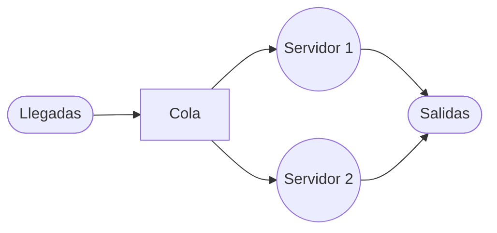
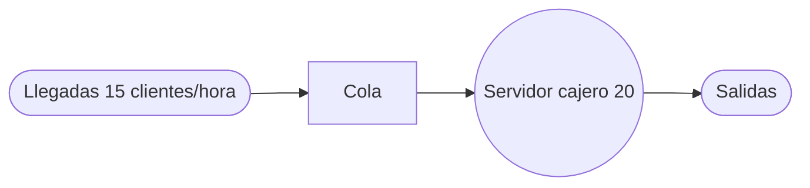

66666
 Este ejercicio se identifica como un problema de **Teoría de Colas** del tipo **Multicanal (Modelo B: M/M/s)**. El sistema describe llegadas de clientes que forman una sola fila para ser atendidos por cualquiera de los dos servidores disponibles.

### Estructura del Sistema de Colas

Se trata de un sistema de **múltiples canales (2 servidores) y una sola fase**, donde los pacientes llegan a una cola común y pasan al primer servidor que quede libre.



---

### Resolución del Ejercicio

#### 1. Identificación de los datos y modelo

- **Tasa promedio de llegadas ($\lambda$):** $10$ clientes por hora.
- **Tasa promedio de servicio ($\mu$):** $8$ clientes por hora (por servidor).
- **Número de servidores ($s$):** $2$.
- **Modelo:** **M/M/2** (Modelo B).

**Verificación de estabilidad:** Para que el sistema alcance un estado estable, se debe cumplir que $\lambda < s\mu$: $10 < 2(8) \Rightarrow 10 < 16$. El sistema es estable.

#### 2. Cálculos Paso a Paso

**a) Probabilidad de que ningún cliente se encuentre en el sistema ($P_0$)** Esta fórmula determina la probabilidad de que los servidores estén inactivos.

- **Fórmula:** $P_o = \frac{1}{\sum_{n=0}^{s-1} \frac{(\lambda / \mu)^n}{n!} + \frac{(\lambda / \mu)^s}{s!} \left( \frac{1}{1 - (\lambda / s \mu)} \right)}$
- **Sustitución de valores:** $P_o = \frac{1}{\left[ \frac{(10/8)^0}{0!} + \frac{(10/8)^1}{1!} \right] + \frac{(10/8)^2}{2!} \left( \frac{1}{1 - (10 / 16)} \right)}$
- **Operaciones parciales:**
    1. $\frac{1.25^0}{1} + \frac{1.25^1}{1} = 1 + 1.25 = 2.25$
    2. $\frac{1.5625}{2} \left( \frac{1}{1 - 0.625} \right) = 0.78125 \left( \frac{1}{0.375} \right) = 0.78125 \times 2.6667 = 2.0833$
    3. $\sum = 2.25 + 2.0833 = 4.3333$
- **Resultado:** $P_o = \frac{1}{4.3333} = \mathbf{0.2307}$ (aproximadamente **$23.1%$**).

**b) Número promedio de unidades en el sistema ($L_s$)** Representa la cantidad total de clientes tanto en fila como en atención.

- **Fórmula:** $L_s = \frac{\lambda \mu (\lambda / \mu)^s P_o}{(s - 1)! (s \mu - \lambda)^2} + \frac{\lambda}{\mu}$
- **Sustitución:** $L_s = \frac{(10)(8)(1.25)^2(0.231)}{(2-1)!(16-10)^2} + \frac{10}{8}$
- **Operaciones parciales:**
    1. $\frac{80 \times 1.5625 \times 0.231}{1 \times 36} = \frac{28.875}{36} = 0.802$
    2. $L_s = 0.802 + 1.25 = 2.052$
- **Resultado:** $L_s = \mathbf{2.052 \text{ clientes}}$.

**c) Tiempo promedio en el que una unidad está dentro del sistema ($W_s$)** Es el tiempo total desde la llegada hasta la salida.

- **Fórmula:** $W_s = \frac{L_s}{\lambda}$
- **Sustitución:** $W_s = \frac{2.052}{10}$
- **Operación:** $W_s = 0.2052 \text{ horas}$
- **Conversión a minutos:** $0.2052 \times 60 \text{ min} = \mathbf{12.31 \text{ minutos}}$.

**d) Número de clientes en la fila ($L_q$)** Representa cuántos pacientes están esperando físicamente en la fila.

- **Fórmula:** $L_q = L_s - \frac{\lambda}{\mu}$
- **Sustitución:** $L_q = 2.052 - 1.25$
- **Resultado:** $L_q = \mathbf{0.802 \text{ clientes}}$.

**e) Tiempo de espera en la fila ($W_q$)** Es el tiempo que el paciente pasa exclusivamente esperando turno.

- **Fórmula:** $W_q = W_s - \frac{1}{\mu}$
- **Sustitución:** $W_q = 0.2052 - \frac{1}{8}$
- **Operación:** $W_q = 0.2052 - 0.125 = 0.0802 \text{ horas}$
- **Conversión a minutos:** $0.0802 \times 60 \text{ min} = \mathbf{4.81 \text{ minutos}}$.

---

### Resumen de Resultados

- **$P_0$:** $23.1%$ de probabilidad de que el hospital no tenga pacientes.
- **$L_s$:** En promedio hay $2.05$ personas en el hospital.
- **$W_s$:** Un paciente pasa un promedio de $12.3$ minutos en total.
- **$L_q$:** En promedio hay $0.80$ personas esperando en la fila.
- **$W_q$:** El tiempo de espera antes de ser atendido es de $4.8$ minutos.


55


Este ejercicio se identifica como un problema de **Teoría de Colas** debido a que describe un sistema de línea de espera con llegadas aleatorias de clientes y un tiempo de servicio determinado para ser atendidos por un servidor.

### Estructura del Sistema de Colas

De acuerdo con la descripción, se trata de un sistema de **canal único y fase única**, donde los clientes llegan a una fila, son atendidos por un solo cajero y luego abandonan el sistema.



---

### Resolución del Ejercicio

#### 1. Identificación de los datos y modelo

- **Patrón de llegadas:** Poisson.
- **Patrón de servicios:** Exponencial.
- **Número de servidores ($s$):** 1 (canal único).
- **Modelo:** **Modelo A (M/M/1)**.

**Parámetros del sistema:**

- **Tasa promedio de llegadas ($\lambda$):** $15$ clientes por hora.
- **Tasa promedio de servicio ($\mu$):** Se atiende 1 cliente cada 3 minutos. Debemos convertir esto a la misma unidad de tiempo (clientes por hora): $$\mu = \frac{60 \text{ min}}{3 \text{ min/cliente}} = 20 \text{ clientes por hora}.$$

#### 2. Cálculos Paso a Paso

**a) La utilización promedio del cajero ($\rho$)** Esta fórmula mide la fracción del tiempo que el servidor está ocupado.

- **Fórmula:** $\rho = \frac{\lambda}{\mu}$
- **Sustitución:** $\rho = \frac{15}{20}$
- **Operación:** $\rho = 0.75$
- **Resultado:** El cajero está ocupado el **$75\%$** del tiempo.

**b) El número promedio de clientes en la línea de espera ($L_q$)** Representa la cantidad de unidades que están físicamente en la fila esperando ser atendidas.

- **Fórmula:** $L_q = \frac{\lambda^2}{\mu(\mu - \lambda)}$
- **Sustitución:** $L_q = \frac{15^2}{20(20 - 15)}$
- **Operaciones parciales:**
    - $15^2 = 225$
    - $20(5) = 100$
- **Resultado:** $L_q = \frac{225}{100} = \mathbf{2.25 \text{ clientes}}$.

**c) El número promedio de clientes en el sistema ($L_s$)** Es el número total de clientes en la instalación, incluyendo los que esperan y el que está siendo atendido.

- **Fórmula:** $L_s = \frac{\lambda}{\mu - \lambda}$
- **Sustitución:** $L_s = \frac{15}{20 - 15}$
- **Operación:** $L_s = \frac{15}{5}$
- **Resultado:** $L_s = \mathbf{3 \text{ clientes}}$.

**d) El tiempo promedio de espera en la fila ($W_q$)** Es el tiempo que un cliente pasa exclusivamente esperando antes de que comience su servicio.

- **Fórmula:** $W_q = \frac{\lambda}{\mu(\mu - \lambda)}$
- **Sustitución:** $W_q = \frac{15}{20(20 - 15)}$
- **Operación:** $W_q = \frac{15}{100} = 0.15 \text{ horas}$
- **Conversión a minutos:** $0.15 \times 60 \text{ min} = \mathbf{9 \text{ minutos}}$.

**e) El tiempo promedio de espera en el sistema ($W_s$)** Es el tiempo total desde que el cliente llega hasta que termina de ser atendido (espera + servicio).

- **Fórmula:** $W_s = \frac{1}{\mu - \lambda}$
- **Sustitución:** $W_s = \frac{1}{20 - 15}$
- **Operación:** $W_s = \frac{1}{5} = 0.2 \text{ horas}$
- **Conversión a minutos:** $0.2 \times 60 \text{ min} = \mathbf{12 \text{ minutos}}$.

---

### Verificación de los resultados

Podemos verificar la relación de Little ($L = \lambda W$):

- $L_s = \lambda \times W_s \rightarrow 3 = 15 \times 0.2 \rightarrow 3 = 3$ (Correcto).
- $L_q = \lambda \times W_q \rightarrow 2.25 = 15 \times 0.15 \rightarrow 2.25 = 2.25$ (Correcto).
- $W_s = W_q + (1/\mu) \rightarrow 12 \text{ min} = 9 \text{ min} + 3 \text{ min} \rightarrow 12 = 12$ (Correcto).


---
---

4444

Este ejercicio se identifica como una **Cadena de Markov en tiempo discreto** porque el sistema evoluciona a través de un número finito de estados (las ciudades A, B y C), en intervalos de tiempo regulares (un día), y la probabilidad de desplazarse a la siguiente ciudad depende únicamente de la ciudad donde se encuentra el agente en el día actual.

### Diagrama de la Cadena de Markov

```tikz
\begin{document}
\begin{tikzpicture}
% Definición de estados (N=3, posicionamiento circular según guía)
\node[draw,circle,thick,color=orange] (A) at (6,11) {A};
\node[draw,circle,thick,color=pink] (B) at (10,4) {B};
\node[draw,circle,thick,color=lime] (C) at (2,4) {C};

% Bucles (Permanencia en el estado, hacia afuera)
\draw[->,ultra thick,orange] (A) .. controls (5,13) and (7,13) .. node[above] {$0.1$} (A);
\draw[->,ultra thick,pink] (B) .. controls (11,3) and (11,5) .. node[right] {$0.2$} (B);
\draw[->,ultra thick,lime] (C) .. controls (1,5) and (1,3) .. node[left] {$0.4$} (C);

% Flechas de transición desde A
\draw[->,very thick,orange] (A) to[bend left=20] node[pos=0.3, right] {$0.3$} (B);
\draw[->,very thick,orange] (A) to[bend right=20] node[pos=0.3, left] {$0.6$} (C);

% Flechas de transición desde B
\draw[->,very thick,pink] (B) to[bend left=20] node[pos=0.3, below] {$0.6$} (C);
\draw[->,very thick,pink] (B) to[bend left=20] node[pos=0.2, left] {$0.2$} (A);

% Flechas de transición desde C
\draw[->,very thick,lime] (C) to[bend left=20] node[pos=0.2, right] {$0.2$} (A);
\draw[->,very thick,lime] (C) to[bend left=20] node[pos=0.3, above] {$0.4$} (B);

\end{tikzpicture}
\end{document}
```

---

### Resolución del Ejercicio

#### 1. Identificación de los datos del problema

El sistema presenta tres estados posibles que representan la ciudad donde el agente pernocta:

- **Estado 1 ($A$):** Ciudad A.
- **Estado 2 ($B$):** Ciudad B.
- **Estado 3 ($C$):** Ciudad C.

Las probabilidades de transición dadas son las siguientes:

- **Desde A:** Se queda en A con $0.1$, va a B con $0.3$ y va a C con $0.6$.
- **Desde B:** Se queda en B con $0.2$, va a C con $0.6$ y va a A con $0.2$.
- **Desde C:** Se queda en C con $0.4$, va a B con $0.4$ y va a A con $0.2$.

#### 2. Construcción de la matriz de probabilidades de transición ($P$)

La matriz se organiza de forma que cada fila represente el estado actual y cada columna el estado siguiente. Una propiedad fundamental es que la suma de las probabilidades de cada renglón debe ser igual a 1 ($100%$ de las posibilidades de movimiento).

- **Renglón 1 (Origen A):** $P_{AA} = 0.1, P_{AB} = 0.3, P_{AC} = 0.6$.
- **Renglón 2 (Origen B):** $P_{BA} = 0.2, P_{BB} = 0.2, P_{BC} = 0.6$.
- **Renglón 3 (Origen C):** $P_{CA} = 0.2, P_{CB} = 0.4, P_{CC} = 0.4$.

La matriz de transición resultante es: $$P = \begin{bmatrix} 0.1 & 0.3 & 0.6 \ 0.2 & 0.2 & 0.6 \ 0.2 & 0.4 & 0.4 \end{bmatrix}$$

#### 3. Verificación de la Matriz

Comprobamos que la matriz sea estocástica (suma de filas igual a la unidad):

- Fila 1: $0.1 + 0.3 + 0.6 = 1.0$ (Correcto)
- Fila 2: $0.2 + 0.2 + 0.6 = 1.0$ (Correcto)
- Fila 3: $0.2 + 0.4 + 0.4 = 1.0$ (Correcto)

### Conclusión del Modelado

El problema ha sido modelado satisfactoriamente como una cadena de Markov homogénea de tres estados, donde la matriz $P$ define completamente el comportamiento del agente comercial a corto y largo plazo.


---
---

33333

Este ejercicio se identifica como una **Cadena de Markov en tiempo discreto** porque el sistema evoluciona a través de un número finito de estados (las posibles composiciones de las bolas en la urna) y la probabilidad de transición al siguiente estado depende únicamente de la composición actual y de las reglas fijas establecidas (propiedad de Markov).

### 1. Identificación de Estados y Datos

Existen dos bolas en la urna. Denotaremos los posibles colores como:

- **U:** Sin pintar (Unpainted).
- **R:** Roja (Red).
- **N:** Negra (Black/Negra).

Los estados del sistema se definen por la combinación de colores de las dos bolas (el orden no importa):

- **Estado 0 ($S_0$):** ${U, U}$ — Dos bolas sin pintar.
- **Estado 1 ($S_1$):** ${R, U}$ — Una bola roja y una sin pintar.
- **Estado 2 ($S_2$):** ${N, U}$ — Una bola negra y una sin pintar.
- **Estado 3 ($S_3$):** ${R, R}$ — Dos bolas rojas.
- **Estado 4 ($S_4$):** ${N, N}$ — Dos bolas negras.
- **Estado 5 ($S_5$):** ${R, N}$ — Una bola roja y una negra.

---

### Diagrama de la Cadena de Markov

```tikz
\begin{document}
\begin{tikzpicture}
% Definición de estados (N=6, posicionamiento circular)
\node[draw,circle,thick,color=orange] (S0) at (90:4) {$S_0$};
\node[draw,circle,thick,color=pink] (S1) at (30:4) {$S_1$};
\node[draw,circle,thick,color=lime] (S2) at (330:4) {$S_2$};
\node[draw,circle,thick,color=purple] (S3) at (270:4) {$S_3$};
\node[draw,circle,thick,color=teal] (S4) at (210:4) {$S_4$};
\node[draw,circle,thick,color=magenta] (S5) at (150:4) {$S_5$};

% Transiciones desde S0 (0.5 a S1, 0.5 a S2)
\draw[->,very thick,orange] (S0) to[bend left=15] node[pos=0.3, right] {$0.5$} (S1);
\draw[->,very thick,orange] (S0) to[bend right=15] node[pos=0.3, left] {$0.5$} (S2);

% Transiciones desde S1 (0.5 a S2, 0.25 a S3, 0.25 a S5)
\draw[->,very thick,pink] (S1) to[bend left=15] node[pos=0.2, right] {$0.5$} (S2);
\draw[->,very thick,pink] (S1) to[bend left=15] node[pos=0.2, right] {$0.25$} (S3);
\draw[->,very thick,pink] (S1) to[bend right=15] node[pos=0.2, above] {$0.25$} (S5);

% Transiciones desde S2 (0.5 a S1, 0.25 a S4, 0.25 a S5)
\draw[->,very thick,lime] (S2) to[bend left=15] node[pos=0.2, left] {$0.5$} (S1);
\draw[->,very thick,lime] (S2) to[bend left=15] node[pos=0.2, left] {$0.25$} (S4);
\draw[->,very thick,lime] (S2) to[bend left=15] node[pos=0.2, below] {$0.25$} (S5);

% Transiciones desde S3 (1.0 a S5)
\draw[->,very thick,purple] (S3) to[bend right=15] node[pos=0.2, left] {$1.0$} (S5);

% Transiciones desde S4 (1.0 a S5)
\draw[->,very thick,teal] (S4) to[bend left=15] node[pos=0.2, left] {$1.0$} (S5);

% Transiciones desde S5 (0.5 a S3, 0.5 a S4)
\draw[->,very thick,magenta] (S5) to[bend right=15] node[pos=0.2, left] {$0.5$} (S3);
\draw[->,very thick,magenta] (S5) to[bend left=15] node[pos=0.2, left] {$0.5$} (S4);

\end{tikzpicture}
\end{document}
```

---

### 2. Análisis de Probabilidades de Transición ($P_{ij}$)

Para cada estado, analizamos qué sucede al seleccionar una bola y lanzar la moneda ($H$: cara, $T$: cruz):

- **Desde $S_0$ ${U, U}$:**
    
    - Se elige una bola $U$ (probabilidad $1.0$).
    - Si moneda es $H$ (prob $0.5$): la bola se pinta de Rojo $\rightarrow {R, U}$ ($S_1$).
    - Si moneda es $T$ (prob $0.5$): la bola se pinta de Negro $\rightarrow {N, U}$ ($S_2$).
    - $P_{01} = 0.5$, $P_{02} = 0.5$.
- **Desde $S_1$ ${R, U}$:**
    
    - Elegir bola $U$ (prob $0.5$): Si moneda es $H$ ($0.5$), pasa a ${R, R}$ ($S_3$); si es $T$ ($0.5$), pasa a ${R, N}$ ($S_5$).
    - Elegir bola $R$ (prob $0.5$): Cambia a Negro independientemente de la moneda $\rightarrow {N, U}$ ($S_2$).
    - $P_{13} = 0.5 \times 0.5 = 0.25$; $P_{15} = 0.5 \times 0.5 = 0.25$; $P_{12} = 0.5$.
- **Desde $S_2$ ${N, U}$:**
    
    - Elegir bola $U$ (prob $0.5$): Si moneda es $H$ ($0.5$), pasa a ${N, R}$ ($S_5$); si es $T$ ($0.5$), pasa a ${N, N}$ ($S_4$).
    - Elegir bola $N$ (prob $0.5$): Cambia a Rojo independientemente de la moneda $\rightarrow {R, U}$ ($S_1$).
    - $P_{25} = 0.5 \times 0.5 = 0.25$; $P_{24} = 0.5 \times 0.5 = 0.25$; $P_{21} = 0.5$.
- **Desde $S_3$ ${R, R}$:**
    
    - Cualquier bola elegida es $R$ (prob $1.0$). Cambia a Negro $\rightarrow {R, N}$ ($S_5$).
    - $P_{35} = 1.0$.
- **Desde $S_4$ ${N, N}$:**
    
    - Cualquier bola elegida es $N$ (prob $1.0$). Cambia a Rojo $\rightarrow {N, R}$ ($S_5$).
    - $P_{45} = 1.0$.
- **Desde $S_5$ ${R, N}$:**
    
    - Elegir bola $R$ (prob $0.5$): Cambia a Negro $\rightarrow {N, N}$ ($S_4$).
    - Elegir bola $N$ (prob $0.5$): Cambia a Rojo $\rightarrow {R, R}$ ($S_3$).
    - $P_{54} = 0.5$, $P_{53} = 0.5$.

---

### 3. Matriz de Probabilidades de Transición ($P$)

La matriz se construye colocando las probabilidades $P_{ij}$ donde la fila representa el estado actual y la columna el estado futuro.

$$P = \begin{bmatrix} 0 & 0.5 & 0.5 & 0 & 0 & 0 \ 0 & 0 & 0.5 & 0.25 & 0 & 0.25 \ 0 & 0.5 & 0 & 0 & 0.25 & 0.25 \ 0 & 0 & 0 & 0 & 0 & 1 \ 0 & 0 & 0 & 0 & 0 & 1 \ 0 & 0 & 0 & 0.5 & 0.5 & 0 \end{bmatrix}$$

### 4. Verificación

Comprobamos que la suma de cada renglón sea igual a 1 para asegurar que es una matriz estocástica válida:

- Fila 0: $0.5 + 0.5 = 1.0$ (Correcto)
- Fila 1: $0.5 + 0.25 + 0.25 = 1.0$ (Correcto)
- Fila 2: $0.5 + 0.25 + 0.25 = 1.0$ (Correcto)
- Fila 3: $1.0 = 1.0$ (Correcto)
- Fila 4: $1.0 = 1.0$ (Correcto)
- Fila 5: $0.5 + 0.5 = 1.0$ (Correcto)