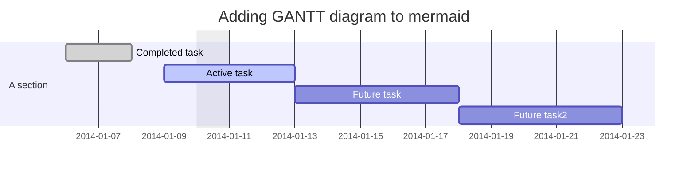
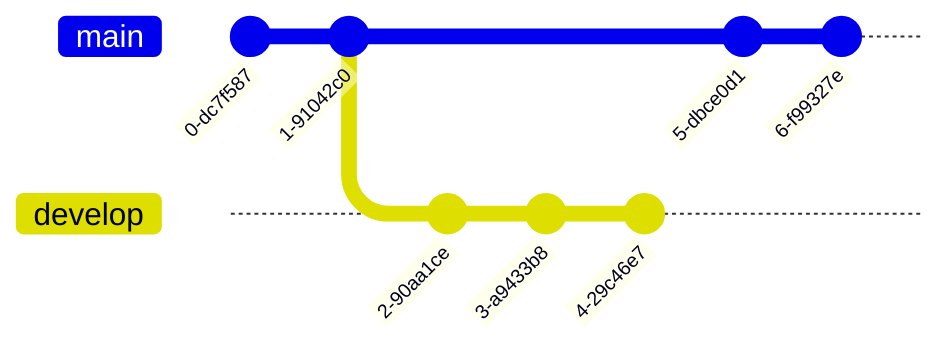
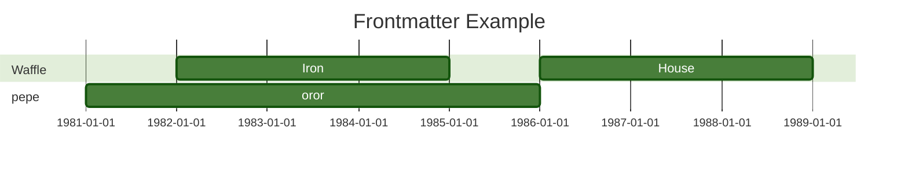

```mermaid
gantt
dateFormat  YYYY-MM-DD
title Adding GANTT diagram to mermaid
excludes weekdays 2014-01-10

section A section
Completed task            :done,    des1, 2014-01-06,2014-01-08
Active task               :active,  des2, 2014-01-09, 3d
Future task               :         des3, after des2, 5d
Future task2               :         des4, after des3, 5d

```

```mermaid
    gitGraph
       commit
       commit
       branch develop
       commit
       commit
       commit
       checkout main
       commit
       commit
```

```mermaid
---
title: Frontmatter Example
displayMode: compact
config:
  theme: forest
gantt:
    useWidth: 400
    compact: true
---
gantt
    section Waffle
        Iron  : 1982, 3y
        House : 1986, 3y
    
	section pepe
		oror : 1981, 5y
		

```