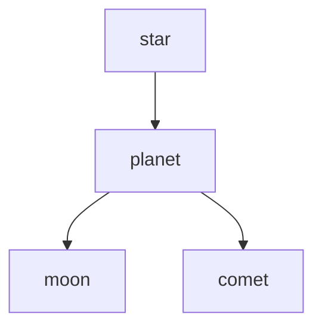

# Obsidian — Guía avanzada de sintaxis

> Sistema Galaxy: [[_galaxy-system]]
> Pendientes: [[_ToDo-system]]

Guía de referencia para sintaxis avanzada de Obsidian: Markdown avanzado, sintaxis propia de Obsidian y comportamiento de Claude frente a cada una. Cada entrada incluye ejemplo, variantes, edge cases y tres cajas de contexto.

---

## Índice

1. [Wikilinks — enlaces internos](#1-wikilinks--enlaces-internos)
2. [Embeds — contenido embebido](#2-embeds--contenido-embebido)
3. [Referencias de bloque](#3-referencias-de-bloque)
4. [YAML frontmatter](#4-yaml-frontmatter)
5. [Bloques de comentario](#5-bloques-de-comentario)
6. [Callouts](#6-callouts)
7. [Tablas](#7-tablas)
8. [LaTeX y matemáticas](#8-latex-y-matemáticas)
9. [Bloques de código](#9-bloques-de-código)
10. [Tareas y checkboxes](#10-tareas-y-checkboxes)
11. [Footnotes](#11-footnotes)
12. [Aliases y display text](#12-aliases-y-display-text)
13. [Tags](#13-tags)
14. [Dataview queries](#14-dataview-queries)

---

## 1. Wikilinks — enlaces internos

### Sintaxis básica

```
[[nombre-del-archivo]]
```

Crea un enlace interno a otra nota del vault. No necesita ruta completa si el nombre es único en el vault — Obsidian lo resuelve automáticamente.

**Ejemplo:**
```
Ver [[ETN806-T01-joint-pdf-definition]] para la definición completa.
```

### Variantes

```
[[nombre-del-archivo|texto visible]]
```
El texto después de `|` es lo que aparece en modo lectura. El link real sigue siendo al archivo original.

```
[[nombre-del-archivo#encabezado]]
```
Apunta a un encabezado específico dentro de la nota. El `#` se escribe sin espacios antes del nombre del encabezado.

```
[[nombre-del-archivo#^id-de-bloque]]
```
Apunta a un bloque específico identificado con `^id`. Ver sección 3.

```
[[carpeta/nombre-del-archivo]]
```
Ruta relativa explícita. Útil si hay dos archivos con el mismo nombre en carpetas distintas.

**Edge cases:**
- Si el archivo no existe todavía, Obsidian muestra el link en color diferente (rojo o gris según el tema) — es un link roto que se resolverá cuando crees el archivo.
- Si renombras un archivo, Obsidian actualiza automáticamente todos los `[[wikilinks]]` que apuntan a él — siempre que la opción "Automatically update internal links" esté activa en Settings → Files & Links.
- Dos archivos con el mismo nombre en carpetas distintas pueden causar ambigüedad. Obsidian elige uno — para control explícito usar la ruta completa.

> **¿Dónde y para qué usarlo en el vault?**
> En el cuerpo de cualquier nota galaxy para conectar conceptos. En el YAML (campos `orbits`, `star`, `concepts_used`, etc.) para metadatos. En el bloque `%%` al final de cada nota para que el grafo los detecte sin mostrarse en modo lectura.

> **¿Sirve en el Sistema Galaxy?**
> Sí — es la base del sistema. Los `[[wikilinks]]` dentro del bloque `%%` son los hilos gravitacionales del grafo. Los del YAML alimentan Dataview. Los del cuerpo crean la navegación entre notas.

> **¿Claude puede verlo?**
> Sí. Claude lee el texto plano del archivo `.md` y ve `[[nombre]]` como texto literal. Claude puede leer, crear y editar wikilinks. No puede "navegar" al archivo destino a menos que lo busque explícitamente por nombre en el vault.

---

## 2. Embeds — contenido embebido

### Sintaxis básica

```
![[nombre-del-archivo]]
```

El `!` antes del `[[` convierte el link en un embed — Obsidian renderiza el contenido del archivo referenciado directamente dentro de la nota actual, en modo lectura.

**Ejemplo:**
```
![[ETN806-T01-joint-pdf-definition]]
```
Muestra el contenido completo de esa nota embebido aquí.

### Variantes

```
![[nombre-del-archivo#encabezado]]
```
Embebe solo la sección que empieza en ese encabezado (hasta el siguiente encabezado del mismo nivel o superior).

```
![[nombre-del-archivo#^id-de-bloque]]
```
Embebe solo el bloque específico identificado con `^id`.

```
![[imagen.png]]
![[imagen.png|400]]
![[imagen.png|400x200]]
```
Embebe una imagen. El número después de `|` es el ancho en píxeles. `400x200` define ancho y alto.

```
![[archivo.pdf]]
![[archivo.pdf#page=5]]
```
Embebe un PDF. Con `#page=N` abre en esa página directamente (requiere PDF++).

```
![[archivo.excalidraw]]
```
Embebe un lienzo de Excalidraw como imagen SVG dentro de la nota.

**Edge cases:**
- Un embed de nota completa incluye todo su contenido — YAML no se muestra, pero los embeds anidados sí se renderizan (hasta cierto nivel de profundidad).
- Embeber un archivo muy pesado (PDF grande, Excalidraw complejo) puede ralentizar el renderizado de la nota.
- `![[archivo#encabezado]]` solo embebe desde ese encabezado hasta el siguiente del mismo nivel — si quieres toda una sección con sub-secciones, el comportamiento puede variar.

> **¿Dónde y para qué usarlo en el vault?**
> Para incluir un `observatory` o `constellation` dentro de una nota `planet` o `star`. Para mostrar un `photon` (imagen Desmos) dentro de un `comet`. Para referenciar secciones de otra nota sin duplicar contenido.

> **¿Sirve en el Sistema Galaxy?**
> Sí, especialmente para embeber visuals (`photon`, `observatory`) en notas de teoría o ejercicios. Mantiene una sola fuente de verdad — el visual vive en su archivo propio y se muestra donde se necesite.

> **¿Claude puede verlo?**
> Parcialmente. Claude ve la sintaxis `![[archivo]]` como texto plano pero **no renderiza el embed** — no ve el contenido del archivo embebido a menos que lo abra por separado. Para que Claude vea el contenido de un embed, hay que pedirle explícitamente que lea ese archivo por su ruta.

---

## 3. Referencias de bloque

### Crear un ID de bloque

```
Este es un párrafo importante. ^mi-id
```

Se agrega `^id` al final de cualquier línea o párrafo. El ID puede ser cualquier texto sin espacios. Obsidian también genera IDs automáticos (como `^bab436`) cuando usas la función de copiar link a bloque.

### Enlazar a un bloque

```
[[nombre-del-archivo#^mi-id]]
```

### Embeber un bloque

```
![[nombre-del-archivo#^mi-id]]
```

Muestra solo ese párrafo o elemento específico embebido en la nota actual.

**Ejemplo real:**
```
En _excalidraw-system hay una lista de pendientes:
![[_excalidraw-system#^bab436]]
```

**Edge cases:**
- El ID de bloque debe estar en la misma línea que el contenido — no en una línea separada.
- Los IDs generados por Obsidian (6 caracteres hexadecimales) son estables — no cambian si mueves el archivo.
- Si editas el texto del bloque, el ID permanece. Si borras el bloque, el link queda roto.
- No funciona en bloques dentro de tablas ni dentro de bloques de código.
- Los IDs son sensibles a mayúsculas: `^MiID` y `^miid` son distintos.

> **¿Dónde y para qué usarlo en el vault?**
> Para referenciar una fórmula específica de una nota `moon` en un `comet` sin embeber toda la nota. Para apuntar a una definición exacta dentro de un `planet`. Para que `_ToDo-system` pudiera referenciar una sección específica de otro archivo (aunque decidimos no usar ese patrón).

> **¿Sirve en el Sistema Galaxy?**
> Sí, con moderación. Es preciso pero frágil — si el bloque se mueve o borra, el link se rompe. Preferir `[[nota#encabezado]]` cuando sea posible porque los encabezados son más estables que los IDs de bloque.

> **¿Claude puede verlo?**
> Parcialmente. Claude ve `^id` como texto en el archivo fuente. Ve `[[archivo#^id]]` como texto en el archivo que lo referencia. Para leer el contenido del bloque referenciado, Claude necesita abrir el archivo fuente y buscar manualmente la línea que termina con ese `^id`. No hay navegación automática.

---

## 4. YAML frontmatter

### Sintaxis básica

```yaml
---
campo: valor
campo_lista:
  - item1
  - item2
campo_inline: [item1, item2]
---
```

El bloque YAML va siempre al inicio del archivo, entre dos líneas de `---`. Define metadatos que Obsidian, Dataview y Templater pueden leer.

**Tipos de valores:**

```yaml
---
texto: "valor entre comillas"
texto_simple: valor sin comillas
numero: 42
decimal: 3.14
booleano: true
fecha: 2026-05-30
lista_bloque:
  - elemento uno
  - elemento dos
lista_inline: [elemento uno, elemento dos]
link: "[[ETN806-T01-star]]"
link_lista:
  - "[[ETN806-T01-star]]"
  - "[[ETN806-T02-star]]"
vacio:
---
```

**Edge cases:**
- Las comillas son obligatorias si el valor contiene `:`, `#`, `[`, `]`, o empieza con caracteres especiales.
- Un campo vacío (sin valor) es válido — Dataview lo lee como `null`.
- El YAML debe ser el primer elemento del archivo, sin ninguna línea antes del primer `---`.
- Indentar con espacios, no con tabs — YAML es sensible a la indentación.
- Los wikilinks en YAML (`"[[nota]]"`) **no generan conexiones en el grafo de Obsidian** — solo son texto para Dataview. Para conexiones en el grafo, usar el bloque `%%`.

> **¿Dónde y para qué usarlo en el vault?**
> En todas las notas Galaxy. Define `galaxy_body`, `subject`, `semester`, `partial`, `topic`, `status`, y los campos de relación (`orbits`, `star`, `concepts_used`, etc.). Es la capa de metadatos que alimenta Dataview y que Claude lee para entender el rol de cada nota.

> **¿Sirve en el Sistema Galaxy?**
> Sí — es el núcleo del sistema. Sin YAML no hay Dataview, no hay filtros, no hay estructura semántica. Es obligatorio en todas las notas.

> **¿Claude puede verlo?**
> Sí, completamente. Claude lee el YAML como texto plano al inicio del archivo. Es la forma más confiable de darle contexto estructurado a Claude sobre una nota. Cuando Claude crea o edita notas, debe mantener el YAML correcto según el tipo de `galaxy_body`.

---

## 5. Bloques de comentario

### Sintaxis

```
%%
contenido invisible en modo lectura
[[wikilinks que aparecen en el grafo]]
%%
```

Todo lo que está entre `%%` y `%%` es invisible en modo lectura y en preview, pero el motor del grafo de Obsidian sí detecta los `[[wikilinks]]` dentro.

**Variante inline:**
```
%%comentario de una sola línea%%
```

**Ejemplo del vault:**
```
%%
galaxy-links
[[ETN806-T01-joint-pdf-definition]]
[[ETN806-T01-marginal-density-formula]]
[[ETN806-T01-star]]
%%
```

**Edge cases:**
- Los `%%` deben estar solos en su línea para el bloque multilínea. El inline funciona en medio de una línea.
- Dataview **no** lee el contenido de los bloques `%%` — solo sirven para el grafo visual.
- El texto dentro de `%%` sí aparece en modo edición — es un comentario para el autor, no para el lector.
- Si hay un `[[link]]` dentro de `%%`, ese link aparece en el panel "Backlinks" de la nota destino aunque no sea visible en la nota fuente.

> **¿Dónde y para qué usarlo en el vault?**
> Al final de cada nota Galaxy, en el bloque `galaxy-links`. Es la capa visual del sistema de conexiones — los links del YAML son para Dataview, los links del `%%` son para el grafo. Deben estar sincronizados.

> **¿Sirve en el Sistema Galaxy?**
> Sí — es la mitad del sistema de dos capas. Sin el bloque `%%`, las notas no aparecen conectadas en el grafo visual de Obsidian aunque el YAML esté perfecto.

> **¿Claude puede verlo?**
> Sí. Claude lee el texto plano del archivo y ve el contenido de los bloques `%%` normalmente. Claude puede leer, crear y editar los bloques `galaxy-links` sin ningún problema. El hecho de que sea invisible en modo lectura no afecta a Claude.

---

## 6. Callouts

### Sintaxis básica

```markdown
> [!tipo]
> Contenido del callout.
```

Obsidian renderiza esto como una caja coloreada con ícono. El `tipo` determina el color y el ícono.

### Tipos built-in

```markdown
> [!note]
> [!info]
> [!tip]
> [!warning]
> [!danger]
> [!success]
> [!question]
> [!failure]
> [!bug]
> [!example]
> [!quote]
> [!abstract]
> [!todo]
```

### Variantes

```markdown
> [!note] Título personalizado
> Contenido con título distinto al tipo.

> [!warning]+ Callout expandible (abierto por defecto)
> Contenido que el usuario puede colapsar.

> [!info]- Callout colapsado por defecto
> El usuario debe hacer clic para expandirlo.
```

**Callout anidado:**
```markdown
> [!note]
> Contenido exterior.
> > [!warning]
> > Callout anidado dentro del anterior.
```

**Con listas y código dentro:**
```markdown
> [!example] Ejemplo de normalización
> Dado $f(x,y) = kxy$ sobre $0 \leq x \leq 1$:
> 1. Integrar sobre la región de soporte
> 2. Igualar a 1 y resolver $k$
> ```python
> from sympy import *
> k = symbols('k')
> ```

```

**Edge cases:**
- El tipo es case-insensitive: `[!NOTE]` y `[!note]` funcionan igual.
- Cualquier texto que no sea un tipo reconocido crea un callout genérico (sin color especial).
- PDF++ usa `[!PDF]` como tipo personalizado — Obsidian lo renderiza como callout aunque no sea un tipo built-in.
- Los callouts en modo exportación (PDF export de Obsidian) se renderizan correctamente.

> **¿Dónde y para qué usarlo en el vault?**
> En notas `planet` para resaltar definiciones clave (`[!note]`). En `comet` para advertencias de método (`[!warning]`). En `asteroid` para citas de PDF con `[!PDF]`. En notas `beacon` para marcar información crítica de configuración.

> **¿Sirve en el Sistema Galaxy?**
> Sí. Los callouts `[!PDF]` son centrales en el sistema PDF++ para citas con link a página exacta. Los demás tipos son opcionales pero útiles para organizar visualmente el contenido de notas complejas.

> **¿Claude puede verlo?**
> Sí. Claude ve la sintaxis `> [!tipo]` como texto plano y la entiende perfectamente. Claude puede crear, leer y editar callouts. Al escribir una nota para el vault, Claude debe usar callouts en lugar de listas cuando el contenido requiera énfasis visual.

---

## 7. Tablas

### Sintaxis básica

```markdown
| Columna 1 | Columna 2 | Columna 3 |
|-----------|-----------|-----------|
| Valor A   | Valor B   | Valor C   |
| Valor D   | Valor E   | Valor F   |
```

### Alineación

```markdown
| Izquierda | Centro  | Derecha |
|:----------|:-------:|--------:|
| texto     | texto   | texto   |
```

`:---` = izquierda (default), `:---:` = centro, `---:` = derecha.

### Variantes y edge cases

```markdown
| Con **negrita** | Con `código` | Con [[link]] |
|-----------------|-------------|--------------|
| celda normal    | `valor`     | [[ETN806]]   |
```

Las celdas aceptan inline markdown: negrita, cursiva, código, links. No aceptan saltos de línea dentro de una celda ni bloques de código multilínea.

**Tablas largas:** No hay sintaxis nativa para fijar encabezados o hacer scroll horizontal. Para tablas muy largas, considerar Dataview que genera tablas dinámicas.

**Edge cases:**
- El número de `|` en la fila de separación (`|---|`) debe coincidir con el número de columnas — si no, Obsidian puede no renderizar la tabla.
- Las celdas pueden tener distinto ancho de texto — los `|` no necesitan estar alineados en el texto plano.
- Los wikilinks `[[]]` dentro de tablas funcionan como enlaces normales.
- Las referencias de bloque `^id` no funcionan dentro de celdas de tabla.

> **¿Dónde y para qué usarlo en el vault?**
> En notas `beacon` para documentar configuraciones (como en `_excalidraw-system`). En notas `planet` para comparar propiedades o fórmulas. En notas `dwarf` para resúmenes estructurados.

> **¿Sirve en el Sistema Galaxy?**
> Sí — es la forma estándar de documentar configuración en los archivos `_config`. Todos los archivos beacon del vault usan tablas extensamente.

> **¿Claude puede verlo?**
> Sí, completamente. Claude lee y escribe tablas en formato Markdown sin ningún problema. Claude ve el texto plano con `|` y lo interpreta correctamente.

---

## 8. LaTeX y matemáticas

### Inline — dentro de una línea

```
$f(x, y)$
$\int_0^1 f(x)\,dx$
$\sum_{i=1}^{n} x_i$
```

Se escribe entre `$...$`. Aparece dentro del flujo del texto.

### Bloque — centrado en su propia línea

```
$$
f(x, y) = \frac{1}{2\pi\sigma_x\sigma_y} \exp\left(-\frac{x^2}{2\sigma_x^2} - \frac{y^2}{2\sigma_y^2}\right)
$$
```

Se escribe entre `$$...$$`. Se renderiza centrado en su propia línea.

### Ejemplos con Quick LaTeX (snippets)

Quick LaTeX permite definir atajos que se expanden al escribir. Ejemplos comunes:

| Snippet | Se expande a | Resultado |
|---------|-------------|-----------|
| `mk` | `$$` (modo inline) | `$...$` |
| `dm` | `$$\n\n$$` | Bloque display |
| `sr` | `^{2}` | Cuadrado |
| `cb` | `^{3}` | Cubo |
| `frac` | `\frac{}{}` | Fracción |
| `int` | `\int_{}^{}` | Integral |

### Sintaxis LaTeX útil para ingeniería

```latex
% Fracción
\frac{numerador}{denominador}

% Integral doble
\iint_D f(x,y)\,dx\,dy

% Límites
\lim_{x \to \infty}

% Sumatorias
\sum_{i=0}^{n} x_i

% Matrices
\begin{pmatrix} a & b \\ c & d \end{pmatrix}

% Sistemas de ecuaciones
\begin{cases} f(x) = x^2 \\ g(x) = 2x \end{cases}

% Texto dentro de math
\text{donde } \sigma > 0

% Norma, valor absoluto
\|x\| \quad |x|

% Parciales
\frac{\partial f}{\partial x}
```

**Edge cases:**
- `$` dentro de texto normal sin intención de LaTeX puede activar accidentalmente el modo math — escapar con `\$` si se necesita el símbolo literal.
- Los bloques `$$` no funcionan dentro de tablas — usar `$inline$` dentro de celdas.
- Algunos símbolos requieren paquetes que Obsidian no soporta (es MathJax, no LaTeX completo). Los paquetes `amsmath` y `amssymb` están disponibles; `tikz` y similares no.
- Completr autocompleta comandos LaTeX al escribir `\` — muestra sugerencias de comandos disponibles.

> **¿Dónde y para qué usarlo en el vault?**
> En notas `moon` para fórmulas. En notas `planet` para definiciones matemáticas formales. En notas `comet` para el desarrollo de ejercicios. En notas `dwarf` para formularios de repaso.

> **¿Sirve en el Sistema Galaxy?**
> Sí — es esencial para ETN806 y cualquier materia de ingeniería. Completr y Quick LaTeX están instalados precisamente para agilizar la escritura de LaTeX en el vault.

> **¿Claude puede verlo?**
> Sí. Claude lee LaTeX como texto plano y lo entiende matemáticamente. Claude puede escribir LaTeX correcto en notas del vault. No renderiza visualmente las fórmulas, pero las procesa correctamente como notación matemática.

---

## 9. Bloques de código

### Inline

```
`código en línea`
```

### Bloque con lenguaje

````
```python
def marginal_density(f, var, limits):
    return integrate(f, (var, limits[0], limits[1]))
```
````

### Lenguajes con resaltado en Obsidian

`python`, `javascript`, `typescript`, `java`, `c`, `cpp`, `r`, `matlab`, `sql`, `bash`, `yaml`, `json`, `markdown`, `latex`, `html`, `css`, entre otros.

### Bloques especiales de Obsidian

````
```dataview
TABLE galaxy_body, title FROM "Semesters"
WHERE subject = "ETN806"
```
````

````
```dataviewjs
const pages = dv.pages('"Semesters"').where(p => p.galaxy_body === "comet");
dv.table(["Título", "Estado"], pages.map(p => [p.title, p.status]));
```
````

````
```desmos
y = x^2
```
````

````

````

**Edge cases:**
- Para mostrar triple backtick ` ``` ` dentro de un bloque de código, envolver el bloque externo con cuádruples backticks ```` ```` ````.
- Los bloques `dataview` y `dataviewjs` requieren el plugin Dataview activo — sin él se renderizan como código normal.
- El bloque `mermaid` es nativo de Obsidian — no requiere plugin adicional.
- Los bloques de código no soportan wikilinks ni LaTeX en su interior — todo es texto literal.

> **¿Dónde y para qué usarlo en el vault?**
> En notas `beacon` para mostrar configuración, comandos o scripts. En notas `comet` si el ejercicio involucra código o pseudocódigo. En notas `planet` si el concepto tiene implementación computacional. Los bloques `dataview` van en el futuro dashboard de MOC.

> **¿Sirve en el Sistema Galaxy?**
> Sí. Los bloques `dataview` serán la base de los dashboards de Fase 4. Los demás tipos son de uso ocasional según el contenido de la materia.

> **¿Claude puede verlo?**
> Sí, completamente. Claude lee el contenido de los bloques de código como texto plano. Claude puede escribir bloques de código correctamente formateados, incluyendo queries Dataview.

---

## 10. Tareas y checkboxes

### Sintaxis básica

```markdown
- [ ] Tarea pendiente
- [x] Tarea completada
```

### Variantes extendidas (plugins)

Obsidian soporta estados adicionales que algunos temas y plugins reconocen:

```markdown
- [/] En progreso
- [-] Cancelada
- [>] Pospuesta
- [!] Importante
- [?] Pregunta
```

**En listas numeradas:**
```markdown
1. [ ] Primer paso
2. [x] Segundo paso completado
3. [ ] Tercer paso
```

**Edge cases:**
- El espacio dentro de `[ ]` es obligatorio para que Obsidian lo reconozca como checkbox — `[]` sin espacio no funciona.
- Los checkboxes son solo visuales — marcar uno en la nota A **no afecta** ninguna otra nota. No hay sincronización automática entre archivos.
- Dataview puede consultar tareas: `TASK FROM "archivo"` lista todos los checkboxes de ese archivo con su estado.
- Los estados extendidos (`[/]`, `[-]`, etc.) solo se renderizan visualmente si el tema activo los soporta. En texto plano siempre son legibles.

> **¿Dónde y para qué usarlo en el vault?**
> Solo en `_ToDo-system` — es la única fuente de verdad de tareas del vault. Los archivos de sistema (`_galaxy-system`, `_excalidraw-system`, etc.) no tienen checkboxes propios.

> **¿Sirve en el Sistema Galaxy?**
> Sí, con la restricción de que viven exclusivamente en `_ToDo-system`. Esa decisión evita duplicación y garantiza que tachar en un solo archivo sea suficiente.

> **¿Claude puede verlo?**
> Sí. Claude lee `- [ ]` y `- [x]` como texto plano. Claude puede editar `_ToDo-system` para marcar tareas como completadas cambiando `[ ]` por `[x]`. Para que Claude actualice el ToDo, hay que pedírselo explícitamente con el nombre de la tarea.

---

## 11. Footnotes

### Sintaxis

```markdown
Este concepto tiene una excepción importante.[^1]

[^1]: La excepción aplica solo cuando la región de soporte es no acotada.
```

**Inline footnote:**
```markdown
Este concepto tiene una excepción.^[La excepción aplica solo cuando la región es no acotada.]
```

**Edge cases:**
- Las footnotes se renderizan al final del documento en modo lectura, con un link de retorno.
- El identificador `[^1]` puede ser cualquier texto: `[^nota-papoulis]`, `[^ver-moon]`. No tiene que ser numérico.
- Las footnotes inline (`^[texto]`) no requieren definición separada — el texto va directamente.
- En exports a PDF, las footnotes aparecen al pie de página si el tema lo soporta.

> **¿Dónde y para qué usarlo en el vault?**
> En notas `planet` o `asteroid` para aclaraciones que interrumpirían el flujo principal. En notas `comet` para condiciones o casos especiales de un ejercicio.

> **¿Sirve en el Sistema Galaxy?**
> Uso ocasional. No es parte del sistema core pero es válido cuando el contenido lo requiere.

> **¿Claude puede verlo?**
> Sí. Claude lee la sintaxis `[^id]` y `[^id]: texto` como texto plano. Claude puede crear y editar footnotes en notas del vault sin problemas.

---

## 12. Aliases y display text

### Alias en YAML

```yaml
---
aliases:
  - PDF conjunta
  - densidad conjunta
  - joint density
---
```

Los aliases permiten que un wikilink encuentre esta nota aunque use un nombre distinto al del archivo:
```
[[PDF conjunta]]       ← encuentra ETN806-T01-joint-pdf-definition.md
[[densidad conjunta]]  ← ídem
```

### Display text en el link

```
[[ETN806-T01-joint-pdf-definition|PDF conjunta]]
```

El texto después de `|` es lo que aparece en modo lectura. El archivo destino sigue siendo el mismo.

**Diferencia clave:**
- `aliases` en YAML: el link puede escribirse con el alias y Obsidian resuelve el archivo correcto.
- Display text `|`: el link destino no cambia, solo cambia cómo se ve el texto en modo lectura.

**Edge cases:**
- Los aliases son case-insensitive en la búsqueda pero se guardan como se escriben.
- Si dos notas tienen el mismo alias, Obsidian puede resolver ambigüedad — evitar aliases idénticos entre notas.
- El display text `|` funciona también en embeds: `![[imagen.png|Mi figura 1]]` muestra el caption.

> **¿Dónde y para qué usarlo en el vault?**
> Los aliases en YAML son útiles en notas `planet` con nombres técnicos largos — permiten linkear con términos más cortos o en español. El display text es útil en notas `comet` para nombrar los conceptos usados con texto más legible.

> **¿Sirve en el Sistema Galaxy?**
> Los aliases son opcionales pero recomendados para notas con nombres de archivo muy técnicos. El Sistema Galaxy usa slugs en inglés que pueden resultar crípticos — un alias en español o con el nombre formal mejora la navegación.

> **¿Claude puede verlo?**
> Sí. Claude lee el campo `aliases` en el YAML y el texto display en los wikilinks. Cuando Claude busca una nota por nombre, los aliases no le ayudan directamente — Claude busca por nombre de archivo, no por alias. Para que Claude encuentre una nota por alias, hay que decirle el nombre real del archivo.

---

## 13. Tags

### Sintaxis inline

```
#etiqueta
#etiqueta/sub-etiqueta
#ETN806
#galaxy-planet
```

Se puede escribir en cualquier parte del cuerpo de la nota. Obsidian los detecta como tags navegables.

### Tags en YAML (recomendado para el vault)

```yaml
---
tags: [ETN806, galaxy-planet, P2, T01]
---
```

O en formato de lista:
```yaml
---
tags:
  - ETN806
  - galaxy-planet
  - P2
  - T01
---
```

### Tags jerárquicos

```
#materia/ETN806
#galaxy/planet
#estado/pendiente
```

El `/` crea jerarquía — en el panel de Tags de Obsidian se agrupan bajo el tag padre.

**Edge cases:**
- Los tags en YAML y los tags inline son equivalentes para Obsidian — ambos aparecen en el panel de Tags y en búsquedas.
- Los tags no pueden contener espacios — usar guiones o camelCase.
- Los tags son case-sensitive en algunos contextos: `#ETN806` y `#etn806` pueden tratarse diferente.
- Dataview puede filtrar por tags: `FROM #galaxy-planet`.
- Un tag que empieza con número no es válido: `#2026` falla, `#Y2026` funciona.

> **¿Dónde y para qué usarlo en el vault?**
> En el YAML de todas las notas Galaxy según el patrón `[ETNXXX, galaxy-[tipo], PN, TNN]`. Los tags son la forma de filtrar notas en la búsqueda nativa de Obsidian y en Dataview.

> **¿Sirve en el Sistema Galaxy?**
> Sí — son la segunda capa de filtrado después del YAML estructurado. Complementan a Dataview para búsquedas rápidas desde el panel de Tags de Obsidian.

> **¿Claude puede verlo?**
> Sí. Claude lee los tags tanto en YAML como inline. Claude puede agregar, editar o eliminar tags en notas del vault. Al crear notas nuevas, Claude debe seguir el patrón de tags del Sistema Galaxy.

---

## 14. Dataview queries

### TABLE — tabla de resultados

````markdown
```dataview
TABLE galaxy_body, subject, status
FROM "Semesters"
WHERE subject = "ETN806"
SORT topic ASC
```
````

### LIST — lista simple

````markdown
```dataview
LIST
FROM "Semesters"
WHERE galaxy_body = "comet" AND status = "pendiente"
```
````

### TASK — lista de checkboxes

````markdown
```dataview
TASK
FROM "_app/_config/_ToDo-system"
WHERE !completed
```
````

### Cláusulas principales

```
FROM "carpeta"              ← notas en esa carpeta
FROM #tag                   ← notas con ese tag
FROM [[nota]]               ← notas que linkean a esa nota
WHERE campo = "valor"       ← filtro de campo YAML
WHERE campo != null         ← campo existe y no está vacío
WHERE !completed            ← solo tareas sin completar (en TASK)
SORT campo ASC/DESC         ← ordenar resultados
LIMIT 10                    ← máximo N resultados
FLATTEN lista               ← expande campos de lista en filas separadas
```

### Dataviewjs — queries en JavaScript

````markdown
```dataviewjs
const comets = dv.pages('"Semesters"')
  .where(p => p.galaxy_body === "comet" && p.status === "pendiente");
dv.table(
  ["Título", "Materia", "Parcial", "Tema"],
  comets.map(p => [p.file.link, p.subject, p.partial, p.topic])
);
```
````

**Edge cases:**
- Dataview solo lee campos del YAML frontmatter — no lee contenido del cuerpo.
- Los campos vacíos en YAML (`campo:` sin valor) se tratan como `null` — `WHERE campo != null` los excluye.
- Las queries se actualizan automáticamente cuando cambian los archivos fuente (según el refresh interval configurado).
- `FROM "carpeta"` incluye subcarpetas — para excluir subcarpetas no hay sintaxis nativa, usar `WHERE` con la ruta.
- Los wikilinks en YAML (como `"[[ETN806-T01-star]]"`) se leen por Dataview como tipo `Link` — se puede mostrar con `file.link` o acceder al nombre con `.path`.

> **¿Dónde y para qué usarlo en el vault?**
> En las notas `star` (MOC de tema) para listar automáticamente todos los `planet`, `moon` y `comet` de ese tema. En la futura MOC de ETN806 para un dashboard de todo el parcial. En `_ToDo-system` para listar tareas pendientes dinámicamente.

> **¿Sirve en el Sistema Galaxy?**
> Sí — es la Fase 4 del sistema. Todo el YAML galaxy fue diseñado para ser consultable con Dataview. Las queries estándar están documentadas en `_ToDo-system`.

> **¿Claude puede verlo?**
> Parcialmente. Claude ve la sintaxis del bloque `dataview` como texto plano y puede escribir queries correctas. Claude **no ejecuta** las queries — no ve los resultados dinámicos que genera Dataview en Obsidian. Para que Claude sepa qué notas existen con ciertos campos, hay que pedirle que liste los archivos del vault directamente.

---

%%
galaxy-links
[[_galaxy-system]]
[[_ToDo-system]]
%%
