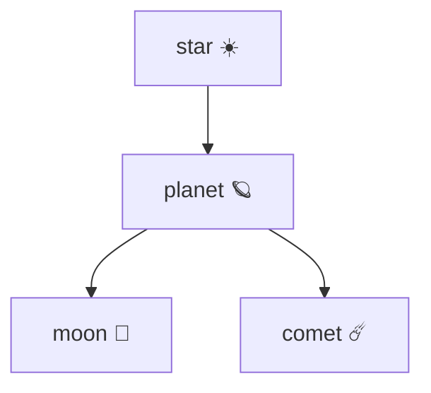

# Obsidian — Guía avanzada de sintaxis

> Sistema Galaxy: [[_galaxy-system]]
> Pendientes: [[_ToDo-system]]

Guía de referencia para sintaxis avanzada de Obsidian: Markdown avanzado, sintaxis propia de Obsidian y comportamiento de Claude frente a cada una. Cada entrada incluye ejemplo, variantes, edge cases y tres cajas de contexto.

---

## Índice

1. [Wikilinks — enlaces internos](#1-wikilinks--enlaces-internos)
2. [Embeds — contenido embebido](#2-embeds--contenido-embebido)
3. [Referencias de bloque](#3-referencias-de-bloque)
4. [YAML frontmatter](#4-yaml-frontmatter)
5. [Bloques de comentario](#5-bloques-de-comentario)
6. [Callouts](#6-callouts)
7. [Tablas](#7-tablas)
8. [LaTeX y matemáticas](#8-latex-y-matemáticas)
9. [Bloques de código](#9-bloques-de-código)
10. [Tareas y checkboxes](#10-tareas-y-checkboxes)
11. [Footnotes](#11-footnotes)
12. [Aliases y display text](#12-aliases-y-display-text)
13. [Tags](#13-tags)
14. [Dataview queries](#14-dataview-queries)
15. [Excalidraw — embeds en notas](#15-excalidraw--embeds-en-notas)
16. [PDF++ — citas y embeds desde PDF](#16-pdf--citas-y-embeds-desde-pdf)

---

## 1. Wikilinks — enlaces internos

### Sintaxis básica

```
[[nombre-del-archivo]]
```

Crea un enlace interno a otra nota del vault. No necesita ruta completa si el nombre es único en el vault — Obsidian lo resuelve automáticamente.

**Ejemplo:**
```
Ver [[ETN806-T01-joint-pdf-definition]] para la definición completa.
```

### Variantes

```
[[nombre-del-archivo|texto visible]]
```
El texto después de `|` es lo que aparece en modo lectura. El link real sigue siendo al archivo original.

```
[[nombre-del-archivo#encabezado]]
```
Apunta a un encabezado específico dentro de la nota. El `#` se escribe sin espacios antes del nombre del encabezado.

```
[[nombre-del-archivo#^id-de-bloque]]
```
Apunta a un bloque específico identificado con `^id`. Ver sección 3.

```
[[carpeta/nombre-del-archivo]]
```
Ruta relativa explícita. Útil si hay dos archivos con el mismo nombre en carpetas distintas.

**Edge cases:**
- Si el archivo no existe todavía, Obsidian muestra el link en color diferente (rojo o gris según el tema) — es un link roto que se resolverá cuando crees el archivo.
- Si renombras un archivo, Obsidian actualiza automáticamente todos los `[[wikilinks]]` que apuntan a él — siempre que la opción "Automatically update internal links" esté activa en Settings → Files & Links.
- Dos archivos con el mismo nombre en carpetas distintas pueden causar ambigüedad. Obsidian elige uno — para control explícito usar la ruta completa.

> [!info] Dónde y para qué usarlo en el vault
> En el cuerpo de cualquier nota galaxy para conectar conceptos. En el YAML (campos `orbits`, `star`, `concepts_used`, etc.) para metadatos. En el bloque `%%` al final de cada nota para que el grafo los detecte sin mostrarse en modo lectura.

> [!example] ¿Sirve en el Sistema Galaxy?
> **Sí** — es la base del sistema. Los `[[wikilinks]]` dentro del bloque `%%` son los hilos gravitacionales del grafo. Los del YAML alimentan Dataview. Los del cuerpo crean la navegación entre notas.

> [!tip] ¿Claude puede verlo?
> **Sí.** Claude lee el texto plano del archivo `.md` y ve `[[nombre]]` como texto literal. Claude puede leer, crear y editar wikilinks. No puede "navegar" al archivo destino automáticamente — para que Claude vea el contenido del archivo enlazado, hay que pedirle explícitamente que lo abra por nombre.

---

## 2. Embeds — contenido embebido

### Sintaxis básica

```
![[nombre-del-archivo]]
```

El `!` antes del `[[` convierte el link en un embed — Obsidian renderiza el contenido del archivo referenciado directamente dentro de la nota actual en modo lectura.

**Ejemplo:**
```
![[ETN806-T01-joint-pdf-definition]]
```
Muestra el contenido completo de esa nota embebido aquí.

### Variantes

```
![[nombre-del-archivo#encabezado]]
```
Embebe solo la sección que empieza en ese encabezado (hasta el siguiente encabezado del mismo nivel o superior).

```
![[nombre-del-archivo#^id-de-bloque]]
```
Embebe solo el bloque específico identificado con `^id`.

```
![[imagen.png]]
![[imagen.png|400]]
![[imagen.png|400x200]]
```
Embebe una imagen. El número después de `|` es el ancho en píxeles. `400x200` define ancho y alto.

```
![[archivo.pdf]]
![[archivo.pdf#page=5]]
```
Embebe un PDF. Con `#page=N` abre en esa página directamente (requiere PDF++).

```
![[archivo.excalidraw]]
```
Embebe un lienzo de Excalidraw como imagen SVG dentro de la nota.

**Edge cases:**
- Un embed de nota completa incluye todo su contenido — el YAML no se muestra, pero los embeds anidados sí se renderizan hasta cierto nivel de profundidad.
- Embeber un archivo muy pesado (PDF grande, Excalidraw complejo) puede ralentizar el renderizado de la nota.
- `![[archivo#encabezado]]` solo embebe desde ese encabezado hasta el siguiente del mismo nivel — si quieres toda una sección con sub-secciones, el comportamiento puede variar.

> [!info] Dónde y para qué usarlo en el vault
> Para incluir un `observatory` o `constellation` dentro de una nota `planet` o `star`. Para mostrar un `photon` (imagen Desmos) dentro de un `comet`. Para referenciar secciones de otra nota sin duplicar contenido.

> [!example] ¿Sirve en el Sistema Galaxy?
> **Sí**, especialmente para embeber visuals (`photon`, `observatory`) en notas de teoría o ejercicios. Mantiene una sola fuente de verdad — el visual vive en su archivo propio y se muestra donde se necesite.

> [!tip] ¿Claude puede verlo?
> **Parcialmente.** Claude ve la sintaxis `![[archivo]]` como texto plano pero **no renderiza el embed** — no ve el contenido del archivo embebido a menos que lo abra por separado. Para que Claude vea el contenido de un embed, hay que pedirle explícitamente que lea ese archivo por su nombre o ruta.

---

## 3. Referencias de bloque

### Crear un ID de bloque

```
Este es un párrafo importante. ^mi-id
```

Se agrega `^id` al final de cualquier línea o párrafo. El ID puede ser cualquier texto sin espacios. Obsidian también genera IDs automáticos (como `^bab436`) cuando usas la función de copiar link a bloque desde el menú contextual.

### Enlazar a un bloque

```
[[nombre-del-archivo#^mi-id]]
```

### Embeber un bloque específico

```
![[nombre-del-archivo#^mi-id]]
```

Muestra solo ese párrafo o elemento específico embebido en la nota actual.

**Ejemplo real del vault:**
```
Pendientes de Excalidraw:
![[_excalidraw-system#^bab436]]
```

**Edge cases:**
- El ID de bloque debe estar en la misma línea que el contenido — no en una línea separada vacía.
- Los IDs generados por Obsidian (6 caracteres hexadecimales como `^bab436`) son estables — no cambian si mueves el archivo.
- Si editas el texto del bloque, el ID permanece. Si borras la línea con el `^id`, el link queda roto.
- No funciona dentro de tablas ni dentro de bloques de código.
- Los IDs son sensibles a mayúsculas: `^MiID` y `^miid` son distintos.

> [!info] Dónde y para qué usarlo en el vault
> Para referenciar una fórmula específica de una nota `moon` en un `comet` sin embeber toda la nota. Para apuntar a una definición exacta dentro de un `planet`. Para hacer referencia cruzada puntual entre notas del mismo tema.

> [!example] ¿Sirve en el Sistema Galaxy?
> **Sí, con moderación.** Es preciso pero frágil — si el bloque se mueve o se borra, el link se rompe silenciosamente. Preferir `[[nota#encabezado]]` cuando sea posible, porque los encabezados son más estables que los IDs de bloque.

> [!tip] ¿Claude puede verlo?
> **Parcialmente.** Claude ve `^id` como texto en el archivo fuente y ve `[[archivo#^id]]` como texto en el archivo que lo referencia. Para leer el contenido del bloque específico, Claude necesita abrir el archivo fuente y buscar manualmente la línea que termina con ese `^id`. No hay navegación automática — hay que decirle a Claude el nombre del archivo y el ID.

---

## 4. YAML frontmatter

### Sintaxis básica

```yaml
---
campo: valor
campo_lista:
  - item1
  - item2
campo_inline: [item1, item2]
---
```

El bloque YAML va siempre al inicio del archivo, entre dos líneas de `---`. Define metadatos que Obsidian, Dataview y Templater pueden leer y usar.

### Tipos de valores

```yaml
---
texto: "valor entre comillas"
texto_simple: valor sin comillas
numero: 42
decimal: 3.14
booleano: true
fecha: 2026-05-30
lista_bloque:
  - elemento uno
  - elemento dos
lista_inline: [elemento uno, elemento dos]
link: "[[ETN806-T01-star]]"
link_lista:
  - "[[ETN806-T01-star]]"
  - "[[ETN806-T02-star]]"
vacio:
---
```

**Edge cases:**
- Las comillas son obligatorias si el valor contiene `:`, `#`, `[`, `]`, o empieza con caracteres especiales.
- Un campo vacío (sin valor) es válido — Dataview lo lee como `null`.
- El YAML debe ser el primer elemento del archivo — ninguna línea antes del primer `---`.
- Indentar con espacios, no con tabs — YAML es sensible a la indentación.
- Los wikilinks en YAML (`"[[nota]]"`) **no generan conexiones en el grafo de Obsidian** — solo son texto para Dataview. Para conexiones visibles en el grafo, usar el bloque `%%`.
- `excalidraw-plugin: parsed` debe ser el primer campo del YAML en archivos `.excalidraw.md` — el plugin lo requiere en esa posición exacta.

> [!info] Dónde y para qué usarlo en el vault
> En todas las notas Galaxy sin excepción. Define `galaxy_body`, `subject`, `semester`, `partial`, `topic`, `status`, y los campos de relación (`orbits`, `star`, `concepts_used`, etc.). Es la capa de metadatos que alimenta Dataview y que Claude lee para entender el rol de cada nota.

> [!example] ¿Sirve en el Sistema Galaxy?
> **Sí — es el núcleo del sistema.** Sin YAML no hay Dataview, no hay filtros, no hay estructura semántica. Es obligatorio en todas las notas. El YAML del Sistema Galaxy sigue plantillas estrictas por tipo de `galaxy_body` — ver `_galaxy-system` para la referencia completa.

> [!tip] ¿Claude puede verlo?
> **Sí, completamente.** Claude lee el YAML como texto plano al inicio del archivo. Es la forma más confiable de darle contexto estructurado a Claude sobre una nota. Cuando Claude crea o edita notas, debe mantener el YAML correcto según el tipo de `galaxy_body` definido en `_galaxy-system`.

---

## 5. Bloques de comentario

### Sintaxis de bloque

```
%%
contenido invisible en modo lectura
[[wikilinks que aparecen en el grafo pero no en el texto]]
%%
```

Todo lo que está entre `%%` y `%%` es invisible en modo lectura y en preview. Sin embargo, el motor del grafo de Obsidian sí detecta los `[[wikilinks]]` que haya dentro.

### Variante inline

```
Texto visible %%comentario invisible%% texto visible.
```

### Ejemplo del vault

```
%%
galaxy-links
[[ETN806-T01-joint-pdf-definition]]
[[ETN806-T01-marginal-density-formula]]
[[ETN806-T01-star]]
%%
```

**Edge cases:**
- Los `%%` de bloque deben estar solos en su línea. El inline puede ir en medio de cualquier línea.
- Dataview **no** lee el contenido de los bloques `%%` — solo sirven para el grafo visual de Obsidian.
- El texto dentro de `%%` sí aparece en modo edición — es un comentario del autor.
- Si hay un `[[link]]` dentro de `%%`, ese link aparece en el panel "Backlinks" de la nota destino aunque no sea visible en la nota fuente.
- Los bloques `%%` no aparecen en exports a PDF ni en previews de GitHub.

> [!info] Dónde y para qué usarlo en el vault
> Al final de cada nota Galaxy, en el bloque `galaxy-links`. Es la capa visual del sistema de conexiones — los links del YAML son para Dataview, los links del `%%` son para el grafo. Ambas capas deben estar sincronizadas entre sí.

> [!example] ¿Sirve en el Sistema Galaxy?
> **Sí — es la mitad del sistema de dos capas.** Sin el bloque `%%`, las notas no aparecen conectadas en el grafo visual de Obsidian aunque el YAML esté perfecto. Toda nota Galaxy debe terminar con su bloque `galaxy-links`.

> [!tip] ¿Claude puede verlo?
> **Sí.** Claude lee el texto plano del archivo y ve el contenido de los bloques `%%` sin ningún problema. El hecho de que sea invisible en modo lectura de Obsidian no afecta a Claude. Claude puede leer, crear y editar los bloques `galaxy-links` directamente.

---

## 6. Callouts

### Sintaxis básica

```markdown
> [!tipo]
> Contenido del callout.
```

Obsidian renderiza esto como una caja coloreada con ícono. El `tipo` determina el color y el ícono.

### Tipos built-in

| Tipo | Color | Uso sugerido |
|------|-------|-------------|
| `note` | Azul | Información general |
| `info` | Azul claro | Contexto adicional |
| `tip` | Verde | Consejos y recomendaciones |
| `warning` | Amarillo | Advertencias importantes |
| `danger` | Rojo | Errores críticos |
| `success` | Verde | Confirmaciones |
| `question` | Morado | Dudas o preguntas |
| `failure` | Rojo claro | Fallos o errores menores |
| `bug` | Rojo | Bugs conocidos |
| `example` | Morado claro | Ejemplos |
| `quote` | Gris | Citas |
| `abstract` | Cian | Resúmenes |
| `todo` | Azul | Tareas pendientes |

### Variantes

```markdown
> [!note] Título personalizado
> Contenido con título distinto al tipo.

> [!warning]+ Callout expandible (abierto por defecto)
> El usuario puede colapsarlo haciendo clic en el encabezado.

> [!info]- Callout colapsado por defecto
> El usuario debe hacer clic para expandirlo.
```

**Callout anidado:**
```markdown
> [!note]
> Contenido exterior.
> > [!warning]
> > Callout anidado dentro del anterior.
```

**Con LaTeX y listas dentro:**
```markdown
> [!example] Normalización de PDF conjunta
> Dado $f(x,y) = kxy$ sobre $0 \leq x \leq 1, 0 \leq y \leq 1$:
> 1. Integrar sobre la región de soporte
> 2. Igualar a 1 y resolver $k$
>
> $$\int_0^1\int_0^1 kxy\,dx\,dy = 1 \implies k = 4$$
```

**PDF++ usa un tipo personalizado:**
```markdown
> [!PDF] [[ETN806-T00-papoulis.pdf#page=142|(Papoulis, p.142)]]
> La densidad conjunta queda definida sobre la región de soporte.
```

**Edge cases:**
- El tipo es case-insensitive: `[!NOTE]` y `[!note]` funcionan igual.
- Cualquier texto que no sea un tipo reconocido crea un callout genérico — útil para tipos personalizados como `[!PDF]`.
- Los callouts en exports a PDF de Obsidian se renderizan correctamente si el tema lo soporta.
- No se puede usar un bloque de código de múltiples líneas dentro de un callout.

> [!info] Dónde y para qué usarlo en el vault
> En notas `planet` para resaltar definiciones clave con `[!note]`. En `comet` para advertencias de método con `[!warning]`. En `asteroid` para citas de PDF con `[!PDF]`. En archivos `beacon` para marcar información crítica de configuración con `[!warning]` o `[!danger]`.

> [!example] ¿Sirve en el Sistema Galaxy?
> **Sí.** Los callouts `[!PDF]` son centrales en el sistema PDF++ para citas con link a página exacta. Los demás tipos son opcionales pero útiles para organizar visualmente el contenido de notas complejas.

> [!tip] ¿Claude puede verlo?
> **Sí.** Claude ve la sintaxis `> [!tipo]` como texto plano y la entiende. Claude puede crear, leer y editar callouts sin problemas. Al escribir notas para el vault, Claude debe usar callouts en lugar de listas cuando el contenido requiera énfasis visual estructurado.

---

## 7. Tablas

### Sintaxis básica

```markdown
| Columna 1 | Columna 2 | Columna 3 |
|-----------|-----------|-----------|
| Valor A   | Valor B   | Valor C   |
| Valor D   | Valor E   | Valor F   |
```

### Alineación de columnas

```markdown
| Izquierda | Centro  | Derecha |
|:----------|:-------:|--------:|
| texto     | texto   | texto   |
```

`:---` = izquierda (default), `:---:` = centro, `---:` = derecha.

### Contenido enriquecido en celdas

```markdown
| Concepto       | Fórmula               | Estado   |
|----------------|-----------------------|----------|
| PDF marginal   | $f_X(x) = \int f\,dy$ | ✅ visto |
| Independencia  | $f(x,y) = f_X f_Y$    | pendiente |
| Nota asociada  | [[ETN806-T01-star]]   | —        |
```

Las celdas aceptan inline markdown: negrita, cursiva, código inline, LaTeX inline, wikilinks, emojis. No aceptan saltos de línea dentro de una celda ni bloques multilínea.

**Edge cases:**
- El número de `|` en la fila de separación debe coincidir con el número de columnas — si no, Obsidian puede no renderizar la tabla.
- Las celdas pueden tener distinto ancho en el texto plano — los `|` no necesitan estar alineados para que funcione.
- Las referencias de bloque `^id` no funcionan dentro de celdas de tabla.
- Los bloques de código multilínea no pueden ir dentro de celdas — usar código inline `` `código` `` en su lugar.
- Para tablas muy largas o dinámicas, Dataview genera mejores resultados que las tablas estáticas.

> [!info] Dónde y para qué usarlo en el vault
> En notas `beacon` para documentar configuraciones. En notas `planet` para comparar propiedades o fórmulas. En notas `dwarf` para resúmenes estructurados de un parcial. En `star` para listar las notas del tema con su estado.

> [!example] ¿Sirve en el Sistema Galaxy?
> **Sí** — es el formato estándar de documentación en todos los archivos `beacon` de `_config`. Los archivos de sistema del vault usan tablas extensamente para configuración y referencia.

> [!tip] ¿Claude puede verlo?
> **Sí, completamente.** Claude lee y escribe tablas en formato Markdown sin ningún problema. Claude ve el texto plano con `|` y lo interpreta correctamente. Claude puede crear tablas nuevas o editar las existentes en cualquier nota del vault.

---

## 8. LaTeX y matemáticas

### Modo inline — dentro de una línea

```
$f(x, y)$
$\int_0^1 f(x)\,dx$
$\sum_{i=1}^{n} x_i$
```

Se escribe entre `$...$`. Aparece dentro del flujo del texto sin interrumpirlo.

### Modo display — centrado en línea propia

```
$$
f(x, y) = \frac{1}{2\pi\sigma_x\sigma_y}
\exp\!\left(-\frac{x^2}{2\sigma_x^2} - \frac{y^2}{2\sigma_y^2}\right)
$$
```

Se escribe entre `$$...$$`. Se renderiza centrado en su propia línea, más grande.

### Snippets de Quick LaTeX (ejemplos comunes)

| Lo que escribes | Se expande a | Resultado |
|-----------------|-------------|-----------|
| `mk` (configurable) | modo inline | `$...$` |
| `dm` (configurable) | modo display | `$$\n\n$$` |
| `//` | `\frac{}{}` | Fracción |
| `sr` | `^{2}` | Cuadrado |
| `cb` | `^{3}` | Cubo |
| `td` | `^{}` | Exponente genérico |

### Referencia de sintaxis LaTeX para ingeniería

```latex
% Fracciones
\frac{numerador}{denominador}

% Integrales
\int_a^b f(x)\,dx
\iint_D f(x,y)\,dx\,dy
\iiint_V f\,dV

% Límites y sumatorias
\lim_{x \to \infty} f(x)
\sum_{i=0}^{n} x_i
\prod_{i=1}^{n} x_i

% Derivadas parciales
\frac{\partial f}{\partial x}
\frac{\partial^2 f}{\partial x^2}

% Matrices
\begin{pmatrix} a & b \\ c & d \end{pmatrix}
\begin{bmatrix} a & b \\ c & d \end{bmatrix}

% Sistemas de ecuaciones
\begin{cases}
  f(x) = x^2 \\
  g(x) = 2x
\end{cases}

% Texto dentro de modo math
\text{donde } \sigma > 0

% Norma y valor absoluto
\|x\| \qquad |x|

% Flecha de implicación
\implies \iff \therefore

% Conjuntos
\in \notin \subset \cup \cap \mathbb{R} \mathbb{Z}

% Probabilidad y estadística
\mathbb{E}[X] \quad \text{Var}(X) \quad \mathbb{P}(A)
f_{X,Y}(x,y) \quad F_X(x)
```

**Edge cases:**
- `$` en texto normal sin intención de LaTeX activa accidentalmente el modo math — escapar con `\$` si se necesita el símbolo literal.
- Los bloques `$$` no funcionan dentro de celdas de tabla — usar `$inline$`.
- Obsidian usa MathJax, no LaTeX completo. Los paquetes `amsmath` y `amssymb` están disponibles; `tikz`, `pgfplots` y similares no funcionan.
- Completr muestra sugerencias de comandos LaTeX al escribir `\` — navegar con flechas y aceptar con Tab.

> [!info] Dónde y para qué usarlo en el vault
> En notas `moon` para fórmulas y propiedades. En notas `planet` para definiciones matemáticas formales. En notas `comet` para el desarrollo paso a paso de ejercicios. En notas `dwarf` para formularios de repaso de parcial.

> [!example] ¿Sirve en el Sistema Galaxy?
> **Sí — es esencial para ETN806 y cualquier materia de ingeniería.** Completr y Quick LaTeX están instalados precisamente para agilizar la escritura de LaTeX. Las notas `moon` con fórmulas son la columna vertebral del Sistema Galaxy para materias técnicas.

> [!tip] ¿Claude puede verlo?
> **Sí.** Claude lee LaTeX como texto plano y lo entiende matemáticamente. Claude puede escribir LaTeX correcto en notas del vault. Claude no renderiza las fórmulas visualmente, pero las procesa e interpreta correctamente como notación matemática.

---

## 9. Bloques de código

### Inline

```
`código en línea`
```

### Bloque con lenguaje especificado

````
```python
def marginal_density(f, var, limits):
    from sympy import integrate
    return integrate(f, (var, *limits))
```
````

### Lenguajes con resaltado en Obsidian

`python`, `javascript`, `typescript`, `r`, `matlab`, `julia`, `c`, `cpp`, `java`, `sql`, `bash`, `yaml`, `json`, `markdown`, `latex`, `html`, `css`, entre otros.

### Bloques especiales que ejecutan plugins

````markdown
```dataview
TABLE galaxy_body, title FROM "Semesters"
WHERE subject = "ETN806" SORT topic ASC
```
````

````markdown
```dataviewjs
const pages = dv.pages('"Semesters"').where(p => p.galaxy_body === "comet");
dv.table(["Título", "Estado"], pages.map(p => [p.title, p.status]));
```
````

````markdown
```desmos
y = x^2 + 1
y = 2x - 1
```
````

````markdown

````

**Edge cases:**
- Para mostrar triple backtick dentro de un bloque de código, envolver el bloque externo con cuádruples backticks.
- Los bloques `dataview` y `dataviewjs` requieren el plugin Dataview activo — sin él se renderizan como código normal sin ejecutarse.
- El bloque `mermaid` es nativo de Obsidian — no requiere plugin adicional.
- Los bloques de código no soportan wikilinks ni LaTeX en su interior — todo es texto literal sin renderizar.
- El bloque `desmos` requiere el plugin obsidian-desmos — ver `desmos_guide.md`.

> [!info] Dónde y para qué usarlo en el vault
> En notas `beacon` para mostrar configuración, comandos o scripts. En notas `comet` si el ejercicio involucra código o pseudocódigo. Los bloques `dataview` van en los dashboards de MOC (Fase 4). El bloque `mermaid` puede usarse en `star` para diagramas rápidos de relación entre conceptos.

> [!example] ¿Sirve en el Sistema Galaxy?
> **Sí.** Los bloques `dataview` serán la base de los dashboards de Fase 4. Los bloques `desmos` son la forma de incrustar gráficas en notas `photon` y `comet`. Los demás tipos son de uso ocasional según el contenido.

> [!tip] ¿Claude puede verlo?
> **Sí, completamente.** Claude lee el contenido de los bloques de código como texto plano. Claude puede escribir bloques correctamente formateados, incluyendo queries Dataview y código Python o LaTeX. Claude no ejecuta el código — solo lo escribe.

---

## 10. Tareas y checkboxes

### Sintaxis básica

```markdown
- [ ] Tarea pendiente
- [x] Tarea completada
```

### Estados extendidos (soporte variable por tema)

```markdown
- [/] En progreso
- [-] Cancelada
- [>] Pospuesta
- [!] Importante
- [?] Pregunta pendiente
```

### En listas numeradas

```markdown
1. [ ] Primer paso
2. [x] Segundo paso — completado
3. [ ] Tercer paso
```

**Edge cases:**
- El espacio dentro de `[ ]` es obligatorio — `[]` sin espacio no se reconoce como checkbox.
- Los checkboxes son solo visuales y locales — marcar uno en la nota A **no afecta** ninguna otra nota. No hay sincronización automática entre archivos.
- Dataview puede consultar checkboxes: `TASK FROM "_app/_config/_ToDo-system"` lista todas las tareas con su estado.
- Los estados extendidos (`[/]`, `[-]`, etc.) solo se renderizan visualmente si el tema activo los soporta. En texto plano son siempre legibles.
- Hacer clic en un checkbox en modo lectura alterna entre `[ ]` y `[x]` — no entre los estados extendidos.

> [!info] Dónde y para qué usarlo en el vault
> **Solo en `_ToDo-system`** — es la única fuente de verdad de tareas del vault. Los archivos de sistema (`_galaxy-system`, `_excalidraw-system`, etc.) no tienen checkboxes propios. Esta decisión evita duplicación y garantiza que tachar en un solo archivo sea suficiente.

> [!example] ¿Sirve en el Sistema Galaxy?
> **Sí, con restricción de ubicación.** Los checkboxes son válidos y útiles, pero solo viven en `_ToDo-system`. Esta es una decisión de diseño del vault — ver la sección de decisiones en `_galaxy-system`.

> [!tip] ¿Claude puede verlo?
> **Sí.** Claude lee `- [ ]` y `- [x]` como texto plano. Claude puede editar `_ToDo-system` para marcar tareas como completadas cambiando `[ ]` por `[x]`. Para que Claude actualice el ToDo, hay que pedírselo explícitamente indicando cuál tarea se completó.

---

## 11. Footnotes

### Sintaxis de referencia + definición

```markdown
Este concepto tiene una excepción importante.[^excepcion]

[^excepcion]: La excepción aplica solo cuando la región de soporte es no acotada.
```

### Footnote inline (sin definición separada)

```markdown
Este concepto tiene una excepción.^[La excepción aplica solo cuando la región es no acotada.]
```

**Edge cases:**
- Las footnotes se renderizan al final del documento en modo lectura, con un número y un link de retorno.
- El identificador puede ser cualquier texto: `[^1]`, `[^nota-papoulis]`, `[^ver-moon]`. No tiene que ser numérico.
- Las footnotes inline `^[texto]` no requieren definición separada — el texto va directamente en la referencia.
- En exports a PDF, las footnotes aparecen al pie de página si el tema lo soporta.
- Las footnotes no generan backlinks ni conexiones en el grafo — son puramente texto.

> [!info] Dónde y para qué usarlo en el vault
> En notas `planet` o `asteroid` para aclaraciones que interrumpirían el flujo principal del texto. En notas `comet` para condiciones especiales o casos degenerados de un ejercicio que no forman parte del desarrollo principal.

> [!example] ¿Sirve en el Sistema Galaxy?
> **Uso ocasional.** No es parte del sistema core pero es válido cuando el contenido lo requiere. No genera conexiones en el grafo ni metadatos para Dataview.

> [!tip] ¿Claude puede verlo?
> **Sí.** Claude lee la sintaxis `[^id]` y `[^id]: texto` como texto plano. Claude puede crear y editar footnotes en notas del vault sin ningún problema.

---

## 12. Aliases y display text

### Aliases en YAML

```yaml
---
aliases:
  - PDF conjunta
  - densidad conjunta
  - joint density
---
```

Los aliases permiten que un wikilink encuentre esta nota aunque use un nombre distinto al del archivo:

```
[[PDF conjunta]]        ← resuelve a ETN806-T01-joint-pdf-definition.md
[[densidad conjunta]]   ← ídem
[[joint density]]       ← ídem
```

### Display text en el link

```
[[ETN806-T01-joint-pdf-definition|PDF conjunta]]
```

El texto después de `|` es lo que se ve en modo lectura. El archivo destino no cambia.

**Diferencia clave entre alias y display text:**
- `aliases` en YAML: el link se puede escribir con el alias y Obsidian resuelve el archivo correcto — útil para escribir en prosa.
- Display text `|`: solo cambia cómo se ve el link en modo lectura, el texto del link en modo edición sigue siendo el nombre real.

**Edge cases:**
- Los aliases son case-insensitive en la búsqueda.
- Si dos notas tienen el mismo alias, Obsidian puede generar ambigüedad — evitar aliases idénticos.
- El display text `|` funciona también en embeds: `![[imagen.png|Figura 1 — Región de soporte]]`.
- Los aliases no afectan el nombre del archivo en disco — son solo metadatos de Obsidian.

> [!info] Dónde y para qué usarlo en el vault
> Los aliases son útiles en notas `planet` con nombres de archivo técnicos en inglés — permiten linkear desde el texto con el término en español o el nombre formal de la materia. El display text es útil en notas `comet` para nombrar conceptos con texto más legible que el slug del archivo.

> [!example] ¿Sirve en el Sistema Galaxy?
> **Opcional pero recomendado.** El Sistema Galaxy usa slugs en inglés (`joint-pdf-definition`) que pueden resultar crípticos en el texto. Un alias en español (`densidad conjunta`) o con el nombre formal mejora la lectura de las notas y la navegación.

> [!tip] ¿Claude puede verlo?
> **Parcialmente.** Claude lee el campo `aliases` en el YAML y el texto display en los wikilinks. Sin embargo, cuando Claude busca una nota por nombre, usa el nombre real del archivo — los aliases no le ayudan directamente para localizar archivos. Para que Claude encuentre una nota, hay que darle el nombre real del archivo o su ruta.

---

## 13. Tags

### Sintaxis inline (en el cuerpo)

```
#ETN806
#galaxy-planet
#P2
```

Se puede escribir en cualquier parte del cuerpo. Obsidian los detecta como tags navegables.

### Tags en YAML (forma preferida para el vault)

```yaml
---
tags: [ETN806, galaxy-planet, P2, T01]
---
```

O en formato de lista bloque:

```yaml
---
tags:
  - ETN806
  - galaxy-planet
  - P2
  - T01
---
```

### Tags jerárquicos

```
#materia/ETN806
#galaxy/planet
#estado/pendiente
```

El `/` crea jerarquía — en el panel de Tags de Obsidian se agrupan bajo el tag padre y se pueden filtrar por rama completa.

**Edge cases:**
- Los tags en YAML y los tags inline son equivalentes — ambos aparecen en el panel de Tags y en búsquedas.
- Los tags no pueden contener espacios — usar guiones (`galaxy-planet`) o camelCase (`galaxyPlanet`).
- Los tags son case-sensitive en algunos contextos — mantener consistencia en el vault (todo en minúsculas o siguiendo el patrón definido).
- Dataview puede filtrar por tags: `FROM #galaxy-planet`.
- Un tag que empieza con número no es válido: `#2026` falla, usar `#Y2026`.

> [!info] Dónde y para qué usarlo en el vault
> En el YAML de todas las notas Galaxy siguiendo el patrón `[ETNXXX, galaxy-[tipo], PN, TNN]`. Los tags permiten filtrar notas en la búsqueda nativa de Obsidian y en Dataview sin necesidad de abrir el YAML completo.

> [!example] ¿Sirve en el Sistema Galaxy?
> **Sí.** Son la segunda capa de filtrado después del YAML estructurado. El patrón de tags del Sistema Galaxy está definido en `_galaxy-system` — seguirlo estrictamente garantiza que las consultas Dataview funcionen correctamente.

> [!tip] ¿Claude puede verlo?
> **Sí.** Claude lee los tags tanto en YAML como inline. Al crear notas nuevas para el vault, Claude debe seguir el patrón de tags definido en `_galaxy-system` para el tipo de `galaxy_body` correspondiente.

---

## 14. Dataview queries

Dataview es un plugin que convierte el vault en una base de datos consultable. Lee los campos YAML de todas las notas y genera tablas, listas o vistas dinámicas.

### TABLE — tabla de resultados

````markdown
```dataview
TABLE galaxy_body, subject, partial, status
FROM "Semesters"
WHERE subject = "ETN806"
SORT topic ASC
```
````

### LIST — lista simple de notas

````markdown
```dataview
LIST
FROM "Semesters"
WHERE galaxy_body = "comet" AND status = "pendiente"
SORT file.name ASC
```
````

### TASK — lista de checkboxes de otras notas

````markdown
```dataview
TASK
FROM "_app/_config/_ToDo-system"
WHERE !completed
```
````

### Cláusulas principales

```
FROM "carpeta"              ← notas en esa carpeta (incluye subcarpetas)
FROM #tag                   ← notas con ese tag
FROM [[nota]]               ← notas que linkean a esa nota
WHERE campo = "valor"       ← filtro por campo YAML exacto
WHERE campo != null         ← campo existe y no está vacío
WHERE !completed            ← solo tareas sin completar (en TASK)
SORT campo ASC / DESC       ← ordenar resultados
LIMIT 10                    ← máximo N resultados
FLATTEN lista_campo         ← expande campos de lista en filas separadas
```

### Campos especiales de Dataview

```
file.name       ← nombre del archivo sin extensión
file.path       ← ruta completa
file.link       ← wikilink a la nota (para mostrar en tablas)
file.size       ← tamaño en bytes
file.ctime      ← fecha de creación
file.mtime      ← fecha de modificación
file.tags       ← lista de tags
file.inlinks    ← notas que enlazan a esta
file.outlinks   ← notas a las que enlaza esta
```

### Dataviewjs — queries en JavaScript

````markdown
```dataviewjs
const comets = dv.pages('"Semesters"')
  .where(p => p.galaxy_body === "comet" && p.status === "pendiente")
  .sort(p => p.topic);

dv.table(
  ["Nota", "Materia", "Parcial", "Tema"],
  comets.map(p => [p.file.link, p.subject, p.partial, p.topic])
);
```
````

**Edge cases:**
- Dataview solo lee campos del YAML frontmatter — no lee contenido del cuerpo de la nota.
- Los campos vacíos en YAML (`campo:` sin valor) se tratan como `null` — `WHERE campo != null` los excluye correctamente.
- Las queries se actualizan automáticamente cuando cambian los archivos fuente.
- `FROM "carpeta"` incluye todas las subcarpetas — para excluir una subcarpeta, filtrar con `WHERE !contains(file.path, "subcarpeta")`.
- Los wikilinks en YAML (como `"[[ETN806-T01-star]]"`) se leen por Dataview como tipo `Link` — mostrar con `p.file.link` o acceder al nombre con `.path`.
- `dataviewjs` tiene acceso a toda la API de Dataview y es más flexible pero más complejo — usar para dashboards avanzados.

> [!info] Dónde y para qué usarlo en el vault
> En las notas `star` (MOC de tema) para listar automáticamente todos los `planet`, `moon` y `comet` del tema. En la futura MOC de ETN806 para un dashboard del parcial completo. En notas `dwarf` para generar el resumen de notas pendientes automáticamente.

> [!example] ¿Sirve en el Sistema Galaxy?
> **Sí — es la Fase 4 del sistema.** Todo el YAML galaxy fue diseñado para ser consultable con Dataview. Las consultas estándar están documentadas en `_ToDo-system`. Dataview ya está instalado y configurado — solo falta crear las queries en las notas correspondientes.

> [!tip] ¿Claude puede verlo?
> **Parcialmente.** Claude ve la sintaxis del bloque `dataview` como texto plano y puede escribir queries correctas conociendo la estructura del YAML. Claude **no ejecuta** las queries — no ve los resultados dinámicos que genera Dataview en Obsidian. Para que Claude sepa qué notas existen con ciertos campos, hay que pedirle que liste los archivos del vault directamente con el conector Filesystem.

---

## 15. Excalidraw — embeds en notas

### Sintaxis básica — archivo completo

```
![[nombre.excalidraw.md]]
```

Embebe el lienzo completo como imagen SVG dentro de la nota. Obsidian lo renderiza en modo lectura gracias a la configuración `displaySVGInPreview: true` del plugin. Ver `_excalidraw-system` para detalles de configuración.

**Ejemplo:**
```
![[ETN806-P2-region-integracion.excalidraw.md]]
```

### Variantes — segmentos del lienzo

El plugin de Excalidraw permite apuntar a partes específicas de un lienzo usando prefijos especiales después de `#^`. Todas las variantes de embed (con `!`) muestran el segmento como imagen en modo lectura. Las variantes de link (sin `!`) abren el archivo en el lienzo y seleccionan o enfocan el elemento.

#### Frame

```
![[nombre.excalidraw.md#^frame=NombreDelFrame]]
```

Muestra solo el contenido del frame con ese nombre, recortado y encuadrado. El frame actúa como una ventana con nombre dentro del lienzo.

**Ejemplo real del vault:**
```
![[RENOMBRAR-30-05-2026 13.12.12.excalidraw#^frame=01]]
```

El nombre del frame es el texto que le diste al frame dentro de Excalidraw. Si el frame se llama `Región de integración`, la sintaxis es `#^frame=Región de integración`.

#### Group — grupo de elementos

```
![[nombre.excalidraw.md#^group=elementID]]
```

Muestra todos los elementos que pertenecen al mismo grupo que el elemento referenciado por `elementID`. El `elementID` es el block reference (`^id`) del elemento de texto dentro del grupo.

**Cómo obtener el ID:** En Excalidraw, clic derecho sobre un elemento de texto del grupo → Copy link. El link resultante contiene el ID.

**Ejemplo:**
```
![[ETN806-P2-constellation.excalidraw.md#^group=abc123]]
```

#### Area — recorte libre alrededor de un elemento

```
![[nombre.excalidraw.md#^area=elementID]]
```

Inserta un recorte de imagen alrededor del elemento referenciado. A diferencia de `group=`, incluye el espacio visual alrededor del elemento, no solo los elementos del grupo. Útil para aislar un diagrama concreto sin usar frames.

> [!warning] `area=` no funciona cuando el archivo se embebe como PNG (solo funciona con SVG). Asegurarse de que `previewImageType: SVG` esté activo en `_excalidraw-system`.

#### El= — elemento de texto como transclusión de texto

```
[[nombre.excalidraw.md#^elementID]]
```

Sin prefijo y sin `!`, si el elemento referenciado es un **texto**, Obsidian transcluye el contenido de ese texto directamente en la nota como texto plano (no como imagen). Útil para reutilizar etiquetas o títulos del lienzo en notas de texto.

> [!warning] Solo funciona con elementos de tipo texto. Referenciar un elemento no-texto (rectángulo, flecha, etc.) sin prefijo genera un error de Obsidian.

### Variante de tamaño

```
![[nombre.excalidraw.md#^frame=01|600]]
```

El número después de `|` controla el ancho en píxeles del embed, igual que con imágenes normales. Aplica a todas las variantes: archivo completo, frame, group y area.

### Links (sin embed) — solo navegación

```
[[nombre.excalidraw.md#^frame=NombreDelFrame]]
[[nombre.excalidraw.md#^group=elementID]]
[[nombre.excalidraw.md#^area=elementID]]
```

Sin `!`, estas sintaxis crean links que al hacer clic abren el lienzo de Excalidraw y enfocan o seleccionan el elemento o frame referenciado. No muestran ninguna imagen en la nota.

**Edge cases:**
- Los nombres de frame son sensibles a mayúsculas y espacios — `#^frame=01` y `#^frame= 01` son distintos.
- Si el frame se renombra dentro de Excalidraw, el link se rompe — los frames con nombres cortos y estables (como `01`, `02`) son más robustos.
- `group=` y `area=` requieren el ID interno del elemento, que Excalidraw genera automáticamente y no es legible. Los frames son más convenientes porque usan el nombre visible que tú defines.
- Para `group=` y `area=`, el ID se obtiene desde el menú contextual del elemento en Excalidraw (clic derecho → Copy link). No es editable manualmente.
- `area=` no soporta PNG como formato de embed — requiere SVG.
- Un frame vacío (sin elementos dentro) se embebe como imagen en blanco, sin error.
- Estos prefijos (`frame=`, `group=`, `area=`) son sintaxis **dependiente del plugin** — si el plugin de Excalidraw se desactiva, los links siguen funcionando como navegación a la página del lienzo, pero el embed deja de mostrar el recorte correcto.

> [!info] Dónde y para qué usarlo en el vault
> Embeber `![[constellation.excalidraw.md#^frame=01]]` en una nota `star` para mostrar la sección del mapa mental correspondiente a ese tema sin abrir el lienzo completo. Embeber un frame con el diagrama de una región de integración directamente en el `comet` donde se resuelve el ejercicio. En notas `planet` para mostrar un esquema visual adjunto sin crear un `observatory` separado si el diagrama ya existe en un `constellation`.

> [!example] ¿Sirve en el Sistema Galaxy?
> **Sí — es la forma preferida de mostrar visuals de Excalidraw en notas de texto.** Los frames son la herramienta más estable y conveniente: tienen nombre visible, se recortan exactamente al contenido del frame, y el nombre lo defines tú. Recomendado: nombrar los frames de `constellation` con números (`01`, `02`...) para poder referenciarlos fácilmente desde notas `star` y `comet`.

> [!tip] ¿Claude puede verlo?
> **Parcialmente.** Claude ve la sintaxis `![[archivo.excalidraw.md#^frame=01]]` como texto plano y puede escribirla correctamente. Claude no renderiza el lienzo ni ve su contenido visual. Para que Claude sepa qué frames existen en un archivo, hay que decírselo explícitamente o pedirle que abra el archivo `.excalidraw.md` y busque los nombres de frame en el JSON (con `decompressForMDView: true` activo, el contenido es legible en modo texto).

---

## 16. PDF++ — citas y embeds desde PDF

> [!note] PDF++ y los callouts `[!PDF]`
> PDF++ también usa el formato de callout descrito en la sección 6 de esta guía. El tipo `[!PDF]` es un callout personalizado que el plugin reconoce y estiliza. Ver sección 6 para la sintaxis general de callouts.

### Sintaxis básica — link a página

```
[[archivo.pdf#page=N|Texto visible]]
```

Crea un link que al hacer clic abre el PDF en la página `N`. Es la sintaxis nativa de Obsidian (desde v1.3.6) — funciona sin PDF++ activo, pero PDF++ la amplía con backlink highlighting: el texto de esa página queda resaltado visualmente en el visor de PDF si tiene backlinks.

**Ejemplo:**
```
[[ETN806-T00-papoulis.pdf#page=142|Papoulis, p.142]]
```

### Variante — embed de página completa

```
![[archivo.pdf#page=N]]
```

Embebe la página completa del PDF como imagen dentro de la nota. Obsidian la renderiza directamente sin necesidad de PDF++.

**Ejemplo:**
```
![[ETN806-T00-papoulis.pdf#page=142]]
```

### Tipo 1 — Selección de texto (highlight de línea)

Este es el tipo más común. Se genera seleccionando texto en el visor de PDF de Obsidian y copiando el link.

**Cómo generarlo:** Abrir el PDF → seleccionar texto → clic derecho → "Copy link to selection" → pegar en la nota.

**Sintaxis generada (link):**
```
[[archivo.pdf#page=N&selection=x1,y1,x2,y2|Archivo, página N]]
```

**Sintaxis generada (embed — muestra el fragmento de texto resaltado):**
```
![[archivo.pdf#page=N&selection=x1,y1,x2,y2|Archivo, página N]]
```

**Ejemplo real:**
```
[[ETN806-T00-papoulis.pdf#page=1&selection=4,0,4,11|Papoulis, página 1]]
```

El parámetro `selection=` contiene cuatro números: coordenadas del inicio y fin de la selección de texto en la página. Estos valores los genera Obsidian automáticamente — no es necesario escribirlos a mano.

Con PDF++ activo, el texto seleccionado queda **resaltado en el visor de PDF** cada vez que la nota que contiene el link está abierta. El color del highlight lo controla la paleta de colores de PDF++ (Settings → PDF++ → Color palette).

**Variante con color explícito:**
```
[[archivo.pdf#page=N&selection=x1,y1,x2,y2&color=yellow|Texto visible]]
```

El parámetro `&color=` es opcional y específico de PDF++ — fuerza el color del highlight independientemente de la paleta activa.

### Tipo 2 — Selección rectangular (recorte de imagen)

Permite seleccionar un área rectangular del PDF (una ecuación, una figura, una tabla) y embeberla como imagen en la nota.

**Cómo generarlo:** En el visor de PDF, activar el modo de selección rectangular (botón en la barra de herramientas de PDF++ o desde el menú contextual). Dibujar el rectángulo sobre la zona de interés → copiar link → pegar en la nota con `!` al inicio.

**Sintaxis (embed — muestra el recorte como imagen):**
```
![[archivo.pdf#page=N&rect=x1,y1,x2,y2]]
```

**Sintaxis (link — solo navega a la página):**
```
[[archivo.pdf#page=N&rect=x1,y1,x2,y2|Texto visible]]
```

**Ejemplo real:**
```
![[ETN806-T00-papoulis.pdf#page=142&rect=38,152,576,809]]
```

Los cuatro valores de `rect=` son las coordenadas del rectángulo en el sistema de coordenadas del PDF: `x1,y1` es la esquina inferior izquierda y `x2,y2` es la esquina superior derecha. PDF++ los genera automáticamente al dibujar la selección.

**Variante con ancho:**
```
![[archivo.pdf#page=N&rect=x1,y1,x2,y2&width=400]]
```

El parámetro `width` controla el ancho del embed en píxeles. Es diferente a la sintaxis `|400` de imágenes normales — aquí se usa `&width=` porque forma parte de la cadena de parámetros del link.

**Edge cases:**
- `selection=` y `rect=` son los dos tipos de anotación posicional de PDF++. `selection` identifica texto; `rect` identifica un área de imagen.
- El parámetro `&color=` en `selection=` es opcional y dependiente del plugin. Sin PDF++ activo, el link sigue funcionando para navegar pero sin highlight visual.
- `rect=` es también dependiente del plugin. Sin PDF++ el link navega a la página correcta pero no muestra el recorte — solo la página completa.
- Si el PDF se mueve fuera del vault, todos estos links se rompen. Los PDFs del vault viven en `_pdf/ETNXXX/` — no moverlos.
- Los embeds `![[pdf#page=N]]` (página completa) son nativos de Obsidian y no dependen de PDF++.
- La barra de herramientas de PDF++ se puede ocultar en embeds de página si `Style Settings` está instalado — ver `_pdf-system` para configuración.
- Los links de selección generados por la paleta de colores de PDF++ incluyen el formato de callout `[!PDF]` automáticamente si está configurado así. Ver sección 6 de esta guía.

> [!info] Dónde y para qué usarlo en el vault
> En notas `asteroid` para citar secciones específicas de un libro o apunte con link directo a la página exacta. En notas `comet` para referenciar la fuente de un ejercicio con `[[pdf#page=N]]`. En notas `planet` para embeber con `![[pdf#page=N&rect=...]]` una figura o fórmula del libro directamente en la nota de teoría. La selección rectangular es especialmente útil para figuras, tablas y ecuaciones tipografíadas que no se pueden copiar como texto.

> [!example] ¿Sirve en el Sistema Galaxy?
> **Sí — es el sistema central de integración con libros y apuntes.** La combinación de `asteroid` (nota de referencia) + links `selection=` para texto y `rect=` para imágenes crea una capa de anotación bidireccional: desde la nota llegas al PDF, y desde el PDF (con PDF++ activo) llegas de vuelta a la nota. Esta bidireccionalidad es el valor principal del plugin sobre un simple link a página.

> [!tip] ¿Claude puede verlo?
> **Parcialmente.** Claude ve la sintaxis `[[pdf#page=N&selection=...]]` y `![[pdf#page=N&rect=...]]` como texto plano y puede escribirla correctamente si se le da el nombre del archivo y el número de página. Claude no puede generar las coordenadas de `selection=` ni de `rect=` — esos valores los produce Obsidian/PDF++ al hacer la selección manualmente. Para que Claude cite un PDF, hay que darle el nombre del archivo y la página; él puede escribir el link `[[archivo.pdf#page=N|texto]]` con eso.

---

%%
galaxy-links
[[_galaxy-system]]
[[_ToDo-system]]
%%
