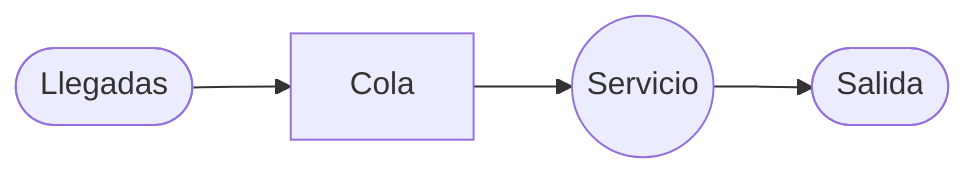
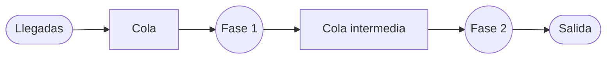
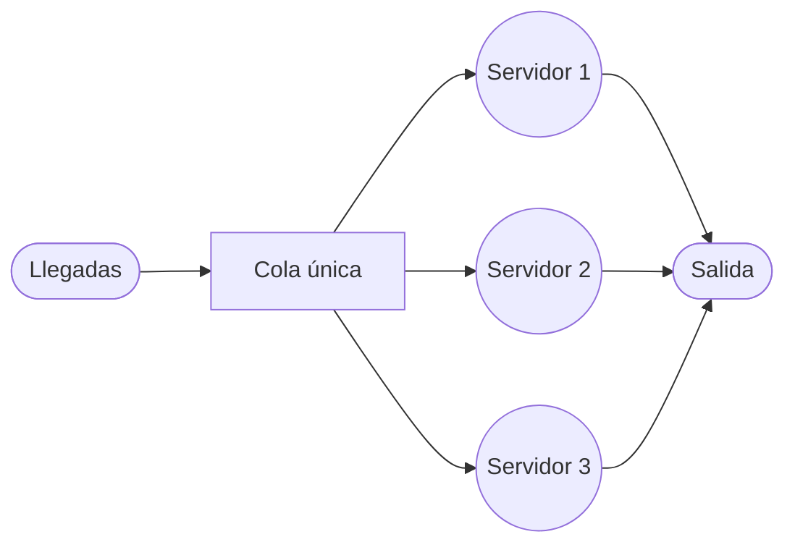
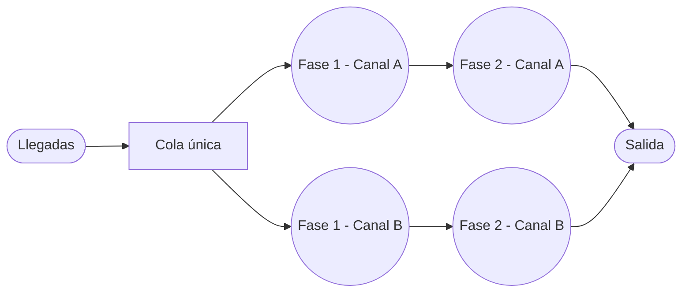

# Guía para dibujar Estructuras de Líneas de Espera en Mermaid

Esta guía describe **4 plantillas fijas** que cubren los sistemas de colas que se ven en el curso (canal único/multicanal, fase única/fases múltiples). A diferencia de la guía de Cadenas de Markov, aquí no hay que calcular posiciones ni ángulos: cada ejercicio usa una de estas 4 plantillas casi sin cambios, solo ajustando el número de servidores o de fases y, si corresponde, las etiquetas de $\lambda$ y $\mu$.

**Nota importante:** estos diagramas representan el **flujo físico de clientes** por el sistema, no probabilidades de transición. No llevan bucles (self-loops) ni etiquetas de probabilidad como las cadenas de Markov — solo cajas y flechas mostrando por dónde pasa el cliente.

## 1. Las 4 estructuras posibles

| Estructura | Canales | Fases | Ejemplo típico | Cómo reconocerla en el enunciado |
|---|---|---|---|---|
| 1 | Único (s=1) | Una | Consulta de un dentista | Se menciona un solo servidor/profesional y un solo paso de atención |
| 2 | Único (s=1) | Múltiples | Venta de hamburguesas (tomar pedido → entregar) | Un solo servidor, pero la atención tiene 2 o más pasos secuenciales (tomar orden, preparar, entregar) |
| 3 | Múltiple (s>1) | Una | Cajeros automáticos de un banco | Se menciona explícitamente "s" servidores, cajeros, ventanillas o canales en paralelo, cada uno resuelve todo el servicio de una vez |
| 4 | Múltiple (s>1) | Múltiples | Matriculación universitaria (varias filas, cada una con 2+ pasos) | Hay varios canales en paralelo Y cada canal tiene 2 o más pasos secuenciales |

Si el enunciado no aclara el número de fases, asume **una sola fase** (estructuras 1 o 3). Si no aclara el número de canales, asume **un solo canal** (estructuras 1 o 2) — los modelos A, B y C del curso (M/M/1, M/M/s, M/D/1) son canal único o multicanal de **una sola fase**; las estructuras 2 y 4 (multifase) solo aplican si el enunciado describe pasos de atención secuenciales.

## 2. Reglas de formato obligatorias para el bloque de código

- **Un solo bloque de código por diagrama, sin excepción.** Todo el diagrama va dentro de un único code fence que abre con tres comillas invertidas seguidas de la palabra "mermaid" y cierra con tres comillas invertidas solas. Nunca dividas un mismo diagrama en varios bloques, y nunca dejes texto suelto fuera del bloque.
- **Siempre usa `flowchart LR`** (de izquierda a derecha) como primera línea dentro del bloque. No mezcles con `graph TD` ni otras variantes — la dirección debe ser siempre la misma en todos los diagramas de colas.
- No agregues estilos de color (`style`, `classDef`) salvo que el usuario lo pida explícitamente; el objetivo es claridad estructural, no decoración.

## 3. Vocabulario visual (mismo significado siempre)

Para que todos los diagramas se vean consistentes, cada forma representa siempre lo mismo:

| Elemento | Sintaxis Mermaid | Forma |
|---|---|---|
| Llegada o salida del sistema | `id([Texto])` | óvalo / estadio |
| Cola (fila de espera) | `id[Texto]` | rectángulo |
| Servidor o fase de servicio | `id((Texto))` | círculo |

No intercambies las formas (por ejemplo, no dibujes un servidor como rectángulo): el rectángulo es siempre cola, el círculo es siempre servicio/fase.

## 4. Convención de nombres de nodos

- `L` = llegadas, `O` = salida (se reutilizan siempre con estos mismos nombres).
- `Q` = cola única. Si hay una cola intermedia entre fases, usa `Q1`, `Q2`...
- `S` = servidor/fase única. Si hay varios servidores en paralelo, usa `S1`, `S2`, `S3`... según corresponda al número real de servidores del ejercicio (si el ejercicio dice s=4, agrega `S4` siguiendo el mismo patrón).
- En sistemas multicanal **y** multifase, nombra cada canal con una letra y cada fase con un número: `A1`, `A2` (canal A, fases 1 y 2), `B1`, `B2` (canal B), etc. Agrega tantos pares de letras como canales tenga el ejercicio.

## 5. Plantilla 1: Canal único, fase única



## 6. Plantilla 2: Canal único, fases múltiples

Repite el bloque `Cola → Fase` por cada fase adicional, encadenando una después de la otra:



## 7. Plantilla 3: Multicanal, fase única

Una sola cola alimenta a todos los servidores en paralelo; todos los servidores apuntan a la misma salida. Agrega o quita líneas `S_n` según el número real de servidores:



## 8. Plantilla 4: Multicanal, fases múltiples

Una sola cola se reparte entre varios canales en paralelo, y cada canal encadena sus propias fases por separado:



## 9. Cómo adaptar una plantilla a un ejercicio concreto

1. Identifica la estructura (1 a 4) con la tabla de la sección 1.
2. Copia la plantilla correspondiente tal cual.
3. Si el ejercicio da $\lambda$ y/o $\mu$ y quieres mostrarlos, etiqueta las flechas así: `Q -->|λ| S` o `S -->|μ| O` (el texto entre `|...|` aparece sobre la flecha). Esto es opcional, no obligatorio.
4. Si el número de servidores o de fases no coincide con el ejemplo de la plantilla, agrega o quita nodos siguiendo el mismo patrón de nombres de la sección 4 — nunca improvises nombres nuevos sin seguir el patrón.
5. No agregues flechas de un nodo hacia sí mismo ni flechas "de vuelta" — el flujo de clientes en estos diagramas es siempre unidireccional, de llegada a salida.

## 10. Errores frecuentes a evitar

- No mezclar formas de nodo entre cola y servidor (el rectángulo es siempre cola, el círculo es siempre servicio).
- No usar `graph TD` u otra dirección distinta a `flowchart LR`.
- No dividir el diagrama en varios bloques de código.
- No agregar bucles, probabilidades o colores de cadena de Markov — estos diagramas son de flujo, no de transición.
- No dejar el número de servidores/fases genérico cuando el ejercicio especifica un número concreto (por ejemplo, si dice "3 cajeros", el diagrama debe tener exactamente `S1`, `S2`, `S3`, ni más ni menos).

## 11. Cuándo dibujar el diagrama

Dibújalo como parte del paso de **identificación del tipo de ejercicio**, antes de aplicar las fórmulas del Modelo A, B o C — del mismo modo en que el diagrama de una cadena de Markov se dibuja antes de construir la matriz de transición. El diagrama sirve para confirmar visualmente qué estructura (1 a 4) corresponde, no para mostrar resultados numéricos.

## 12. Prompt sugerido para pedirle esto a NotebookLM

> "Identifica qué estructura de línea de espera (canal único/multicanal, fase única/fases múltiples) corresponde a este ejercicio según la tabla de la guía, y dibújala en Mermaid usando la plantilla correspondiente, ajustando el número de servidores o fases a los datos del ejercicio."

## 13. Checklist final antes de entregar el diagrama

- [ ] Un único bloque ` ```mermaid `, con `flowchart LR` como primera línea.
- [ ] Las formas respetan el vocabulario: óvalo = llegada/salida, rectángulo = cola, círculo = servidor/fase.
- [ ] El número de servidores en paralelo coincide exactamente con el "s" del ejercicio (si aplica).
- [ ] El número de fases coincide con lo descrito en el enunciado (si aplica).
- [ ] No hay bucles, colores ni etiquetas de probabilidad propias de cadenas de Markov.
- [ ] Los nombres de nodo siguen la convención de la sección 4.
