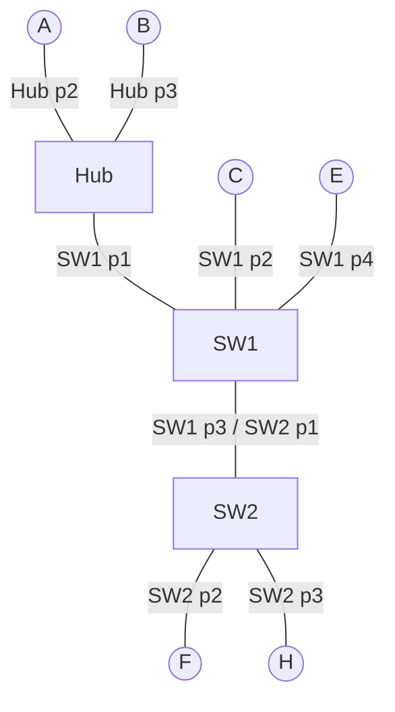

# Ejemplo 2: switches + ARP

Transmisiones en orden secuencial: **1ro F→E, 2do C→B, 3ro A→B, 4to E→H**.

Cada tramo se explica completo y por sí solo, sin depender de los anteriores.

## Leyenda de las etiquetas en los pasos

- **`[T-conm SWx]`** = se anota o renueva en la **tabla de conmutación** del switch x (MAC → puerto).
- **`[T-arp X]`** = se anota en la **tabla ARP** del equipo X (IP → MAC).
- Si un paso no lleva etiqueta, solo se reenvía o se descarta la trama y no se escribe nada en ninguna tabla.

## Topología

---

## Qué cambia respecto al ejemplo 1: ahora hay 2 tablas

| Tabla | Etiqueta | Dónde vive | Qué relaciona | Dura |
|---|---|---|---|---|
| **Tabla de conmutación** | `T-conm` | Switch | MAC → puerto | 5 min, volátil |
| **Tabla ARP** | `T-arp` | Cada PC | IP → MAC | ~3 min, volátil |

**Por qué hace falta ARP:** el equipo que envía conoce la **IP destino** (viene en el mensaje) pero no su **MAC**, y la trama necesita la MAC para viajar.

**Cómo funciona el algoritmo ARP (antes de enviar el dato):**
1. **Solicitud ARP (broadcast):** el emisor manda una trama con MAC origen = suya, MAC destino = `FF:FF:FF:FF:FF:FF` y pregunta "¿quién tiene la IP X?".
2. Todos la reciben y la procesan, pero **solo el dueño de la IP X responde**. Los demás la descartan sin aprender nada.
3. **Respuesta ARP (unicast):** el dueño responde directo a la MAC del emisor.
4. Quedan registrados: el **dueño** aprende `IP_emisor → MAC_emisor` (al recibir la solicitud) y el **emisor** aprende `IP_dueño → MAC_dueño` (al recibir la respuesta). Ambos en su `T-arp`.
5. Recién ahí el emisor envía el **dato real** (unicast).

**Qué hace el switch con esto (2 cosas, siempre en este orden):**
1. Mira la **MAC origen** de la trama y la anota en su `T-conm` con el puerto de entrada (si ya existe, solo renueva el temporizador).
2. Mira la **MAC destino** y la busca en su `T-conm`:
   - Si la encuentra → envía **solo por ese puerto** (si es el mismo de entrada, descarta).
   - Si no la encuentra → **inundación**: copia por todos los puertos menos el de entrada.
   - La solicitud ARP es broadcast: la MAC `FF..F` nunca está en la `T-conm`, así que **siempre hay inundación**.

Estado inicial: todas las tablas vacías (`T-conm` de SW1 y SW2, y `T-arp` de todos los equipos).

---

## 1ra transmisión: F → E

### Tablas finales

| Conmutación SW1 | Puerto | | Conmutación SW2 | Puerto |
|---|---|---|---|---|
| MAC_F | 3 | | MAC_F | 2 |
| MAC_E | 4 | | MAC_E | 1 |

| ARP de F | MAC | | ARP de E | MAC |
|---|---|---|---|---|
| IP_E | MAC_E | | IP_F | MAC_F |

### Pasos

**Solicitud ARP (broadcast)**
1. F no conoce la MAC de E. Envía una solicitud ARP: origen MAC_F, destino `FF..F`, pregunta por IP_E. Entra a SW2 por el puerto 2.
2. **SW2 (puerto 2):**
   - MAC origen (MAC_F): `[T-conm SW2]` anota `MAC_F → 2`.
   - MAC destino (`FF..F`): es broadcast y nunca está en la tabla → inundación por los puertos 1 y 3.
   - Puerto 3 → H: la procesa, la IP preguntada no es la suya y descarta (no anota nada).
   - Puerto 1 → SW1.
3. **SW1 (puerto 3):**
   - MAC origen (MAC_F): `[T-conm SW1]` anota `MAC_F → 3`.
   - MAC destino (`FF..F`): broadcast → inundación por los puertos 1, 2 y 4.
   - Puerto 1 → Hub → A y B descartan.
   - Puerto 2 → C descarta.
   - Puerto 4 → **E**: la IP es la suya, procesa y `[T-arp E]` anota `IP_F → MAC_F`.

**Respuesta ARP (unicast)**
4. E responde a MAC_F. Entra a SW1 por el puerto 4.
5. **SW1 (puerto 4):**
   - MAC origen (MAC_E): `[T-conm SW1]` anota `MAC_E → 4`.
   - MAC destino (MAC_F): la busca en su `T-conm` y encuentra `MAC_F → 3` (la anotó en el paso 3). Como sabe dónde está F, envía **solo por el 3**, sin inundación.
6. **SW2 (puerto 1):**
   - MAC origen (MAC_E): `[T-conm SW2]` anota `MAC_E → 1`.
   - MAC destino (MAC_F): la busca en su `T-conm` y encuentra `MAC_F → 2` (la anotó en el paso 2) → envía **solo por el 2**.
7. **F** recibe la respuesta y `[T-arp F]` anota `IP_E → MAC_E`.

**Dato F → E**
8. Ahora F envía el dato con MAC destino = MAC_E.
   - SW2 (puerto 2): MAC_F ya existe, `[T-conm SW2]` solo renueva el temporizador. Encuentra `MAC_E → 1` → envía solo por el 1.
   - SW1 (puerto 3): MAC_F ya existe, `[T-conm SW1]` solo renueva el temporizador. Encuentra `MAC_E → 4` → envía solo por el 4.
   - Solo E lo recibe.

---

## 2da transmisión: C → B

Partimos de las tablas que dejó la 1ra transmisión: SW1 = {MAC_F → 3, MAC_E → 4}, SW2 = {MAC_F → 2, MAC_E → 1}. C y B tienen su `T-arp` vacía.

### Tablas finales

| Conmutación SW1 | Puerto | | Conmutación SW2 | Puerto |
|---|---|---|---|---|
| MAC_F | 3 | | MAC_F | 2 |
| MAC_E | 4 | | MAC_E | 1 |
| MAC_C | 2 | | MAC_C | 1 |
| MAC_B | 1 | | | |

| ARP de C | MAC | | ARP de B | MAC |
|---|---|---|---|---|
| IP_B | MAC_B | | IP_C | MAC_C |

### Pasos

**Solicitud ARP (broadcast)**
1. C no conoce la MAC de B. Envía una solicitud ARP: origen MAC_C, destino `FF..F`, pregunta por IP_B. Entra a SW1 por el puerto 2.
2. **SW1 (puerto 2):**
   - MAC origen (MAC_C): `[T-conm SW1]` anota `MAC_C → 2`.
   - MAC destino (`FF..F`): broadcast → inundación por los puertos 1, 3 y 4.
   - Puerto 1 → Hub, que la repite por todos sus puertos: **B** procesa, la IP es la suya y `[T-arp B]` anota `IP_C → MAC_C`; A descarta.
   - Puerto 4 → E descarta.
   - Puerto 3 → SW2.
3. **SW2 (puerto 1):**
   - MAC origen (MAC_C): `[T-conm SW2]` anota `MAC_C → 1`.
   - MAC destino (`FF..F`): broadcast → inundación por los puertos 2 y 3.
   - Puerto 2 → F descarta.
   - Puerto 3 → H descarta.

**Respuesta ARP (unicast)**
4. B responde a MAC_C. Sale hacia el Hub, que la repite por todos sus puertos: A la descarta y SW1 la recibe por el puerto 1.
5. **SW1 (puerto 1):**
   - MAC origen (MAC_B): `[T-conm SW1]` anota `MAC_B → 1`.
   - MAC destino (MAC_C): la busca en su `T-conm` y encuentra `MAC_C → 2` (la anotó en el paso 2) → envía **solo por el 2**.
6. **SW2 no ve la respuesta** (SW1 no la envió por el puerto 3), así que su `T-conm` no cambia.
7. **C** recibe la respuesta y `[T-arp C]` anota `IP_B → MAC_B`.

**Dato C → B**
8. Ahora C envía el dato con MAC destino = MAC_B.
   - SW1 (puerto 2): MAC_C ya existe, `[T-conm SW1]` solo renueva el temporizador. Encuentra `MAC_B → 1` → envía solo por el 1.
   - El Hub lo repite: A descarta y B lo procesa.
   - SW2 no lo ve.

---

## 3ra transmisión: A → B

Partimos de las tablas que dejó la 2da transmisión: SW1 = {MAC_F → 3, MAC_E → 4, MAC_C → 2, MAC_B → 1}, SW2 = {MAC_F → 2, MAC_E → 1, MAC_C → 1}. B ya tiene `IP_C → MAC_C` en su `T-arp`. A tiene su `T-arp` vacía.

### Tablas finales

| Conmutación SW1 | Puerto | | Conmutación SW2 | Puerto |
|---|---|---|---|---|
| MAC_F | 3 | | MAC_F | 2 |
| MAC_E | 4 | | MAC_E | 1 |
| MAC_C | 2 | | MAC_C | 1 |
| MAC_B | 1 ✓ | | MAC_A | 1 |
| MAC_A | 1 | | | |

| ARP de A | MAC | | ARP de B | MAC |
|---|---|---|---|---|
| IP_B | MAC_B | | IP_C | MAC_C |
| | | | IP_A | MAC_A |

### Pasos

**Solicitud ARP (broadcast)**
1. A no conoce la MAC de B. Envía una solicitud ARP: origen MAC_A, destino `FF..F`, pregunta por IP_B. Sale al Hub, que la repite por todos sus puertos.
2. Llega a **B** (procesa, la IP es la suya y `[T-arp B]` anota `IP_A → MAC_A`) y a SW1 por el puerto 1.
3. **SW1 (puerto 1):**
   - MAC origen (MAC_A): `[T-conm SW1]` anota `MAC_A → 1`.
   - MAC destino (`FF..F`): broadcast → inundación por los puertos 2, 3 y 4.
   - Puerto 2 → C descarta.
   - Puerto 4 → E descarta.
   - Puerto 3 → SW2.
4. **SW2 (puerto 1):**
   - MAC origen (MAC_A): `[T-conm SW2]` anota `MAC_A → 1`.
   - MAC destino (`FF..F`): broadcast → inundación por los puertos 2 y 3.
   - Puerto 2 → F descarta.
   - Puerto 3 → H descarta.

**Respuesta ARP (unicast)**
5. B responde a MAC_A. Sale hacia el Hub, que la repite por todos sus puertos: A la procesa y SW1 la recibe por el puerto 1.
6. **SW1 (puerto 1):**
   - MAC origen (MAC_B): `[T-conm SW1]` MAC_B **ya existía** → no se agrega fila, solo se **resetea el temporizador** (esa es la ✓ de tus apuntes).
   - MAC destino (MAC_A): la busca en su `T-conm` y encuentra `MAC_A → 1`, el mismo puerto por el que entró (A y B están del mismo lado) → **descarta**.
   - SW2 no la ve.
7. **A** recibe la respuesta y `[T-arp A]` anota `IP_B → MAC_B`.

**Dato A → B**
8. Ahora A envía el dato con MAC destino = MAC_B. El Hub lo repite: B lo procesa y SW1 lo recibe por el puerto 1.
   - SW1 (puerto 1): MAC_A ya existe, `[T-conm SW1]` solo renueva el temporizador. Encuentra `MAC_B → 1`, el mismo puerto de entrada → descarta.
   - SW2 no lo ve.

---

## 4ta transmisión: E → H (derivada, no aparece en las tablas de tus apuntes)

Partimos de las tablas que dejó la 3ra transmisión: SW1 = {MAC_F → 3, MAC_E → 4, MAC_C → 2, MAC_B → 1, MAC_A → 1}, SW2 = {MAC_F → 2, MAC_E → 1, MAC_C → 1, MAC_A → 1}. E ya tiene `IP_F → MAC_F` en su `T-arp`. H tiene su `T-arp` vacía.

### Tablas finales

| Conmutación SW1 | Puerto | | Conmutación SW2 | Puerto |
|---|---|---|---|---|
| MAC_F | 3 | | MAC_F | 2 |
| MAC_E | 4 ✓ | | MAC_E | 1 ✓ |
| MAC_C | 2 | | MAC_C | 1 |
| MAC_B | 1 ✓ | | MAC_A | 1 |
| MAC_A | 1 | | MAC_H | 3 |
| MAC_H | 3 | | | |

| ARP de E | MAC | | ARP de H | MAC |
|---|---|---|---|---|
| IP_F | MAC_F | | IP_E | MAC_E |
| IP_H | MAC_H | | | |

### Pasos

**Solicitud ARP (broadcast)**
1. E no conoce la MAC de H (solo tiene la de F en su `T-arp`). Envía una solicitud ARP: origen MAC_E, destino `FF..F`, pregunta por IP_H. Entra a SW1 por el puerto 4.
2. **SW1 (puerto 4):**
   - MAC origen (MAC_E): `[T-conm SW1]` ya existe, solo renueva el temporizador.
   - MAC destino (`FF..F`): broadcast → inundación por los puertos 1, 2 y 3.
   - Puerto 1 → Hub → A y B descartan.
   - Puerto 2 → C descarta.
   - Puerto 3 → SW2.
3. **SW2 (puerto 1):**
   - MAC origen (MAC_E): `[T-conm SW2]` ya existe, solo renueva el temporizador.
   - MAC destino (`FF..F`): broadcast → inundación por los puertos 2 y 3.
   - Puerto 2 → F descarta.
   - Puerto 3 → **H**: la IP es la suya, procesa y `[T-arp H]` anota `IP_E → MAC_E`.

**Respuesta ARP (unicast)**
4. H responde a MAC_E. Entra a SW2 por el puerto 3.
5. **SW2 (puerto 3):**
   - MAC origen (MAC_H): `[T-conm SW2]` anota `MAC_H → 3`.
   - MAC destino (MAC_E): la busca en su `T-conm` y encuentra `MAC_E → 1` → envía **solo por el 1**.
6. **SW1 (puerto 3):**
   - MAC origen (MAC_H): `[T-conm SW1]` anota `MAC_H → 3`.
   - MAC destino (MAC_E): la busca en su `T-conm` y encuentra `MAC_E → 4` → envía **solo por el 4**.
7. **E** recibe la respuesta y `[T-arp E]` anota `IP_H → MAC_H`.

**Dato E → H**
8. Ahora E envía el dato con MAC destino = MAC_H.
   - SW1 (puerto 4): MAC_E ya existe, solo renueva. Encuentra `MAC_H → 3` → envía solo por el 3.
   - SW2 (puerto 1): MAC_E ya existe, solo renueva. Encuentra `MAC_H → 3` → envía solo por el 3.
   - Solo H lo recibe.

---

## Ideas clave

1. El **broadcast ARP siempre se inunda** (la MAC `FF..F` nunca está en la `T-conm`) y por eso enseña la MAC del emisor a todos los switches por donde pasa.
2. La **respuesta ARP es unicast**: enseña la MAC de quien responde solo a los switches por donde pasa.
3. En ARP **solo el dueño de la IP anota en su `T-arp`** a partir del broadcast. Los demás procesan y descartan.
4. **Inundación vs ARP:** en ambos se envía a todos, pero en ARP el destino procesa y responde, y en la inundación del switch el destino ni siquiera sabe que se está buscando su MAC.
5. Si la MAC ya estaba en la `T-conm`, no se agrega fila: **se renueva el temporizador** (✓).
6. Si el destino queda por el mismo puerto de entrada, el switch **descarta**.
7. Quién escribe dónde: el **switch** escribe en `T-conm` (siempre con la MAC origen de la trama que pasa) y el **PC** escribe en `T-arp` (al recibir una solicitud dirigida a él o una respuesta).
