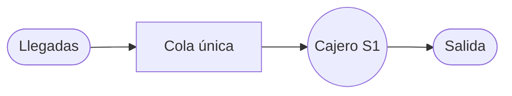
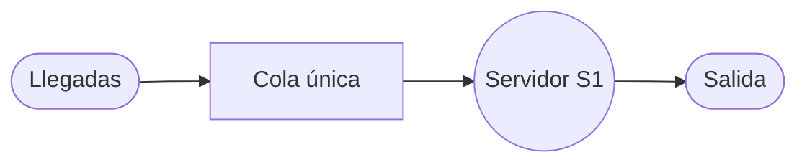

# 1

El departamento de estudios de mercado de una fábrica estima que el 20% de la gente que compra un producto un mes, no lo comprará el mes siguiente. Además, el 30% de quienes no lo compren un mes lo adquirirá al mes siguiente. En una población de 1000 individuos, 100 compraron el producto el primer mes. ¿Cuántos lo comprarán al mes próximo? ¿Y dentro de tres meses? 

```tikz
%\documentclass[tikz,border=10pt]{standalone}
\usetikzlibrary{arrows.meta, positioning}
\begin{document}
\begin{tikzpicture}
    % Definición de estados (N=2, posicionamiento horizontal según guía)
    \node (C) at (2,6) [draw,circle,thick,color=orange,minimum size=1.5cm] {$C$};
    \node (NC) at (10,6) [draw,circle,thick,color=pink,minimum size=1.5cm] {$NC$};

    % Bucles (Self-loops) hacia afuera
    \draw[->,ultra thick,orange] (C) .. controls (0,8) and (0,4) .. node[left,color=black] {$0.80$} (C);
    \draw[->,ultra thick,pink] (NC) .. controls (12,8) and (12,4) .. node[right,color=black] {$0.70$} (NC);

    % Transiciones entre estados
    \draw[->,very thick,orange] (C) to[bend left=30] node[above,color=black] {$0.20$} (NC);
    \draw[->,very thick,pink] (NC) to[bend left=30] node[below,color=black] {$0.30$} (C);
\end{tikzpicture}
\end{document}
```

### Análisis Técnico y Resolución del Ejercicio

Este ejercicio se identifica como un proceso de **Cadenas de Markov en tiempo discreto**. Se cumplen las condiciones fundamentales: el sistema posee un número finito de estados (comprar o no comprar), las probabilidades de transición son constantes en el tiempo (estacionarias) y la probabilidad de un estado futuro depende únicamente del estado actual (Propiedad de Markov).

---

#### 1. Identificación de Datos y Estados

- **Población total ($N$):** $1000$ individuos.
- **Estados del sistema:**
    - **Estado 1 ($C$):** Clientes que compran el producto.
    - **Estado 2 ($NC$):** Clientes que no compran el producto.
- **Probabilidades de transición dadas:**
    - De compra a no compra ($P_{12}$): $0.20$ (20%).
    - De no compra a compra ($P_{21}$): $0.30$ (30%).

---

#### 2. Construcción de la Matriz de Transición ($P$)

La suma de las probabilidades de cada fila debe ser igual a $1$ (propiedad estocástica). Calculamos las probabilidades de permanencia (bucles):

- **Para el Estado $C$:** $P_{11} = 1 - P_{12} = 1 - 0.20 = \mathbf{0.80}$ (probabilidad de seguir comprando).
- **Para el Estado $NC$:** $P_{22} = 1 - P_{21} = 1 - 0.30 = \mathbf{0.70}$ (probabilidad de seguir sin comprar).

La matriz de transición resultante es: $$P = \begin{bmatrix} 0.8 & 0.2 \ 0.3 & 0.7 \end{bmatrix}$$

---

#### 3. Definición del Vector de Estado Inicial ($\pi(1)$)

En el primer mes, $100$ personas compraron el producto. Expresamos el estado inicial en términos de probabilidades dividiendo por la población total ($1000$):

- $\pi_C(1) = \frac{100}{1000} = 0.10$
- $\pi_{NC}(1) = \frac{900}{1000} = 0.90$

El vector inicial es: $\pi(1) = [0.1, \quad 0.9]$.

---

#### 4. Proyección para el Próximo Mes (Mes 2)

Utilizamos la relación recurrente $\pi(n+1) = \pi(n) \cdot P$: $$\pi(2) = [0.1, \quad 0.9] \begin{bmatrix} 0.8 & 0.2 \ 0.3 & 0.7 \end{bmatrix}$$

**Cálculo de componentes:**

- $\pi_1(2) = (0.1 \times 0.8) + (0.9 \times 0.3) = 0.08 + 0.27 = \mathbf{0.35}$
- $\pi_2(2) = (0.1 \times 0.2) + (0.9 \times 0.7) = 0.02 + 0.63 = \mathbf{0.65}$

**Conversión a número de individuos:**

- Compradores (Mes 2) = $0.35 \times 1000 = \mathbf{350 \text{ individuos}}$.

---

#### 5. Proyección para dentro de tres meses (Mes 4)

Para hallar el estado en el periodo 4 (tres meses después del inicio), iteramos paso a paso:

**Paso A: Cálculo para el Mes 3** $$\pi(3) = \pi(2) \cdot P = [0.35, \quad 0.65] \begin{bmatrix} 0.8 & 0.2 \ 0.3 & 0.7 \end{bmatrix}$$

- $\pi_1(3) = (0.35 \times 0.8) + (0.65 \times 0.3) = 0.28 + 0.195 = \mathbf{0.475}$
- $\pi_2(3) = (0.35 \times 0.2) + (0.65 \times 0.7) = 0.07 + 0.455 = \mathbf{0.525}$

**Paso B: Cálculo para el Mes 4** $$\pi(4) = \pi(3) \cdot P = [0.475, \quad 0.525] \begin{bmatrix} 0.8 & 0.2 \ 0.3 & 0.7 \end{bmatrix}$$

- $\pi_1(4) = (0.475 \times 0.8) + (0.525 \times 0.3) = 0.38 + 0.1575 = \mathbf{0.5375}$
- $\pi_2(4) = (0.475 \times 0.2) + (0.525 \times 0.7) = 0.095 + 0.3675 = \mathbf{0.4625}$

**Conversión a número de individuos:**

- Compradores (Mes 4) = $0.5375 \times 1000 = \mathbf{537.5 \text{ individuos}}$.

---

#### Resultado Final y Verificación

Al cabo de los periodos solicitados, el número de compradores será:

- **Al mes próximo:** $350$ individuos.
- **Dentro de tres meses:** aproximadamente **$538$ individuos** (redondeando $537.5$).

**Verificación:** La suma de probabilidades en el mes 4 es $0.5375 + 0.4625 = 1.0$, lo que confirma la validez del modelo estocástico.


---
---

# 2 


Un banco está considerando abrir un servicio para que los clientes paguen desde su automóvil, se estima que los clientes llegaran a una tasa promedio (λ ) de 15 por hora. El cajero que trabajara en la ventanilla puede atender a los clientes a un ritmo promedio (µ ) de 1 cada 3 minutos. Suponiendo que el patrón de llegadas en Poisson y el patrón de servicios es exponencial encuentre: a) La utilización promedio del cajero b) El numero promedio de clientes en la línea de espera c) el numero promedio de clientes en el sistema d) El tiempo promedio de espera en la fila e) El tiempo promedio de espera en el sistema


Para resolver este ejercicio de teoría de colas, seguiremos el procedimiento detallado en las fuentes prioritarias, identificando primero la estructura del sistema y luego aplicando las fórmulas correspondientes al modelo identificado.

### 1. Identificación de Datos y Modelo

De acuerdo con el enunciado, el sistema presenta las siguientes características:

- **Tasa promedio de llegadas ($\lambda$):** $15$ clientes por hora.
- **Tasa promedio de servicio ($\mu$):** El cajero atiende a $1$ cliente cada $3$ minutos. Debemos convertir esta tasa a las mismas unidades que $\lambda$ (clientes por hora): $$\mu = \frac{60 \text{ min/hora}}{3 \text{ min/cliente}} = \mathbf{20 \text{ clientes por hora}}$$
- **Estructura:** Se trata de un sistema de **canal único y fase única**, ya que hay un solo cajero atendiendo una sola fila.
- **Modelo de colas:** Dado que las llegadas siguen una distribución de Poisson y los servicios una distribución exponencial con un solo servidor, el modelo es **M/M/1** (Modelo A).

#### Diagrama del Sistema (Estructura de Canal Único, Fase Única)

Según la guía de dibujo para líneas de espera:



### 2. Verificación de Estabilidad

Antes de proceder con los cálculos, verificamos si el sistema alcanza un estado estable (solución estacionaria). Para ello, la tasa de servicio debe ser mayor que la tasa de llegada ($\lambda < \mu$): $$15 < 20$$ La condición se cumple, por lo tanto, el sistema es estable.

---

### 3. Resolución Paso a Paso

#### a) La utilización promedio del cajero ($\rho$)

Esta medida indica la fracción de tiempo que el servidor permanece ocupado.

- **Fórmula:** $\rho = \frac{\lambda}{\mu}$
- **Sustitución:** $\rho = \frac{15}{20}$
- **Resultado:** $\rho = \mathbf{0.75}$ El cajero está ocupado el **75%** del tiempo.

#### b) El número promedio de clientes en la línea de espera ($L_q$)

Representa la cantidad de unidades que están físicamente en la fila esperando ser atendidas.

- **Fórmula:** $L_q = \frac{\lambda^2}{\mu(\mu - \lambda)}$
- **Sustitución:** $L_q = \frac{15^2}{20(20 - 15)}$
- **Operaciones parciales:**
    - $15^2 = 225$
    - $20(20 - 15) = 20(5) = 100$
- **Resultado:** $L_q = \frac{225}{100} = \mathbf{2.25 \text{ clientes}}$ En promedio, hay **2.25 clientes** en la fila (aproximadamente 2).

#### c) El número promedio de clientes en el sistema ($L_s$)

Es el número total de clientes en la instalación, incluyendo los que esperan y el que está siendo atendido.

- **Fórmula:** $L_s = \frac{\lambda}{\mu - \lambda}$
- **Sustitución:** $L_s = \frac{15}{20 - 15}$
- **Operación:** $L_s = \frac{15}{5} = \mathbf{3}$ Hay un promedio de **3 clientes** en el sistema en total.

#### d) El tiempo promedio de espera en la fila ($W_q$)

Es el tiempo que un cliente pasa exclusivamente esperando antes de que comience su servicio.

- **Fórmula:** $W_q = \frac{\lambda}{\mu(\mu - \lambda)}$
- **Sustitución:** $W_q = \frac{15}{20(20 - 15)}$
- **Operación:** $W_q = \frac{15}{100} = \mathbf{0.15 \text{ horas}}$
- **Conversión a minutos:** $0.15 \times 60 \text{ min} = \mathbf{9 \text{ minutos}}$ Un cliente espera en promedio **9 minutos** antes de ser atendido.

#### e) El tiempo promedio de espera en el sistema ($W_s$)

Es el tiempo total desde que el cliente llega hasta que termina de ser atendido (espera + servicio).

- **Fórmula:** $W_s = \frac{1}{\mu - \lambda}$
- **Sustitución:** $W_s = \frac{1}{20 - 15}$
- **Operación:** $W_s = \frac{1}{5} = \mathbf{0.2 \text{ horas}}$
- **Conversión a minutos:** $0.2 \times 60 \text{ min} = \mathbf{12 \text{ minutos}}$ Un cliente permanece en promedio **12 minutos** en el sistema.

---

### 4. Verificación de los Resultados

Utilizamos la **Relación de Little** ($L = \lambda W$) para validar los cálculos:

1. **Para el sistema:** $L_s = \lambda \times W_s \rightarrow 3 = 15 \times 0.2 \rightarrow \mathbf{3 = 3}$ (Correcto).
2. **Para la cola:** $L_q = \lambda \times W_q \rightarrow 2.25 = 15 \times 0.15 \rightarrow \mathbf{2.25 = 2.25}$ (Correcto).
3. **Relación entre tiempos:** $W_s = W_q + (1/\mu) \rightarrow 12 \text{ min} = 9 \text{ min} + (1/20 \times 60) \text{ min} \rightarrow \mathbf{12 = 9 + 3}$ (Correcto).


---
---


# 3
(25%) Un agente comercial realiza su trabajo en tres ciudades A, B y C. Para evitar desplazamientos innecesarios está todo el día en la misma ciudad y allí pernocta, desplazándose a otra ciudad al día siguiente, si no tiene suficiente trabajo. Después de estar trabajando un día en C, la probabilidad de tener que seguir trabajando en ella al día siguiente es 0.4, la de tener que viajar a B es 0.4 y la de tener que ir a A es 0.2. Si el viajante duerme un día en B, con probabilidad de un 20% tendrá que seguir trabajando en la misma ciudad al día siguiente, en el 60% de los casos viajará a C, mientras que irá a A con probabilidad 0.2. Por último, si el agente comercial trabaja todo un día en A, permanecerá en esa misma ciudad, al día siguiente, con una probabilidad 0.1, irá a B con una probabilidad de 0.3 y a C con una probabilidad de 0.6. a) Si hoy el viajante está en C, ¿cuál es la probabilidad de que también tenga que trabajar en C al cabo de cuatro días? b) ¿Cuáles son los porcentajes de días en los que el agente comercial está en cada una de las tres ciudades?

```tikz
%\documentclass[tikz,border=10pt]{standalone}
\usetikzlibrary{arrows.meta, positioning}
\begin{document}
\begin{tikzpicture}
    % Definición de estados (N=3, posicionamiento circular centrado en 6,6)
    % Radio R=4.5, Ángulos: 90, -30, -150
    \node (A) at (6,10.5) [draw,circle,thick,color=orange,minimum size=1.2cm] {$A$};
    \node (B) at (9.9,3.75) [draw,circle,thick,color=pink,minimum size=1.2cm] {$B$};
    \node (C) at (2.1,3.75) [draw,circle,thick,color=lime,minimum size=1.2cm] {$C$};

    % Bucles (Self-loops) hacia afuera
    \draw[->,ultra thick,orange] (A) .. controls (4,12.5) and (8,12.5) .. node[above,color=black] {$0.1$} (A);
    \draw[->,ultra thick,pink] (B) .. controls (11.9,1.75) and (11.9,5.75) .. node[right,color=black] {$0.2$} (B);
    \draw[->,ultra thick,lime] (C) .. controls (0.1,1.75) and (0.1,5.75) .. node[left,color=black] {$0.4$} (C);

    % Transiciones desde A (Renglón 1)
    \draw[->,very thick,orange] (A) to[bend left=20] node[pos=0.2,right,color=black] {$0.3$} (B);
    \draw[->,very thick,orange] (A) to[bend left=20] node[pos=0.2,left,color=black] {$0.6$} (C);

    % Transiciones desde B (Renglón 2)
    \draw[->,very thick,pink] (B) to[bend left=20] node[pos=0.2,left,color=black] {$0.2$} (A);
    \draw[->,very thick,pink] (B) to[bend left=20] node[pos=0.2,above,color=black] {$0.6$} (C);

    % Transiciones desde C (Renglón 3)
    \draw[->,very thick,lime] (C) to[bend left=20] node[pos=0.2,right,color=black] {$0.2$} (A);
    \draw[->,very thick,lime] (C) to[bend left=20] node[pos=0.2,below,color=black] {$0.4$} (B);

\end{tikzpicture}
\end{document}
```

### Análisis Técnico y Resolución del Ejercicio

Este ejercicio se modela como una **Cadena de Markov en tiempo discreto** con parámetros estacionarios. El sistema presenta un número finito de estados (ciudades A, B y C) y las probabilidades de transición dependen únicamente del estado actual (Propiedad de Markov).

---

#### 1. Identificación de Datos y Estados

- **Estados del sistema:**
    - Estado 1 ($A$): Ciudad A.
    - Estado 2 ($B$): Ciudad B.
    - Estado 3 ($C$): Ciudad C.
- **Probabilidades de transición (dadas):**
    - Desde A: $P_{AA}=0.1, P_{AB}=0.3, P_{AC}=0.6$.
    - Desde B: $P_{BA}=0.2, P_{BB}=0.2, P_{BC}=0.6$.
    - Desde C: $P_{CA}=0.2, P_{CB}=0.4, P_{CC}=0.4$.

---

#### 2. Construcción de la Matriz de Transición ($P$)

Organizamos las probabilidades en una matriz estocástica donde cada fila suma 1:

$$P = \begin{bmatrix} 0.1 & 0.3 & 0.6 \ 0.2 & 0.2 & 0.6 \ 0.2 & 0.4 & 0.4 \end{bmatrix}$$

---

#### 3. Resolución del Inciso A: Probabilidad al cabo de cuatro días

Si hoy está en la ciudad C, el vector de estado inicial es $\pi(0) = [0, \quad 0, \quad 1]$. Para hallar el estado después de 4 días, aplicamos la relación recurrente $\pi(n) = \pi(n-1) \cdot P$:

- **Día 1 ($\pi(1)$):** $$\pi(1) = \begin{bmatrix} 0.1 & 0.3 & 0.6 \ 0.2 & 0.2 & 0.6 \ 0.2 & 0.4 & 0.4 \end{bmatrix} = [0.2, \quad 0.4, \quad 0.4]$$
    
- **Día 2 ($\pi(2)$):** $$\pi(2) = [0.2, 0.4, 0.4] \cdot P = [0.18, \quad 0.30, \quad 0.52]$$
    
    - $0.2(0.1) + 0.4(0.2) + 0.4(0.2) = 0.02 + 0.08 + 0.08 = 0.18$
    - $0.2(0.3) + 0.4(0.2) + 0.4(0.4) = 0.06 + 0.08 + 0.16 = 0.30$
    - $0.2(0.6) + 0.4(0.6) + 0.4(0.4) = 0.12 + 0.24 + 0.16 = 0.52$
- **Día 3 ($\pi(3)$):** $$\pi(3) = [0.18, 0.30, 0.52] \cdot P = [0.182, \quad 0.322, \quad 0.496]$$
    
- **Día 4 ($\pi(4)$):** $$\pi(4) = [0.182, 0.322, 0.496] \cdot P = [0.1818, \quad 0.3174, \quad \mathbf{0.5008}]$$
    

**Respuesta A:** La probabilidad de que trabaje en C al cabo de cuatro días es **0.5008** (o 50.08%).

---

#### 4. Resolución del Inciso B: Porcentajes a largo plazo (Estado Estable)

Buscamos el vector estacionario $\pi = [\pi_A, \pi_B, \pi_C]$ que cumple $\pi P = \pi$ y $\sum \pi_i = 1$.

**Sistema de ecuaciones:**

1. $\pi_A = 0.1 \pi_A + 0.2 \pi_B + 0.2 \pi_C \implies 0.9 \pi_A - 0.2 \pi_B - 0.2 \pi_C = 0$
2. $\pi_B = 0.3 \pi_A + 0.2 \pi_B + 0.4 \pi_C \implies -0.3 \pi_A + 0.8 \pi_B - 0.4 \pi_C = 0$
3. $\pi_A + \pi_B + \pi_C = 1$

Resolviendo por sustitución (eliminando una ecuación redundante):

- De (1): $0.9 \pi_A = 0.2 (\pi_B + \pi_C)$. Como $\pi_B + \pi_C = 1 - \pi_A$, entonces: $0.9 \pi_A = 0.2 (1 - \pi_A) = 0.2 - 0.2 \pi_A$ $1.1 \pi_A = 0.2 \implies \pi_A = \frac{0.2}{1.1} = \frac{2}{11} \approx \mathbf{0.1818}$
    
- Sustituyendo $\pi_A$ en (2): $0.8 \pi_B = 0.3 (\frac{2}{11}) + 0.4 \pi_C$. Sabiendo $\pi_C = 1 - \pi_A - \pi_B = 1 - \frac{2}{11} - \pi_B = \frac{9}{11} - \pi_B$: $0.8 \pi_B = \frac{0.6}{11} + 0.4 (\frac{9}{11} - \pi_B)$ $0.8 \pi_B = \frac{0.6}{11} + \frac{3.6}{11} - 0.4 \pi_B$ $1.2 \pi_B = \frac{4.2}{11} \implies \pi_B = \frac{4.2}{13.2} = \frac{42}{132} = \frac{7}{22} \approx \mathbf{0.3182}$
    
- Finalmente: $\pi_C = 1 - \frac{4}{22} - \frac{7}{22} = \frac{11}{22} = \mathbf{0.5}$
    

**Respuesta B:** Los porcentajes de días en cada ciudad a largo plazo son:

- Ciudad A: **18.18%**
- Ciudad B: **31.82%**
- Ciudad C: **50.00%**.
- 


---
---


# 4


Suponga un restaurante de comidas rápidas al cual llegan en promedio 100 clientes por hora. Se tiene capacidad para atender en promedio a 150 clientes por hora Se sabe que los clientes esperan en promedio 2 minutos en la cola Calcule las medidas de desempeño del sistema a) ¿Cuál es la probabilidad que el sistema este ocioso? b) ¿Cuál es la probabilidad que un cliente llegue y tenga que esperar, porque el sistema está ocupado? c) ¿Cuál es el número promedio de clientes en la cola? d) ¿Cuál es la probabilidad que haya 10 clientes en la cola?


Para resolver este ejercicio de teoría de colas, seguiremos el procedimiento pedagógico detallado en las fuentes prioritarias, identificando primero los datos, la estructura del sistema y aplicando las fórmulas del modelo correspondiente.

### 1. Identificación de Datos y Modelo

A partir del enunciado, extraemos los siguientes parámetros:

- **Tasa promedio de llegadas ($\lambda$):** $100$ clientes/hora.
- **Tasa promedio de servicio ($\mu$):** $150$ clientes/hora.
- **Tiempo promedio de espera en la cola ($W_q$):** $2$ minutos.
    - _Conversión a horas:_ $W_q = \frac{2 \text{ min}}{60 \text{ min/hora}} = \mathbf{\frac{1}{30} \text{ horas}} \approx 0.0333 \text{ h}$.
- **Número de servidores ($s$):** $1$ (se asume canal único al no mencionar múltiples cajeros).
- **Modelo de colas:** Dado que se proporcionan tasas promedio y se comporta como un sistema de espera estándar, aplicamos el **Modelo A: M/M/1** (Llegadas Poisson, Servicio Exponencial, 1 Servidor).

#### Diagrama del Sistema (Canal Único, Fase Única)

Según la guía de dibujo para líneas de espera:



---

### 2. Verificación de Estabilidad

Antes de realizar los cálculos, verificamos que la tasa de servicio sea mayor que la de llegada ($\lambda < \mu$) para que el sistema no crezca indefinidamente: $$100 < 150$$ La condición se cumple, por lo tanto, el sistema es estable y tiene una solución de estado estacionario.

Calculamos el **factor de utilización ($\rho$)**:

- **Fórmula:** $\rho = \frac{\lambda}{\mu}$
- **Sustitución:** $\rho = \frac{100}{150}$
- **Resultado:** $\rho = \mathbf{0.6667}$ (o $66.67\%$).

---

### 3. Resolución de los Incisos

#### a) ¿Cuál es la probabilidad que el sistema esté ocioso ($P_0$)?

La probabilidad de que el sistema esté vacío (u ocioso) es el complemento de la utilización.

- **Fórmula:** $P_0 = 1 - \rho$
- **Sustitución:** $P_0 = 1 - 0.6667$
- **Resultado:** $P_0 = \mathbf{0.3333}$ Existe una probabilidad del **33.33%** de que el restaurante esté vacío.

#### b) ¿Cuál es la probabilidad que un cliente llegue y tenga que esperar ($P_w$)?

Un cliente debe esperar si el servidor está ocupado al momento de su llegada. En un sistema M/M/1, esto es igual a la utilización del sistema.

- **Fórmula:** $P_w = \rho$
- **Sustitución:** $P_w = \frac{100}{150}$
- **Resultado:** $P_w = \mathbf{0.6667}$ La probabilidad de tener que esperar es del **66.67%**.

#### c) ¿Cuál es el número promedio de clientes en la cola ($L_q$)?

Utilizamos la **Ley de Little** ($L = \lambda W$), ya que el tiempo de espera en la cola ($W_q$) es un dato conocido.

- **Datos:** $\lambda = 100$ cl/h, $W_q = 1/30$ h.
- **Fórmula:** $L_q = \lambda \times W_q$
- **Sustitución:** $L_q = 100 \times \left(\frac{1}{30}\right)$
- **Operación:** $L_q = \frac{100}{30} = \mathbf{3.33 \text{ clientes}}$ En promedio, hay **3.33 clientes** esperando en la fila.

#### d) ¿Cuál es la probabilidad que haya 10 clientes en la cola ($P_{N_q=10}$)?

Tener 10 clientes **en la cola** implica que hay **11 clientes en el sistema** (10 esperando + 1 siendo atendido). Buscamos la probabilidad de estado $P_{11}$.

- **Fórmula:** $P_n = (1 - \rho)\rho^n$
- **Sustitución ($n=11$):** $P_{11} = (1 - 0.6667) \times (0.6667)^{11}$
- **Operaciones parciales:**
    - $1 - 0.6667 = 0.3333$
    - $(0.6667)^{11} \approx 0.01156$
- **Cálculo final:** $P_{11} = 0.3333 \times 0.01156 = \mathbf{0.00385}$ La probabilidad de que haya exactamente 10 clientes en la cola es de **0.385%**.

---

### 4. Resumen de Medidas de Desempeño

- **Utilización ($\rho$):** $66.67\%$.
- **Probabilidad de sistema ocioso ($P_0$):** $33.33\%$.
- **Probabilidad de esperar ($P_w$):** $66.67\%$.
- **Clientes en cola ($L_q$):** $3.33$ personas.
- **Probabilidad de 10 en cola ($P_{11}$):** $0.00385$.
