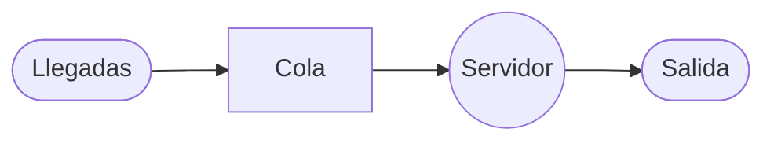
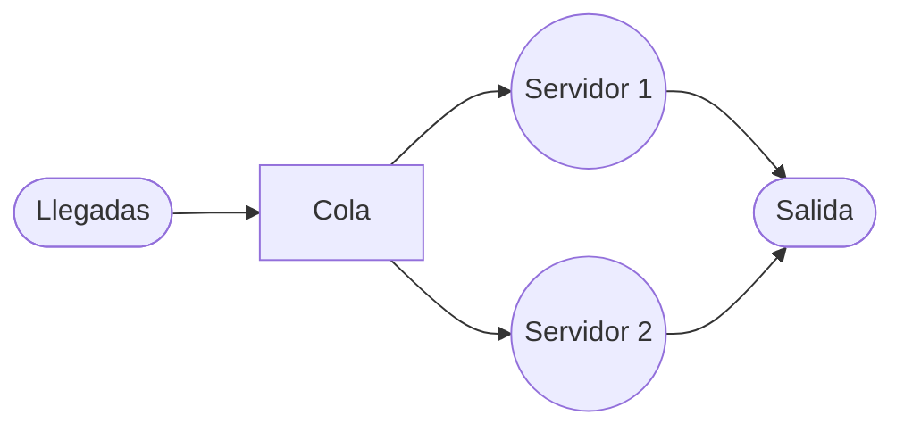

# CADENA DE MARKOV Y TEORÍA DE COLAS

## Ejercicio 1.

El departamento de estudios de mercado de una fábrica estima que el 20% de la gente que compra un producto un mes, no lo comprará el mes siguiente. Además, el 30% de quienes no lo compren un mes lo adquirirá al mes siguiente. En una población de 1000 individuos, 100 compraron el producto el primer mes.

¿Cuántos lo comprarán al mes próximo? ¿Y dentro de tres meses?
### solución
Este ejercicio se identifica como una **Cadena de Markov en tiempo discreto** porque presenta un número finito de estados (comprar o no comprar), probabilidades de transición constantes en el tiempo y la propiedad de que el estado futuro depende únicamente del estado actual.

### Diagrama de la Cadena de Markov

```tikz
\begin{document}
\begin{tikzpicture}
% Definición de estados (N=2, posicionamiento en línea horizontal)
\node[draw,circle,thick,color=orange] (C) at (2,6) {C};
\node[draw,circle,thick,color=pink] (NC) at (10,6) {NC};

% Bucles (hacia afuera)
\draw[->,ultra thick,orange] (C) .. controls (0,8) and (0,4) .. node[left] {$0.8$} (C);
\draw[->,ultra thick,pink] (NC) .. controls (12,8) and (12,4) .. node[right] {$0.7$} (NC);

% Flechas de transición
\draw[->,very thick,orange] (C) to[bend left=30] node[above] {$0.2$} (NC);
\draw[->,very thick,pink] (NC) to[bend left=30] node[below] {$0.3$} (C);

\end{tikzpicture}
\end{document}
```

---

### Resolución del Ejercicio

#### 1. Identificación de datos y estados

- **Población total ($N$):** $1000$ individuos.
- **Estados del sistema:**
    - **Estado 1 ($C$):** Comprar el producto.
    - **Estado 2 ($NC$):** No comprar el producto.
- **Probabilidades dadas:**
    - De compra a no compra: $P_{12} = 0.2$ ($20\%$).
    - De no compra a compra: $P_{21} = 0.3$ ($30\%$).

#### 2. Construcción de la matriz de transición ($P$)

La suma de las probabilidades de cada fila debe ser igual a $1$ (propiedad estocástica).

- $P_{11} = 1 - P_{12} = 1 - 0.2 = \mathbf{0.8}$ (Probabilidad de seguir comprando).
- $P_{22} = 1 - P_{21} = 1 - 0.3 = \mathbf{0.7}$ (Probabilidad de seguir sin comprar).

La matriz de transición es: $$P = \begin{bmatrix} 0.8 & 0.2 \ 0.3 & 0.7 \end{bmatrix}$$

#### 3. Definición del vector de estado inicial ($\pi(1)$)

En el primer mes, $100$ personas compraron el producto. Expresamos esto en probabilidades dividiendo por la población total ($1000$):

- $\pi_1(1) = 100 / 1000 = 0.1$
- $\pi_2(1) = (1000 - 100) / 1000 = 0.9$ $$\pi(1) = [0.1, \quad 0.9]$$

#### 4. Proyección para el próximo mes (Mes 2)

Aplicamos la relación recurrente $\pi(n+1) = \pi(n) \cdot P$: $$\pi(2) = [0.1, \quad 0.9] \begin{bmatrix} 0.8 & 0.2 \ 0.3 & 0.7 \end{bmatrix}$$

- $\pi_1(2) = (0.1 \times 0.8) + (0.9 \times 0.3) = 0.08 + 0.27 = \mathbf{0.35}$
- $\pi_2(2) = (0.1 \times 0.2) + (0.9 \times 0.7) = 0.02 + 0.63 = \mathbf{0.65}$

**Número de compradores (Mes 2):** $0.35 \times 1000 = \mathbf{350}$ individuos.

#### 5. Proyección para dentro de tres meses (Mes 4)

Para calcular el estado en el periodo 4 (tres meses después del primero), podemos iterar paso a paso:

**Cálculo para el Mes 3:** $$\pi(3) = \pi(2) \cdot P = [0.35, \quad 0.65] \begin{bmatrix} 0.8 & 0.2 \ 0.3 & 0.7 \end{bmatrix}$$

- $\pi_1(3) = (0.35 \times 0.8) + (0.65 \times 0.3) = 0.28 + 0.195 = \mathbf{0.475}$
- $\pi_2(3) = (0.35 \times 0.2) + (0.65 \times 0.7) = 0.07 + 0.455 = \mathbf{0.525}$

**Cálculo para el Mes 4:** $$\pi(4) = \pi(3) \cdot P = [0.475, \quad 0.525] \begin{bmatrix} 0.8 & 0.2 \ 0.3 & 0.7 \end{bmatrix}$$

- $\pi_1(4) = (0.475 \times 0.8) + (0.525 \times 0.3) = 0.38 + 0.1575 = \mathbf{0.5375}$
- $\pi_2(4) = (0.475 \times 0.2) + (0.525 \times 0.7) = 0.095 + 0.3675 = \mathbf{0.4625}$

**Número de compradores (Mes 4):** $0.5375 \times 1000 = \mathbf{537.5}$ (aproximadamente **538 individuos**).

---

### Resultado Final

- Al mes próximo lo comprarán **350 individuos**.
- Dentro de tres meses lo comprarán aproximadamente **538 individuos**.

**Verificación:** En cada paso, las probabilidades suman $1$ ($0.5375 + 0.4625 = 1.0$), lo que valida la consistencia del modelo.

---

## Ejercicio 2.

En una población de 10000 habitantes, 5000 no fuman, 2500 fuman uno o menos de un paquete diario y 2500 fuman más de un paquete diario. En un mes hay un 5% de probabilidad de que un no fumador comience a fumar un paquete diario, o menos, y un 2% de que un no fumador pase a fumar más de un paquete diario.

Para los que fuman un paquete, o menos, hay un 10% de probabilidad de que dejen el tabaco, y un 10% de que pasen a fumar más de un paquete diario. Entre los que fuman más de un paquete, hay un 5% de probabilidad de que dejen el tabaco y un 10% de que pasen a fumar un paquete, o menos.

¿Cuántos individuos habrá de cada clase el próximo mes?
### solución

```tikz
\usepackage{tikz}
\usetikzlibrary{arrows.meta}

\begin{document}
\begin{tikzpicture}

    % Configuración de los nodos de estado (Regla: draw, circle, thick, color; NO fill)
    % N=3, Centro=(6,6), R=4.5. Ángulos: 90, -30, -150.
    \node[draw, circle, thick, color=orange, minimum size=1.5cm] (NF) at (6, 10.5) {\textbf{NF}};
    \node[draw, circle, thick, color=pink, minimum size=1.5cm] (F1) at (9.9, 3.75) {\textbf{F1}};
    \node[draw, circle, thick, color=lime, minimum size=1.5cm] (F2) at (2.1, 3.75) {\textbf{F2}};

    % Bucle (self-loop) de cada estado (Regla: controls cx1,cy1 and cx2,cy2)
    % Probabilidades: NF=0.93, F1=0.80, F2=0.85
    \draw[->, ultra thick, color=orange] (NF) .. controls (5, 12.5) and (7, 12.5) .. node[above] {$0.93$} (NF);
    \draw[->, ultra thick, color=pink] (F1) .. controls (11.5, 3) and (11.5, 4.5) .. node[right] {$0.80$} (F1);
    \draw[->, ultra thick, color=lime] (F2) .. controls (0.5, 4.5) and (0.5, 3) .. node[left] {$0.85$} (F2);

    % Flechas de transición (Regla: bend left=N)
    % Salidas de NF
    \draw[->, very thick, color=orange] (NF) to[bend left=10] node[pos=0.2, right] {$0.05$} (F1);
    \draw[->, very thick, color=orange] (NF) to[bend left=10] node[pos=0.2, left] {$0.02$} (F2);

    % Salidas de F1
    \draw[->, very thick, color=pink] (F1) to[bend left=20] node[pos=0.3, left] {$0.10$} (NF);
    \draw[->, very thick, color=pink] (F1) to[bend left=20] node[pos=0.3, above] {$0.10$} (F2);

    % Salidas de F2
    \draw[->, very thick, color=lime] (F2) to[bend left=30] node[pos=0.4, right] {$0.05$} (NF);
    \draw[->, very thick, color=lime] (F2) to[bend left=30] node[pos=0.4, below] {$0.10$} (F1);

\end{tikzpicture}
\end{document}
```

Este problema se clasifica como una **Cadena de Markov de tiempo discreto**. Se identifica este patrón porque la población se distribuye en categorías exhaustivas y excluyentes (estados), las probabilidades de cambio entre estas categorías son constantes (estacionarias) y el estado futuro depende únicamente del estado actual (propiedad de Markov).

### 1. Identificación de los datos del problema

- **Población total ($N$):** $10,000$ habitantes.
- **Estados del sistema:**
    - **Estado 1 ($NF$):** Habitantes que no fuman.
    - **Estado 2 ($F1$):** Habitantes que fuman un paquete o menos diariamente.
    - **Estado 3 ($F2$):** Habitantes que fuman más de un paquete diariamente.
- **Distribución Inicial (Mes 0):**
    - $5,000$ no fumadores.
    - $2,500$ fuman $\le 1$ paquete.
    - $2,500$ fuman $> 1$ paquete.

### 2. Explicación de lo que se pide

Se solicita determinar el número exacto de individuos que pertenecerán a cada una de las tres clases de fumadores transcurrido un periodo de tiempo (el próximo mes).

### 3. Fórmulas utilizadas y razonamiento

Para proyectar la evolución de la población, utilizaremos el álgebra matricial de Markov:

1. **Matriz de Probabilidades de Transición ($P$):** Organiza las probabilidades de cambio entre estados. La suma de cada renglón debe ser exactamente $1$ (probabilidad total de salida).
2. **Vector de Estado Inicial ($\pi(0)$):** Representa la distribución porcentual de la población en el tiempo inicial.
3. **Relación Recurrente de Markov:** Para hallar la distribución en el tiempo $n+1$, multiplicamos el vector de estado actual por la matriz de transición: $$\pi(n+1) = \pi(n) \cdot P$$.

### 4. Construcción de la Matriz de Transición ($P$)

Calculamos las probabilidades de permanencia (bucles) restando las probabilidades de salida de $1$:

- **Renglón 1 (Desde $NF$):**
    - Hacia $F1$ ($P_{12}$): $0.05$.
    - Hacia $F2$ ($P_{13}$): $0.02$.
    - Permanece $NF$ ($P_{11}$): $1 - (0.05 + 0.02) = 0.93$.
- **Renglón 2 (Desde $F1$):**
    - Hacia $NF$ ($P_{21}$): $0.10$.
    - Hacia $F2$ ($P_{23}$): $0.10$.
    - Permanece $F1$ ($P_{22}$): $1 - (0.10 + 0.10) = 0.80$.
- **Renglón 3 (Desde $F2$):**
    - Hacia $NF$ ($P_{31}$): $0.05$.
    - Hacia $F1$ ($P_{32}$): $0.10$.
    - Permanece $F2$ ($P_{33}$): $1 - (0.05 + 0.10) = 0.85$.

La matriz de transición resultante es: $$P = \begin{bmatrix} 0.93 & 0.05 & 0.02 \\ 0.10 & 0.80 & 0.10 \\ 0.05 & 0.10 & 0.85 \end{bmatrix}$$.

### 5. Definición del Vector de Estado Inicial ($\pi(0)$)

Convertimos las cifras de población inicial en probabilidades dividiendo por el total ($10,000$):

- $\pi_{NF}(0) = \frac{5000}{10000} = 0.50$
- $\pi_{F1}(0) = \frac{2500}{10000} = 0.25$
- $\pi_{F2}(0) = \frac{2500}{10000} = 0.25$

Vector inicial: $$\pi(0) = [0.50, \quad 0.25, \quad 0.25]$$.

### 6. Desarrollo de los cálculos paso a paso

Multiplicamos el vector inicial por la matriz de transición para hallar $\pi(1)$: $$\pi(1) = [0.50, \quad 0.25, \quad 0.25] \begin{bmatrix} 0.93 & 0.05 & 0.02 \\ 0.10 & 0.80 & 0.10 \\ 0.05 & 0.10 & 0.85 \end{bmatrix}$$

**Cálculo para No Fumadores ($\pi_{NF}(1)$):** $$\pi_{NF}(1) = (0.50 \times 0.93) + (0.25 \times 0.10) + (0.25 \times 0.05)$$ $$\pi_{NF}(1) = 0.465 + 0.025 + 0.0125 = \mathbf{0.5025}$$.

**Cálculo para Fumadores $\le 1$ paquete ($\pi_{F1}(1)$):** $$\pi_{F1}(1) = (0.50 \times 0.05) + (0.25 \times 0.80) + (0.25 \times 0.10)$$ $$\pi_{F1}(1) = 0.025 + 0.20 + 0.025 = \mathbf{0.25}$$.

**Cálculo para Fumadores $> 1$ paquete ($\pi_{F2}(1)$):** $$\pi_{F2}(1) = (0.50 \times 0.02) + (0.25 \times 0.10) + (0.25 \times 0.85)$$ $$\pi_{F2}(1) = 0.01 + 0.025 + 0.2125 = \mathbf{0.2475}$$.

### 7. Conversión a número de individuos

Multiplicamos las probabilidades obtenidas por la población total ($10,000$):

- **No fumadores:** $0.5025 \times 10,000 = \mathbf{5,025}$ sujetos.
- **Fumadores $\le 1$ paquete:** $0.25 \times 10,000 = \mathbf{2,500}$ sujetos.
- **Fumadores $> 1$ paquete:** $0.2475 \times 10,000 = \mathbf{2,475}$ sujetos.

### 8. Resultado final y Verificación

El próximo mes habrá **5,025 no fumadores**, **2,500 fumadores de un paquete o menos** y **2,475 fumadores de más de un paquete**.

**Verificación:** La suma total de los individuos debe coincidir con la población original: $5025 + 2500 + 2475 = 10,000$ habitantes. El cálculo es correcto.


---

## Ejercicio 3.

Una urna contiene dos bolas sin pintar. Se selecciona una bola al azar y se lanza una moneda.
Si la bola elegida no está pintada y la moneda produce cara, pintamos la bola de rojo; si la moneda produce cruz, la pintamos de negro.

Si la bola ya está pintada, entonces cambiamos el color de la bola de rojo a negro o de negro a rojo, independientemente de si la moneda produce cara o cruz.

Modele el problema como una cadena de Markov y encuentre la matriz de probabilidades de transición.
### solución

```tikz
\usepackage{tikz}
\usetikzlibrary{arrows.meta}

\begin{document}
\begin{tikzpicture}

    % Configuración de los nodos de estado (N=6, Centro=(6,6), R=5)
    % Ángulos: 90, 30, -30, -90, -150, -210
    \node[draw, circle, thick, color=orange, minimum size=1.2cm] (UU) at (6, 11) {\textbf{UU}};
    \node[draw, circle, thick, color=pink, minimum size=1.2cm] (UR) at (10.3, 8.5) {\textbf{UR}};
    \node[draw, circle, thick, color=lime, minimum size=1.2cm] (UN) at (10.3, 3.5) {\textbf{UN}};
    \node[draw, circle, thick, color=purple, minimum size=1.2cm] (RR) at (6, 1) {\textbf{RR}};
    \node[draw, circle, thick, color=teal, minimum size=1.2cm] (NN) at (1.7, 3.5) {\textbf{NN}};
    \node[draw, circle, thick, color=magenta, minimum size=1.2cm] (RN) at (1.7, 8.5) {\textbf{RN}};

    % Bucles (self-loops) obligatorios por regla de formato (P_ii = 0)
    \draw[->, ultra thick, color=orange] (UU) .. controls (5, 13) and (7, 13) .. node[above] {$0.0$} (UU);
    \draw[->, ultra thick, color=pink] (UR) .. controls (11.8, 9.5) and (11.8, 7.5) .. node[right] {$0.0$} (UR);
    \draw[->, ultra thick, color=lime] (UN) .. controls (11.8, 4.5) and (11.8, 2.5) .. node[right] {$0.0$} (UN);
    \draw[->, ultra thick, color=purple] (RR) .. controls (7, -1) and (5, -1) .. node[below] {$0.0$} (RR);
    \draw[->, ultra thick, color=teal] (NN) .. controls (0.2, 2.5) and (0.2, 4.5) .. node[left] {$0.0$} (NN);
    \draw[->, ultra thick, color=magenta] (RN) .. controls (0.2, 7.5) and (0.2, 9.5) .. node[left] {$0.0$} (RN);

    % Flechas de transición entre estados (solo P_ij > 0)
    % Salidas de UU (Estado 0)
    \draw[->, very thick, color=orange] (UU) to[bend left=10] node[pos=0.2, above] {$0.50$} (UR);
    \draw[->, very thick, color=orange] (UU) to[bend left=10] node[pos=0.2, left] {$0.50$} (UN);

    % Salidas de UR (Estado 1)
    \draw[->, very thick, color=pink] (UR) to[bend left=20] node[pos=0.3, left] {$0.50$} (UN);
    \draw[->, very thick, color=pink] (UR) to[bend left=20] node[pos=0.3, right] {$0.25$} (RR);
    \draw[->, very thick, color=pink] (UR) to[bend left=20] node[pos=0.3, above] {$0.25$} (RN);

    % Salidas de UN (Estado 2)
    \draw[->, very thick, color=lime] (UN) to[bend left=30] node[pos=0.3, right] {$0.50$} (UR);
    \draw[->, very thick, color=lime] (UN) to[bend left=30] node[pos=0.3, below] {$0.25$} (NN);
    \draw[->, very thick, color=lime] (UN) to[bend left=30] node[pos=0.3, left] {$0.25$} (RN);

    % Salidas de RR (Estado 3)
    \draw[->, very thick, color=purple] (RR) to[bend left=40] node[pos=0.4, right] {$1.0$} (RN);

    % Salidas de NN (Estado 4)
    \draw[->, very thick, color=teal] (NN) to[bend left=50] node[pos=0.4, left] {$1.0$} (RN);

    % Salidas de RN (Estado 5)
    \draw[->, very thick, color=magenta] (RN) to[bend left=60] node[pos=0.2, below] {$0.50$} (RR);
    \draw[->, very thick, color=magenta] (RN) to[bend left=60] node[pos=0.2, right] {$0.50$} (NN);

\end{tikzpicture}
\end{document}
```

Este problema se modela mediante una **Cadena de Markov de tiempo discreto**. Se identifica como tal porque el sistema evoluciona en etapas (selecciones), posee un número finito de estados posibles (combinaciones de colores en la urna), y la probabilidad de pasar al siguiente estado depende exclusivamente de la composición actual de la urna y no de los pasos previos.

### 1. Identificación de los datos del problema

- **Población total ($N$):** $2$ bolas.
- **Acción 1:** Selección aleatoria de una bola (probabilidad de elegir una bola específica $= 1/2$).
- **Acción 2:** Lanzamiento de una moneda justa ($P(H) = 1/2$, $P(T) = 1/2$).
- **Reglas de transición:**
    1. Si la bola es **sin pintar (U)**:
        - Cae cara (H): La bola se vuelve **Roja (R)**.
        - Cae cruz (T): La bola se vuelve **Negra (N)**.
    2. Si la bola es **pintada (R o N)**:
        - Se cambia al color opuesto ($R \to N$ o $N \to R$) sin importar la moneda.

### 2. Definición de los estados del sistema

Los estados representan las posibles combinaciones de colores de las dos bolas dentro de la urna. Denotaremos los estados de la siguiente manera:

- **Estado 0 ($UU$):** Dos bolas sin pintar.
- **Estado 1 ($UR$):** Una bola sin pintar y una roja.
- **Estado 2 ($UN$):** Una bola sin pintar y una negra.
- **Estado 3 ($RR$):** Dos bolas rojas.
- **Estado 4 ($NN$):** Dos bolas negras.
- **Estado 5 ($RN$):** Una bola roja y una negra.

### 3. Explicación de lo que se pide

Se solicita modelar el proceso y construir la **matriz de probabilidades de transición ($P$)**, la cual organiza las probabilidades $P_{ij}$ de pasar del estado $i$ al estado $j$ en un solo paso.

### 4. Razonamiento y fórmulas utilizadas

La probabilidad de transición se calcula sumando las probabilidades de los eventos que llevan de un estado a otro. Dado que la selección de la bola y el lanzamiento de la moneda son eventos independientes, multiplicamos sus probabilidades: $$P(\text{Evento}) = P(\text{Selección}) \times P(\text{Moneda})$$

### 5. Cálculo de las probabilidades de transición paso a paso

#### Desde el Estado 0 ($UU$)

- Se selecciona una bola sin pintar (probabilidad $1$).
- Si sale cara ($1/2$), pasa a ser roja: $(U, U) \to (R, U)$. Prob $= 1 \times 1/2 = 0.5$.
- Si sale cruz ($1/2$), pasa a ser negra: $(U, U) \to (N, U)$. Prob $= 1 \times 1/2 = 0.5$.
- **Resultados:** $P_{01} = 0.5, P_{02} = 0.5$.

#### Desde el Estado 1 ($UR$)

- Caso A: Se elige la bola **U** ($1/2$):
    - Cara ($1/2$): Se vuelve roja $\to (R, R)$. Prob $= 1/2 \times 1/2 = 0.25$.
    - Cruz ($1/2$): Se vuelve negra $\to (N, R)$. Prob $= 1/2 \times 1/2 = 0.25$.
- Caso B: Se elige la bola **R** ($1/2$):
    - Cambia de color a negra $\to (U, N)$. Prob $= 1/2 \times 1 = 0.5$.
- **Resultados:** $P_{13} = 0.25, P_{15} = 0.25, P_{12} = 0.5$.

#### Desde el Estado 2 ($UN$)

- Caso A: Se elige la bola **U** ($1/2$):
    - Cara ($1/2$): Se vuelve roja $\to (R, N)$. Prob $= 1/2 \times 1/2 = 0.25$.
    - Cruz ($1/2$): Se vuelve negra $\to (N, N)$. Prob $= 1/2 \times 1/2 = 0.25$.
- Caso B: Se elige la bola **N** ($1/2$):
    - Cambia de color a roja $\to (U, R)$. Prob $= 1/2 \times 1 = 0.5$.
- **Resultados:** $P_{25} = 0.25, P_{24} = 0.25, P_{21} = 0.5$.

#### Desde el Estado 3 ($RR$)

- Se selecciona una bola roja (probabilidad $1$).
- Cambia obligatoriamente a negra $\to (N, R)$. Prob $= 1 \times 1 = 1$.
- **Resultado:** $P_{35} = 1$.

#### Desde el Estado 4 ($NN$)

- Se selecciona una bola negra (probabilidad $1$).
- Cambia obligatoriamente a roja $\to (R, N)$. Prob $= 1 \times 1 = 1$.
- **Resultado:** $P_{45} = 1$.

#### Desde el Estado 5 ($RN$)

- Caso A: Se elige la bola **R** ($1/2$):
    - Cambia a negra $\to (N, N)$. Prob $= 1/2 \times 1 = 0.5$.
- Caso B: Se elige la bola **N** ($1/2$):
    - Cambia a roja $\to (R, R)$. Prob $= 1/2 \times 1 = 0.5$.
- **Resultados:** $P_{54} = 0.5, P_{53} = 0.5$.

### 6. Resultado Final: Matriz de Transición ($P$)

Organizamos los valores en la matriz siguiendo el orden de los estados del 0 al 5:

$$P = \begin{bmatrix} 0 & 0.5 & 0.5 & 0 & 0 & 0 \\ 0 & 0 & 0.5 & 0.25 & 0 & 0.25 \\ 0 & 0.5 & 0 & 0 & 0.25 & 0.25 \\ 0 & 0 & 0 & 0 & 0 & 1 \\ 0 & 0 & 0 & 0 & 0 & 1 \\ 0 & 0 & 0 & 0.5 & 0.5 & 0 \end{bmatrix}$$

### 7. Verificación

Comprobamos que la suma de cada renglón sea igual a $1$ (propiedad de matriz estocástica):

- Fila 0: $0.5 + 0.5 = 1.0$ (Correcto)
- Fila 1: $0.5 + 0.25 + 0.25 = 1.0$ (Correcto)
- Fila 2: $0.5 + 0.25 + 0.25 = 1.0$ (Correcto)
- Fila 3: $1.0 = 1.0$ (Correcto)
- Fila 4: $1.0 = 1.0$ (Correcto)
- Fila 5: $0.5 + 0.5 = 1.0$ (Correcto)

---

## Ejercicio 4.

Un agente comercial realiza su trabajo en tres ciudades A, B y C. Para evitar desplazamientos innecesarios está todo el día en la misma ciudad y allí pernocta, desplazándose a otra ciudad al día siguiente, si no tiene suficiente trabajo. Después de estar trabajando un día en C, la probabilidad de tener que seguir trabajando en ella al día siguiente es 0.4, la de tener que viajar a B es 0.4 y la de tener que ir a A es 0.2.

Si el viajante duerme un día en B, con probabilidad de un 20% tendrá que seguir trabajando en la misma ciudad al día siguiente, en el 60% de los casos viajará a C, mientras que irá a A con probabilidad 0.2.

Por último, si el agente comercial trabaja todo un día en A, permanecerá en esa misma ciudad al día siguiente con una probabilidad 0.1, irá a B con una probabilidad de 0.3 y a C con una probabilidad de 0.6.

Modele el problema como una cadena de Markov.
### solución
```tikz
\usepackage{tikz}
\usetikzlibrary{arrows.meta}

\begin{document}
\begin{tikzpicture}

    % Configuración de los nodos de estado (N=3, Centro=(6,6), R=4.5)
    % Colores: orange (A), pink (B), lime (C)
    \node[draw, circle, thick, color=orange, minimum size=1.5cm] (A) at (6, 10.5) {\textbf{A}};
    \node[draw, circle, thick, color=pink, minimum size=1.5cm] (B) at (9.9, 3.75) {\textbf{B}};
    \node[draw, circle, thick, color=lime, minimum size=1.5cm] (C) at (2.1, 3.75) {\textbf{C}};

    % Bucles (self-loops) sobresaliendo hacia afuera del centro (Regla: controls cx1,cy1 and cx2,cy2)
    \draw[->, ultra thick, color=orange] (A) .. controls (5, 12.5) and (7, 12.5) .. node[above] {$0.1$} (A);
    \draw[->, ultra thick, color=pink] (B) .. controls (11.5, 3) and (11.5, 4.5) .. node[right] {$0.2$} (B);
    \draw[->, ultra thick, color=lime] (C) .. controls (0.5, 4.5) and (0.5, 3) .. node[left] {$0.4$} (C);

    % Flechas de transición curvas (Regla: bend left=N)
    % Transiciones desde A (orange)
    \draw[->, very thick, color=orange] (A) to[bend left=10] node[pos=0.2, right] {$0.3$} (B);
    \draw[->, very thick, color=orange] (A) to[bend left=10] node[pos=0.2, left] {$0.6$} (C);

    % Transiciones desde B (pink)
    \draw[->, very thick, color=pink] (B) to[bend left=20] node[pos=0.3, left] {$0.2$} (A);
    \draw[->, very thick, color=pink] (B) to[bend left=20] node[pos=0.3, above] {$0.6$} (C);

    % Transiciones desde C (lime)
    \draw[->, very thick, color=lime] (C) to[bend left=30] node[pos=0.4, right] {$0.2$} (A);
    \draw[->, very thick, color=lime] (C) to[bend left=30] node[pos=0.4, below] {$0.4$} (B);

\end{tikzpicture}
\end{document}
```

Este ejercicio se modela como una **Cadena de Markov de tiempo discreto**. Se identifica como tal porque cumple con las características fundamentales de estos procesos estocásticos:

- **Estados finitos:** El sistema puede estar en tres situaciones o categorías mutuamente excluyentes (Ciudades A, B o C).
- **Probabilidades de transición constantes:** Las probabilidades de moverse de una ciudad a otra al día siguiente son fijas y no cambian con el tiempo.
- **Propiedad de Markov:** La ciudad donde el agente estará mañana depende únicamente de la ciudad donde se encuentra hoy, y no de su historial de viajes previos.

### 1. Identificación de los datos del problema

El sistema tiene tres estados posibles correspondientes a las ciudades donde el agente puede pernoctar:

- **Estado 1 ($A$):** Estar en la ciudad A.
- **Estado 2 ($B$):** Estar en la ciudad B.
- **Estado 3 ($C$):** Estar en la ciudad C.

Las probabilidades condicionales de transición dadas por el enunciado son:

- **Desde Ciudad A:**
    - Permanecer en A ($A \to A$): $0.1$
    - Ir a Ciudad B ($A \to B$): $0.3$
    - Ir a Ciudad C ($A \to C$): $0.6$
- **Desde Ciudad B:**
    - Ir a Ciudad A ($B \to A$): $0.2$
    - Permanecer en B ($B \to B$): $0.2$
    - Ir a Ciudad C ($B \to C$): $0.6$
- **Desde Ciudad C:**
    - Ir a Ciudad A ($C \to A$): $0.2$
    - Ir a Ciudad B ($C \to B$): $0.4$
    - Permanecer en C ($C \to C$): $0.4$

### 2. Explicación de lo que se pide

Se solicita modelar el proceso como una cadena de Markov, lo que implica estructurar formalmente los estados y construir la **matriz de probabilidades de transición ($P$)**. Esta matriz organiza las probabilidades de moverse de un estado $i$ a un estado $j$ en un solo paso de tiempo (un día).

### 3. Fórmulas utilizadas y razonamiento

La matriz de transición se define como: $$P = \begin{bmatrix} P_{AA} & P_{AB} & P_{AC} \\ P_{BA} & P_{BB} & P_{BC} \\ P_{CA} & P_{CB} & P_{CC} \end{bmatrix}$$

Una propiedad fundamental de las matrices estocásticas es que **la suma de las probabilidades de cada renglón debe ser igual a 1**. Esto representa la certeza de que el agente debe estar en alguna de las tres ciudades al día siguiente (los estados son colectivamente exhaustivos).

### 4. Sustitución de valores paso a paso

Organizamos los datos proporcionados en cada renglón de la matriz:

- **Renglón 1 (Ciudad A):** Sustituimos las probabilidades $P_{AA} = 0.1$, $P_{AB} = 0.3$ y $P_{AC} = 0.6$.
- **Renglón 2 (Ciudad B):** Sustituimos las probabilidades $P_{BA} = 0.2$, $P_{BB} = 0.2$ y $P_{BC} = 0.6$.
- **Renglón 3 (Ciudad C):** Sustituimos las probabilidades $P_{CA} = 0.2$, $P_{CB} = 0.4$ y $P_{CC} = 0.4$.

### 5. Resultado Final: Matriz de Transición ($P$)

Insertando todos los valores en la estructura matricial, obtenemos el modelo matemático del comportamiento del agente comercial:

$$P = \begin{bmatrix} 0.1 & 0.3 & 0.6 \\ 0.2 & 0.2 & 0.6 \\ 0.2 & 0.4 & 0.4 \end{bmatrix}$$

### 6. Verificación del resultado

Comprobamos que cada fila sume la unidad para asegurar que el modelo es estocásticamente válido:

- **Fila A:** $0.1 + 0.3 + 0.6 = 1.0$ (Correcto)
- **Fila B:** $0.2 + 0.2 + 0.6 = 1.0$ (Correcto)
- **Fila C:** $0.2 + 0.4 + 0.4 = 1.0$ (Correcto)

La matriz describe completamente las transiciones diarias del sistema y permite realizar predicciones futuras sobre la ubicación del agente.


---
---

## Ejercicio 5.

Un banco está considerando abrir un servicio para que los clientes paguen desde su automóvil, se estima que los clientes llegarán a una tasa promedio $(\lambda)$ de 15 quince por hora. El cajero que trabajará en la ventanilla puede atender a los clientes a un ritmo promedio $(\mu)$ de 1 cada 3 minutos.
Suponiendo que el patrón de llegadas en Poisson y el patrón de servicios es exponencial, encuentre:

a) La utilización promedio del cajero.
b) El número promedio de clientes en la línea de espera.
c) El número promedio de clientes en el sistema.
d) El tiempo promedio de espera en la fila.
e) El tiempo promedio de espera en el sistema.
### solución

Este ejercicio corresponde a un problema de **Teoría de Colas**. A continuación, se presenta la identificación del modelo, la estructura física del sistema y la resolución detallada paso a paso.

### 1. Identificación de la estructura y el modelo

De acuerdo con los datos proporcionados:

- **Llegadas (Poisson):** Los clientes llegan a una tasa promedio de $\lambda = 15$ por hora.
- **Servicio (Exponencial):** El cajero atiende a un ritmo de un cliente cada 3 minutos.
- **Configuración:** Existe un solo cajero (canal único) y el proceso consta de una sola parada para el cliente (fase única).
- **Modelo de cola:** Se trata de un modelo **M/M/1** (Modelo A), que asume llegadas de Poisson, tiempos de servicio exponenciales y un solo servidor.

#### Diagrama de la estructura (Mermaid)

Según la guía de estructuras de líneas de espera, esta es la representación del flujo físico del sistema:



---

### 2. Identificación de datos y conversiones

Para que los cálculos sean consistentes, ambos parámetros ($\lambda$ y $\mu$) deben estar en la misma unidad de tiempo (clientes por hora).

- **Tasa de llegada ($\lambda$):** $$\lambda = 15 \text{ clientes/hora}$$
    
- **Tasa de servicio ($\mu$):** El problema indica que el tiempo de servicio es de 3 minutos por cliente. Para hallar $\mu$ (cuántos clientes se pueden atender en una hora), realizamos la conversión: $$1 \text{ cliente} \longrightarrow 3 \text{ min}$$ $$x \text{ clientes} \longrightarrow 60 \text{ min}$$ $$\mu = \frac{60 \text{ min} \cdot 1 \text{ cliente}}{3 \text{ min}} = 20 \text{ clientes/hora}$$ $$\mu = 20 \text{ clientes/hora}$$
    

---

### 3. Resolución de los incisos

#### a) La utilización promedio del cajero ($\rho$)

Esta fórmula determina la fracción del tiempo que el cajero está ocupado atendiendo clientes.

- **Fórmula:** $\rho = \frac{\lambda}{\mu}$
- **Sustitución:** $\rho = \frac{15}{20}$
- **Operación:** $0.75$
- **Resultado:** La utilización es del **75%**.

#### b) El número promedio de clientes en la línea de espera ($L_q$)

Representa la cantidad de vehículos que se encuentran físicamente en la fila aguardando ser atendidos.

- **Fórmula:** $L_q = \frac{\lambda^2}{\mu(\mu - \lambda)}$
- **Sustitución:** $L_q = \frac{15^2}{20(20 - 15)}$
- **Operación parcial:** $\frac{225}{20(5)} = \frac{225}{100}$
- **Resultado:** $2.25$ clientes (aproximadamente **2 clientes**).

#### c) El número promedio de clientes en el sistema ($L_s$)

Incluye tanto a los clientes que están en la fila como al que está siendo atendido en la ventanilla.

- **Fórmula:** $L_s = \frac{\lambda}{\mu - \lambda}$
- **Sustitución:** $L_s = \frac{15}{20 - 15}$
- **Operación:** $\frac{15}{5}$
- **Resultado:** **3 clientes** en el sistema.

#### d) El tiempo promedio de espera en la fila ($W_q$)

Es el tiempo que un cliente pasa únicamente en la cola antes de llegar a la ventanilla.

- **Fórmula:** $W_q = \frac{\lambda}{\mu(\mu - \lambda)}$
- **Sustitución:** $W_q = \frac{15}{20(20 - 15)}$
- **Operación:** $\frac{15}{100} = 0.15$ horas.
- **Conversión a minutos:** $0.15 \text{ horas} \times 60 \text{ min/hora} = 9$ minutos.
- **Resultado:** **9 minutos**.

#### e) El tiempo promedio de espera en el sistema ($W_s$)

Es el tiempo total desde que el cliente llega a la cola hasta que termina de pagar y sale del servicio.

- **Fórmula:** $W_s = \frac{1}{\mu - \lambda}$
- **Sustitución:** $W_s = \frac{1}{20 - 15}$
- **Operación:** $\frac{1}{5} = 0.2$ horas.
- **Conversión a minutos:** $0.2 \text{ horas} \times 60 \text{ min/hora} = 12$ minutos.
- **Resultado:** **12 minutos**.


---

## Ejercicio 6.

En un hospital llegan 10 clientes cada hora $(\lambda)$ y un solo servidor puede atender 8 clientes cada hora $(\mu)$. Si se colocan 2 servidores determine:

a) Probabilidad de que ningún cliente se encuentre en el sistema.
b) Número promedio de unidades en el sistema.
c) Tiempo promedio en el que una unidad está dentro del sistema.
d) Número de clientes en la fila.
e) Tiempo de espera en la fila.
### solución

### 1. Identificación de la estructura y el modelo

De acuerdo con los datos del problema:

- **Tasa de llegada ($\lambda$):** 10 clientes/hora.
- **Tasa de servicio ($\mu$):** 8 clientes/hora por servidor.
- **Número de servidores ($s$):** 2 servidores.
- **Configuración:** Los clientes forman una sola fila para ser atendidos por el primer servidor que se libere (multicanal, fase única),.
- **Modelo de cola:** Se trata de un modelo **M/M/s** (Modelo B), que asume llegadas de Poisson, tiempos de servicio exponenciales y $s$ servidores en paralelo,.

#### Diagrama de la estructura (Mermaid)

Según la guía de estructuras de líneas de espera para un sistema multicanal ($s=2$):



---

### 2. Identificación de datos y parámetros

- $\lambda = 10 \text{ pacientes/hora}$
- $\mu = 8 \text{ pacientes/hora}$
- $s = 2$
- Factor de utilización ($\rho$): $\rho = \frac{\lambda}{s \cdot \mu} = \frac{10}{2 \cdot 8} = \frac{10}{16} = 0.625$. Como $\rho < 1$, el sistema es estable,.

---

### 3. Resolución de los incisos

#### a) Probabilidad de que ningún cliente se encuentre en el sistema ($P_o$)

Esta fórmula calcula la probabilidad de que el sistema esté vacío.

- **Fórmula:** $P_o = \frac{1}{\sum_{n=0}^{s-1} \frac{(\lambda / \mu)^n}{n!} + \frac{(\lambda / \mu)^s}{s!} \left( \frac{1}{1 - (\lambda / s \cdot \mu)} \right)}$.
- **Operaciones parciales:**
    1. Sumatoria ($n=0$ a $1$): $\frac{(10/8)^0}{0!} + \frac{(10/8)^1}{1!} = 1 + 1.25 = 2.25$.
    2. Término de los servidores: $\frac{(10/8)^2}{2!} \left( \frac{1}{1 - (10/16)} \right) = \frac{1.5625}{2} \left( \frac{1}{0.375} \right) = 0.78125 \cdot 2.6667 \approx 2.0833$.
    3. Denominador total: $2.25 + 2.0833 = 4.3333$.
- **Resultado:** $P_o = \frac{1}{4.3333} = 0.231$. Existe una probabilidad del **23.1%** de que el sistema esté vacío.

#### b) Número promedio de unidades en el sistema ($L_s$)

Representa el promedio de pacientes tanto en espera como en atención.

- **Fórmula:** $L_s = \frac{\lambda \mu (\lambda / \mu)^s P_o}{(s - 1)! (s \mu - \lambda)^2} + \frac{\lambda}{\mu}$.
- **Sustitución:** $L_s = \frac{10 \cdot 8 \cdot (1.25)^2 \cdot 0.231}{(1)! \cdot (16 - 10)^2} + 1.25$.
- **Operaciones parciales:** $\frac{80 \cdot 1.5625 \cdot 0.231}{36} + 1.25 = \frac{28.875}{36} + 1.25 = 0.802 + 1.25$.
- **Resultado:** $L_s = 2.052$. Hay un promedio de **2.05 pacientes** en el sistema.

#### c) Tiempo promedio en el que una unidad está dentro del sistema ($W_s$)

- **Fórmula:** $W_s = \frac{L_s}{\lambda}$.
- **Sustitución:** $W_s = \frac{2.052}{10} = 0.2052 \text{ horas}$.
- **Conversión a minutos:** $0.2052 \text{ h} \cdot 60 \text{ min/h} = 12.31 \text{ min}$.
- **Resultado:** El tiempo promedio en el sistema es de **12.31 minutos**.

#### d) Número de clientes en la fila ($L_q$)

Representa a los pacientes que están únicamente esperando en la fila.

- **Fórmula:** $L_q = L_s - \frac{\lambda}{\mu}$ (deducida de,).
- **Sustitución:** $L_q = 2.052 - \frac{10}{8} = 2.052 - 1.25$.
- **Resultado:** $L_q = 0.802$. Hay un promedio de **0.80 pacientes** en la fila.

#### e) Tiempo de espera en la fila ($W_q$)

- **Fórmula:** $W_q = W_s - \frac{1}{\mu}$.
- **Sustitución:** $W_q = 0.2052 - \frac{1}{8} = 0.2052 - 0.125 = 0.0802 \text{ horas}$.
- **Conversión a minutos:** $0.0802 \text{ h} \cdot 60 \text{ min/h} = 4.81 \text{ min}$.
- **Resultado:** El tiempo promedio de espera en fila es de **4.81 minutos**.


---

## Ejercicio 7.

Existe un lavado automático de autos con una línea de remolque, de manera que los autos se mueven a través de la instalación de lavado como en una línea de ensamble. Supóngase que el lavado de autos puede aceptar un auto cada cinco minutos $(\mu)$ (un auto cada cinco minutos da una tasa de 12 autos por hora) y que la tasa promedio de llegadas $(\lambda)$ es de nueve autos por hora.

Calcular:
a) Longitud media de la cola.
b) Tiempo medio de espera en la cola.
c) Número medio de clientes en el sistema.
d) Tiempo medio de espera en el sistema.
### solución

Este ejercicio corresponde a un problema de **Teoría de Colas** con tiempos de servicio constantes. A continuación, se presenta la identificación del modelo, la estructura física del sistema y la resolución detallada paso a paso siguiendo los procedimientos de las fuentes prioritarias,.

### 1. Identificación de la estructura y el modelo

De acuerdo con la descripción del problema:

- **Llegadas:** Los clientes llegan a una tasa promedio de $\lambda = 9$ autos por hora.
- **Servicio:** El lavado es automático (línea de ensamble), lo que implica un tiempo de servicio **constante** (no probabilístico) de 5 minutos por auto.
- **Configuración:** Existe un solo carril de lavado (canal único) y el proceso es de una sola etapa (fase única).
- **Modelo de cola:** Se identifica como el **Modelo C: M/D/1**, que asume llegadas de Poisson, tiempos de servicio constantes (Determinísticos) y un solo servidor,.

#### Diagrama de la estructura (Mermaid)

Representación del flujo físico del sistema para un canal único y fase única:


---

### 2. Identificación de datos y parámetros

Para realizar los cálculos, los datos deben estar expresados en las mismas unidades de tiempo (autos por hora):

- **Tasa de llegada ($\lambda$):** $$\lambda = 9 \text{ autos/hora}$$
    
- **Tasa de servicio ($\mu$):** El problema indica que se acepta un auto cada 5 minutos. $$\mu = \frac{60 \text{ min}}{5 \text{ min/auto}} = 12 \text{ autos/hora}$$
    

---

### 3. Resolución de los incisos

#### a) Longitud media de la cola ($L_q$)

Esta medida representa el número promedio de autos que están esperando en la fila antes de entrar a la línea de lavado. En el modelo M/D/1, la cola es exactamente la mitad que en el modelo M/M/1 debido a la falta de variabilidad en el servicio.

- **Fórmula:** $L_q = \frac{\lambda^2}{2\mu(\mu - \lambda)}$
- **Sustitución:** $L_q = \frac{9^2}{2(12)(12 - 9)}$
- **Operaciones parciales:**
    1. Numerador: $9^2 = 81$
    2. Denominador: $2 \cdot 12 \cdot (3) = 24 \cdot 3 = 72$
    3. División: $81 / 72 = 1.125$
- **Resultado:** $1.125$ autos (aproximadamente **1 auto** en fila).

#### b) Tiempo medio de espera en la cola ($W_q$)

Representa el tiempo promedio que un vehículo pasa únicamente esperando en la fila.

- **Fórmula:** $W_q = \frac{\lambda}{2\mu(\mu - \lambda)}$
- **Sustitución:** $W_q = \frac{9}{2(12)(12 - 9)}$
- **Operación:** $\frac{9}{72} = 0.125$ horas.
- **Conversión a minutos:** $0.125 \text{ horas} \cdot 60 \text{ min/hora} = 7.5$ minutos.
- **Resultado:** **7.5 minutos**.

#### c) Número medio de clientes en el sistema ($L_s$)

Es la suma de los autos que están esperando en la fila más los que están siendo lavados en la línea de ensamble.

- **Fórmula:** $L_s = L_q + \frac{\lambda}{\mu}$
- **Sustitución:** $L_s = 1.125 + \frac{9}{12}$
- **Operación:** $1.125 + 0.75$
- **Resultado:** **1.875 autos** en el sistema.

#### d) Tiempo medio de espera en el sistema ($W_s$)

Es el tiempo total desde que el auto llega a la instalación hasta que sale completamente limpio.

- **Fórmula:** $W_s = W_q + \frac{1}{\mu}$
- **Sustitución:** $W_s = 0.125 + \frac{1}{12}$
- **Operaciones parciales:**
    1. Tiempo de servicio en horas: $1/12 \approx 0.0833$ horas.
    2. Suma: $0.125 + 0.0833 = 0.2083$ horas.
- **Conversión a minutos:** $0.2083 \text{ horas} \cdot 60 \text{ min/hora} \approx 12.5$ minutos.
- **Resultado:** **12.5 minutos**.


---