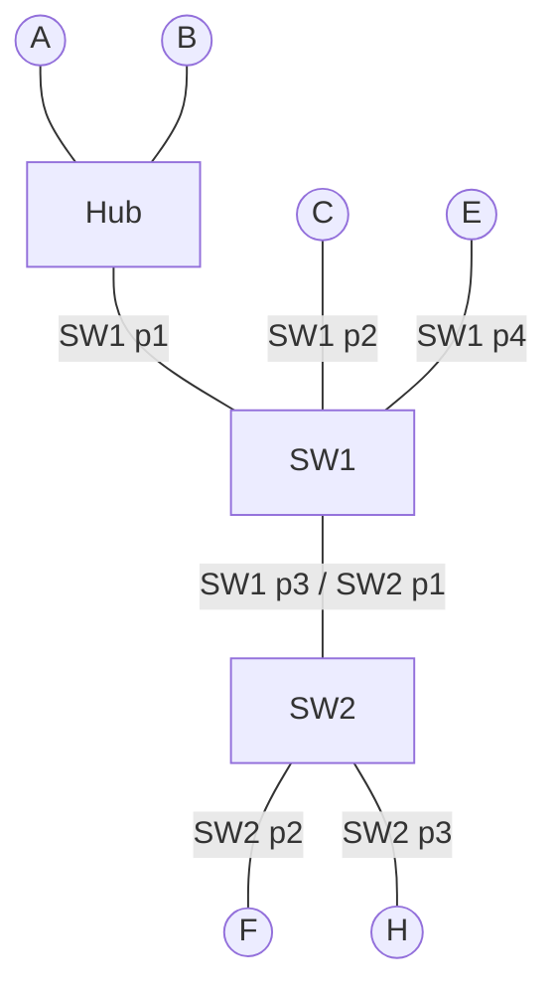

# Tarea: tablas de conmutación (SW1 y SW2)

Transmisiones en orden secuencial: **1ro A→B, 2do H→F, 3ro C→E**. Cada una incluye ida y respuesta.

## Topología

- **SW1:** puerto 1 → Hub (A, B), puerto 2 → C, puerto 3 → SW2, puerto 4 → E.
- **SW2:** puerto 1 → SW1, puerto 2 → F, puerto 3 → H.

## Regla del switch (se repite siempre)

1. **Aprende:** registra la MAC origen con el puerto por donde entró la trama.
2. **Decide:** busca la MAC destino.
   - Si existe en la tabla → envía solo por ese puerto (si es el mismo puerto de entrada, descarta).
   - Si no existe → **inundación**: copia por todos los puertos menos el de entrada.

Estado inicial: SW1 y SW2 vacíos.

---

## 1ra transmisión: A → B (y respuesta B → A)

### Tablas finales

| SW1 | Puerto | | SW2 | Puerto |
|---|---|---|---|---|
| MAC_A | 1 | | MAC_A | 1 |
| MAC_B | 1 | | | |

### Pasos: ida A → B

1. **A envía la trama.** Sale hacia el Hub con MAC origen = A y MAC destino = B.
2. **El Hub la repite** por todos sus puertos. Llega a:
   - **B:** la MAC destino es la suya, la procesa. Sin problema.
   - **SW1 (puerto 1):** sigue el camino.
3. **SW1 recibe por el puerto 1.**
   - Aprende: MAC_A no está → anota `MAC_A → 1`.
   - Decide: MAC_B no está → inundación por 2, 3 y 4.
4. **Puertos de salida de SW1.**
   - Puerto 2 → C: la MAC destino no es la suya, descarta.
   - Puerto 4 → E: descarta.
   - Puerto 3 → SW2: sigue el camino.
5. **SW2 recibe por el puerto 1.**
   - Aprende: MAC_A no está → anota `MAC_A → 1`.
   - Decide: MAC_B no está → inundación por 2 y 3.
6. **Puertos de salida de SW2.**
   - Puerto 2 → F: descarta.
   - Puerto 3 → H: descarta.

Fin de la ida.

### Pasos: respuesta B → A

7. **B responde.** MAC origen = B, MAC destino = A. Sale hacia el Hub.
8. **El Hub la repite.** Llega a A (la procesa) y a SW1 por el puerto 1.
9. **SW1 recibe por el puerto 1.**
   - Aprende: MAC_B no está → anota `MAC_B → 1`.
   - Decide: MAC_A está y apunta al puerto 1, el mismo por el que entró (A y B están del mismo lado) → **descarta**.
10. **SW2 nunca ve esta trama**, por eso su tabla no cambia.

---

## 2da transmisión: H → F (y respuesta F → H)

### Tablas finales

| SW1 | Puerto | | SW2 | Puerto |
|---|---|---|---|---|
| MAC_A | 1 | | MAC_A | 1 |
| MAC_B | 1 | | MAC_H | 3 |
| MAC_H | 3 | | MAC_F | 2 |

### Pasos: ida H → F

1. **H envía la trama.** MAC origen = H, MAC destino = F. Entra a SW2 por el puerto 3 (H está conectado directo, sin hub).
2. **SW2 recibe por el puerto 3.**
   - Aprende: anota `MAC_H → 3`.
   - Decide: MAC_F no está → inundación por 1 y 2.
3. **Puertos de salida de SW2.**
   - Puerto 2 → F: es el destino, la procesa.
   - Puerto 1 → SW1: sigue el camino.
4. **SW1 recibe por el puerto 3.**
   - Aprende: anota `MAC_H → 3`.
   - Decide: MAC_F no está → inundación por 1, 2 y 4.
5. **Puertos de salida de SW1.** Similar al paso 4 de A→B pero sin pasar a SW2:
   - Puerto 1 → Hub → A y B descartan.
   - Puerto 2 → C descarta.
   - Puerto 4 → E descarta.

### Pasos: respuesta F → H

6. **F responde.** MAC origen = F, MAC destino = H. Entra a SW2 por el puerto 2.
7. **SW2 recibe por el puerto 2.**
   - Aprende: anota `MAC_F → 2`.
   - Decide: MAC_H está en el puerto 3 → envía **solo por el 3** (sin inundación).
8. **SW1 no ve esta trama**, su tabla no cambia (por eso SW1 no conoce a F).

---

## 3ra transmisión: C → E (y respuesta E → C)

### Tablas finales

| SW1 | Puerto | | SW2 | Puerto |
|---|---|---|---|---|
| MAC_A | 1 | | MAC_A | 1 |
| MAC_B | 1 | | MAC_H | 3 |
| MAC_H | 3 | | MAC_F | 2 |
| MAC_C | 2 | | MAC_C | 1 |
| MAC_E | 4 | | | |

### Pasos: ida C → E

1. **C envía la trama.** MAC origen = C, MAC destino = E. Entra a SW1 por el puerto 2.
2. **SW1 recibe por el puerto 2.**
   - Aprende: anota `MAC_C → 2`.
   - Decide: MAC_E no está → inundación por 1, 3 y 4.
3. **Puertos de salida de SW1.**
   - Puerto 4 → E: es el destino, la procesa.
   - Puerto 1 → Hub → A y B descartan.
   - Puerto 3 → SW2: sigue el camino.
4. **SW2 recibe por el puerto 1.** Similar al paso 5 de A→B:
   - Aprende: anota `MAC_C → 1`.
   - Decide: MAC_E no está → inundación por 2 y 3 → F y H descartan.

### Pasos: respuesta E → C

5. **E responde.** MAC origen = E, MAC destino = C. Entra a SW1 por el puerto 4.
6. **SW1 recibe por el puerto 4.**
   - Aprende: anota `MAC_E → 4`.
   - Decide: MAC_C está en el puerto 2 → envía **solo por el 2**.
7. **SW2 no ve esta trama**, su tabla no cambia.

---

## Ideas clave

1. La **ida** enseña la MAC del emisor a todos los switches por donde pasa (por la inundación).
2. La **respuesta** enseña la MAC de quien contesta solo a los switches por donde pasa, porque ya no hay inundación.
3. Un switch descarta la trama si el destino queda por el mismo puerto por el que entró.
4. Las tablas se llenan según el orden de los eventos (secuencial), y se borran cada 5 min o sin energía.
