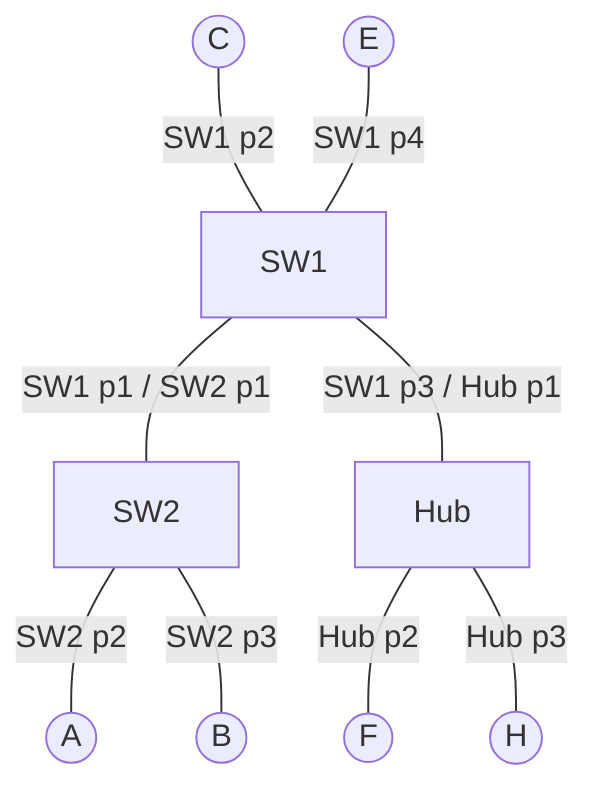

# Tarea x: ejercicio de la última hoja (switches + hub + ARP)

Transmisiones en orden secuencial: **1ro B→F, 2do H→F, 3ro C→E, 4to A→B**.

> **Supuestos (revisar):**
> - En tus apuntes la última transmisión dice "D→B", pero en la topología no existe D. Lo leí como **A→B** (la "A" manuscrita se parece a una "D").
> - Como el ejemplo anterior era con ARP, el ejercicio se resuelve **con ARP** (cada tramo tiene solicitud, respuesta y dato).

Cada tramo se explica completo y por sí solo, sin depender de los anteriores.

## Leyenda de las etiquetas en los pasos

- **`[T-conm SWx]`** = se anota o renueva en la **tabla de conmutación** del switch x (MAC → puerto).
- **`[T-arp X]`** = se anota en la **tabla ARP** del equipo X (IP → MAC).
- Si un paso no lleva etiqueta, solo se reenvía o se descarta la trama y no se escribe nada en ninguna tabla.
- El **Hub no tiene tablas**: repite la trama por todos sus puertos menos el de entrada.

## Topología

- **SW1:** puerto 1 → SW2, puerto 2 → C, puerto 3 → Hub, puerto 4 → E.
- **SW2:** puerto 1 → SW1, puerto 2 → A, puerto 3 → B.
- **Hub:** puerto 1 → SW1, puerto 2 → F, puerto 3 → H.

## Cómo trabaja un switch (siempre en este orden)

1. Mira la **MAC origen** de la trama y la anota en su `T-conm` con el puerto de entrada (si ya existe, solo renueva el temporizador).
2. Mira la **MAC destino** y la busca en su `T-conm`:
   - Si la encuentra → envía **solo por ese puerto** (si es el mismo de entrada, descarta).
   - Si no la encuentra → **inundación**: copia por todos los puertos menos el de entrada.
   - La solicitud ARP es broadcast (`FF:FF:FF:FF:FF:FF`): esa MAC nunca está en la tabla, así que **siempre hay inundación**.

Estado inicial: todas las tablas vacías (`T-conm` de SW1 y SW2, y `T-arp` de todos los equipos).

---

## 1ra transmisión: B → F

### Tablas finales

| Conmutación SW1 | Puerto | | Conmutación SW2 | Puerto |
|---|---|---|---|---|
| MAC_B | 1 | | MAC_B | 3 |
| MAC_F | 3 | | MAC_F | 1 |

| ARP de B | MAC | | ARP de F | MAC |
|---|---|---|---|---|
| IP_F | MAC_F | | IP_B | MAC_B |

### Pasos

**Solicitud ARP (broadcast)**
1. B no conoce la MAC de F. Envía una solicitud ARP: origen MAC_B, destino `FF..F`, pregunta por IP_F. Entra a SW2 por el puerto 3.
2. **SW2 (puerto 3):**
   - MAC origen (MAC_B): `[T-conm SW2]` anota `MAC_B → 3`.
   - MAC destino (`FF..F`): broadcast → inundación por los puertos 1 y 2.
   - Puerto 2 → A: la procesa, la IP preguntada no es la suya y descarta (no anota nada).
   - Puerto 1 → SW1.
3. **SW1 (puerto 1):**
   - MAC origen (MAC_B): `[T-conm SW1]` anota `MAC_B → 1`.
   - MAC destino (`FF..F`): broadcast → inundación por los puertos 2, 3 y 4.
   - Puerto 2 → C descarta.
   - Puerto 4 → E descarta.
   - Puerto 3 → Hub, que la repite por sus puertos 2 y 3: **F** procesa, la IP es la suya y `[T-arp F]` anota `IP_B → MAC_B`; H descarta.

**Respuesta ARP (unicast)**
4. F responde a MAC_B. Sale hacia el Hub (puerto 2), que la repite por sus puertos 1 y 3: H la descarta (la MAC destino no es la suya) y SW1 la recibe por su puerto 3.
5. **SW1 (puerto 3):**
   - MAC origen (MAC_F): `[T-conm SW1]` anota `MAC_F → 3`.
   - MAC destino (MAC_B): la busca en su `T-conm` y encuentra `MAC_B → 1` (la anotó en el paso 3) → envía **solo por el 1**, sin inundación.
6. **SW2 (puerto 1):**
   - MAC origen (MAC_F): `[T-conm SW2]` anota `MAC_F → 1`.
   - MAC destino (MAC_B): la busca en su `T-conm` y encuentra `MAC_B → 3` (la anotó en el paso 2) → envía **solo por el 3**.
7. **B** recibe la respuesta y `[T-arp B]` anota `IP_F → MAC_F`.

**Dato B → F**
8. Ahora B envía el dato con MAC destino = MAC_F.
   - SW2 (puerto 3): MAC_B ya existe, `[T-conm SW2]` solo renueva el temporizador. Encuentra `MAC_F → 1` → envía solo por el 1.
   - SW1 (puerto 1): MAC_B ya existe, `[T-conm SW1]` solo renueva el temporizador. Encuentra `MAC_F → 3` → envía solo por el 3.
   - El Hub lo repite por sus puertos 2 y 3: F lo procesa y H lo descarta.

---

## 2da transmisión: H → F

Partimos de las tablas que dejó la 1ra transmisión: SW1 = {MAC_B → 1, MAC_F → 3}, SW2 = {MAC_B → 3, MAC_F → 1}. F ya tiene `IP_B → MAC_B` en su `T-arp`. H tiene su `T-arp` vacía.

### Tablas finales

| Conmutación SW1 | Puerto | | Conmutación SW2 | Puerto |
|---|---|---|---|---|
| MAC_B | 1 | | MAC_B | 3 |
| MAC_F | 3 | | MAC_F | 1 |
| MAC_H | 3 | | MAC_H | 1 |

| ARP de H | MAC | | ARP de F | MAC |
|---|---|---|---|---|
| IP_F | MAC_F | | IP_B | MAC_B |
| | | | IP_H | MAC_H |

### Pasos

**Solicitud ARP (broadcast)**
1. H no conoce la MAC de F. Envía una solicitud ARP: origen MAC_H, destino `FF..F`, pregunta por IP_F. Entra al Hub por el puerto 3.
2. El **Hub** la repite por sus puertos 1 y 2 (no usa tablas):
   - Puerto 2 → **F**: la IP es la suya, procesa y `[T-arp F]` anota `IP_H → MAC_H`.
   - Puerto 1 → SW1.
3. **SW1 (puerto 3):**
   - MAC origen (MAC_H): `[T-conm SW1]` anota `MAC_H → 3`.
   - MAC destino (`FF..F`): broadcast → inundación por los puertos 1, 2 y 4.
   - Puerto 2 → C descarta.
   - Puerto 4 → E descarta.
   - Puerto 1 → SW2.
4. **SW2 (puerto 1):**
   - MAC origen (MAC_H): `[T-conm SW2]` anota `MAC_H → 1`.
   - MAC destino (`FF..F`): broadcast → inundación por los puertos 2 y 3.
   - Puerto 2 → A descarta.
   - Puerto 3 → B descarta.

**Respuesta ARP (unicast)**
5. F responde a MAC_H. Sale hacia el Hub (puerto 2), que la repite por sus puertos 1 y 3: H la procesa y SW1 la recibe por su puerto 3.
6. **SW1 (puerto 3):**
   - MAC origen (MAC_F): ya existe como `MAC_F → 3`, `[T-conm SW1]` solo renueva el temporizador.
   - MAC destino (MAC_H): la busca en su `T-conm` y encuentra `MAC_H → 3`, el mismo puerto por el que entró (F y H están del mismo lado, detrás del Hub) → **descarta**.
   - SW2 no la ve.
7. **H** recibe la respuesta y `[T-arp H]` anota `IP_F → MAC_F`.

**Dato H → F**
8. Ahora H envía el dato con MAC destino = MAC_F. El Hub lo repite por sus puertos 1 y 2: F lo procesa y SW1 lo recibe por el puerto 3.
   - SW1 (puerto 3): MAC_H ya existe, `[T-conm SW1]` solo renueva el temporizador. Encuentra `MAC_F → 3`, el mismo puerto de entrada → descarta.
   - SW2 no lo ve.

---

## 3ra transmisión: C → E

Partimos de las tablas que dejó la 2da transmisión: SW1 = {MAC_B → 1, MAC_F → 3, MAC_H → 3}, SW2 = {MAC_B → 3, MAC_F → 1, MAC_H → 1}. C y E tienen su `T-arp` vacía.

### Tablas finales

| Conmutación SW1 | Puerto | | Conmutación SW2 | Puerto |
|---|---|---|---|---|
| MAC_B | 1 | | MAC_B | 3 |
| MAC_F | 3 | | MAC_F | 1 |
| MAC_H | 3 | | MAC_H | 1 |
| MAC_C | 2 | | MAC_C | 1 |
| MAC_E | 4 | | | |

| ARP de C | MAC | | ARP de E | MAC |
|---|---|---|---|---|
| IP_E | MAC_E | | IP_C | MAC_C |

### Pasos

**Solicitud ARP (broadcast)**
1. C no conoce la MAC de E. Envía una solicitud ARP: origen MAC_C, destino `FF..F`, pregunta por IP_E. Entra a SW1 por el puerto 2.
2. **SW1 (puerto 2):**
   - MAC origen (MAC_C): `[T-conm SW1]` anota `MAC_C → 2`.
   - MAC destino (`FF..F`): broadcast → inundación por los puertos 1, 3 y 4.
   - Puerto 4 → **E**: la IP es la suya, procesa y `[T-arp E]` anota `IP_C → MAC_C`.
   - Puerto 3 → Hub, que la repite por sus puertos 2 y 3: F y H descartan.
   - Puerto 1 → SW2.
3. **SW2 (puerto 1):**
   - MAC origen (MAC_C): `[T-conm SW2]` anota `MAC_C → 1`.
   - MAC destino (`FF..F`): broadcast → inundación por los puertos 2 y 3.
   - Puerto 2 → A descarta.
   - Puerto 3 → B descarta.

**Respuesta ARP (unicast)**
4. E responde a MAC_C. Entra a SW1 por el puerto 4.
5. **SW1 (puerto 4):**
   - MAC origen (MAC_E): `[T-conm SW1]` anota `MAC_E → 4`.
   - MAC destino (MAC_C): la busca en su `T-conm` y encuentra `MAC_C → 2` (la anotó en el paso 2) → envía **solo por el 2**.
   - SW2 y el Hub no ven la respuesta, así que sus tablas (y la de E en SW2) no cambian.
6. **C** recibe la respuesta y `[T-arp C]` anota `IP_E → MAC_E`.

**Dato C → E**
7. Ahora C envía el dato con MAC destino = MAC_E.
   - SW1 (puerto 2): MAC_C ya existe, `[T-conm SW1]` solo renueva el temporizador. Encuentra `MAC_E → 4` → envía solo por el 4.
   - Solo E lo recibe. SW2 y el Hub no lo ven.

---

## 4ta transmisión: A → B (asumida, en tus apuntes dice "D → B")

Partimos de las tablas que dejó la 3ra transmisión: SW1 = {MAC_B → 1, MAC_F → 3, MAC_H → 3, MAC_C → 2, MAC_E → 4}, SW2 = {MAC_B → 3, MAC_F → 1, MAC_H → 1, MAC_C → 1}. B ya tiene `IP_F → MAC_F` en su `T-arp`. A tiene su `T-arp` vacía.

### Tablas finales

| Conmutación SW1 | Puerto | | Conmutación SW2 | Puerto |
|---|---|---|---|---|
| MAC_B | 1 | | MAC_B | 3 ✓ |
| MAC_F | 3 | | MAC_F | 1 |
| MAC_H | 3 | | MAC_H | 1 |
| MAC_C | 2 | | MAC_C | 1 |
| MAC_E | 4 | | MAC_A | 2 |
| MAC_A | 1 | | | |

| ARP de A | MAC | | ARP de B | MAC |
|---|---|---|---|---|
| IP_B | MAC_B | | IP_F | MAC_F |
| | | | IP_A | MAC_A |

### Pasos

**Solicitud ARP (broadcast)**
1. A no conoce la MAC de B. Envía una solicitud ARP: origen MAC_A, destino `FF..F`, pregunta por IP_B. Entra a SW2 por el puerto 2.
2. **SW2 (puerto 2):**
   - MAC origen (MAC_A): `[T-conm SW2]` anota `MAC_A → 2`.
   - MAC destino (`FF..F`): broadcast → inundación por los puertos 1 y 3.
   - Puerto 3 → **B**: la IP es la suya, procesa y `[T-arp B]` anota `IP_A → MAC_A`.
   - Puerto 1 → SW1.
3. **SW1 (puerto 1):**
   - MAC origen (MAC_A): `[T-conm SW1]` anota `MAC_A → 1`.
   - MAC destino (`FF..F`): broadcast → inundación por los puertos 2, 3 y 4.
   - Puerto 2 → C descarta.
   - Puerto 4 → E descarta.
   - Puerto 3 → Hub, que la repite por sus puertos 2 y 3: F y H descartan.

**Respuesta ARP (unicast)**
4. B responde a MAC_A. Entra a SW2 por el puerto 3.
5. **SW2 (puerto 3):**
   - MAC origen (MAC_B): ya existía como `MAC_B → 3`, no se agrega fila, `[T-conm SW2]` solo **resetea el temporizador** (✓).
   - MAC destino (MAC_A): la busca en su `T-conm` y encuentra `MAC_A → 2` (la anotó en el paso 2) → envía **solo por el 2**.
   - SW1 no la ve (SW2 no la mandó por el puerto 1).
6. **A** recibe la respuesta y `[T-arp A]` anota `IP_B → MAC_B`.

**Dato A → B**
7. Ahora A envía el dato con MAC destino = MAC_B.
   - SW2 (puerto 2): MAC_A ya existe, `[T-conm SW2]` solo renueva el temporizador. Encuentra `MAC_B → 3` → envía solo por el 3.
   - Solo B lo recibe. SW1 y el Hub no lo ven.

---

## Resumen: cómo quedan las tablas al final

| Conmutación SW1 | Puerto | | Conmutación SW2 | Puerto |
|---|---|---|---|---|
| MAC_B | 1 | | MAC_B | 3 |
| MAC_F | 3 | | MAC_F | 1 |
| MAC_H | 3 | | MAC_H | 1 |
| MAC_C | 2 | | MAC_C | 1 |
| MAC_E | 4 | | MAC_A | 2 |
| MAC_A | 1 | | | |

| Equipo | Tabla ARP |
|---|---|
| A | IP_B → MAC_B |
| B | IP_F → MAC_F, IP_A → MAC_A |
| C | IP_E → MAC_E |
| E | IP_C → MAC_C |
| F | IP_B → MAC_B, IP_H → MAC_H |
| H | IP_F → MAC_F |

## Ideas clave

1. El **broadcast ARP siempre se inunda** y por eso enseña la MAC del emisor a todos los switches por donde pasa.
2. La **respuesta ARP es unicast**: enseña la MAC de quien responde solo a los switches por donde pasa.
3. El **Hub** no aprende nada: repite por todos sus puertos menos el de entrada. Por eso F y H, detrás del mismo Hub, se hablan sin que el switch haga nada (SW1 descarta cuando el destino está por el puerto de entrada).
4. Si la MAC ya estaba en la `T-conm`, no se agrega fila: **se renueva el temporizador** (✓).
5. SW2 nunca aprende a E, porque ni la solicitud de E ni su respuesta llegaron a pasar por SW2. Aprender depende de **por dónde pasa la trama**.
